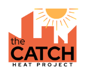

# cityClimateHealth

The package `cityClimateHealth` makes it simple to estimate climate-health impacts at small spatial scales. Starting from a messy exposure and outcome dataset, we can quickly estimate climate-health impacts.




## Installing the package

```
remotes::install_github("cmilando/cityClimateHealth")
```

you may have to first [install STAN](https://mc-stan.org/install/) and `cmdstanr`:
```
install.packages('cmdstanr', repos = c('https://stan-dev.r-universe.dev', getOption('repos')))
```

## Usage 

This package can be used in three main ways:

| 1-stage design | 2-stage design | Spatial Bayes |
|----------------|----------------|---------------|
| A 1-stage model when estimating a *single set of beta coefficients* for heat-health impacts across single or multiple zones: `vignette("one_stage_demo")`| A 2-stage design is used when estimating heat-health impacts across many zones, but where *individual zone models* are desired: `vignette("two_stage_demo")`| If numbers are very small in the 2-stage design, spatial bayesian methods can be used to tighten confidence intervals: `vignette("bayesian_demo")`|

In implementations, an attributable number calculation is applied to model outputs, see `vignette("attributable_number")`. 

## Starting a new analysis

To start a new analysis, you will need the following **4** datasets:

| Exposure | Outcomes | Populations | Spatial |
|----------|----------|----------|----------|
| Exposures at the daily scale for each `geo_unit` | Health outcomes at the daily scale for each `geo_unit` | Population data for each subdivision of the health outcome data that you want results for | A map showing how the various `geo_unit`s are neighbors |

This package comes pre-loaded with **simluated** datasets of each type (e.g., `ma_exposure`, `ma_deaths`, `ma_pop_data`, and `ma_towns` respectively) so each of these methods can be explored. 

## Use cases

So far, `cityClimateHealth` has been used in several submitted and 
in preparation manuscripts, with associated press:

* [NPR spent 2 years tracking deaths from heat. We found a staggering hidden toll](https://www.npr.org/2026/08/31/nx-s1-5724225/heat-wave-death-toll-tracker)
* [Building a Cool Culture in the Lower Mystic: The Summer 2026 Cool Communications Campaign](https://www.mapc.org/planning101/building-a-cool-culture-in-the-lower-mystic/)

## Funding attribution

Support for this project comes from the Massachusetts Municipal Vulnerability Prepared-ness (MVP) program, and the Wellcome Foundation for the [Community Adaptations for City Heat Project (CATCH)](https://www.catchcityheat.org/) at Boston University (Climate Impact Award 311886/Z/24/Z), and the [Boston University Center for Climate and Health](https://sites.bu.edu/climateandhealth/).

