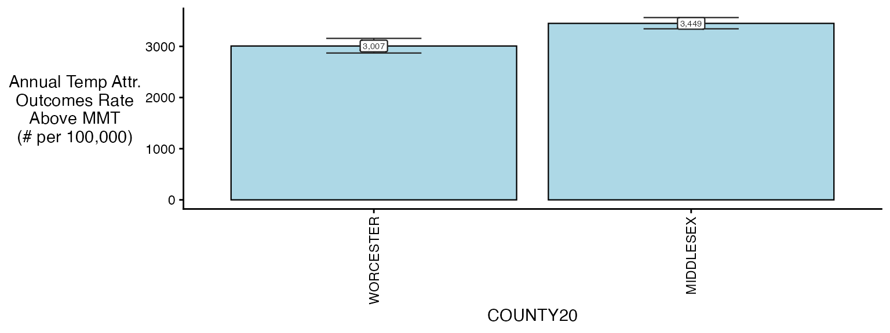
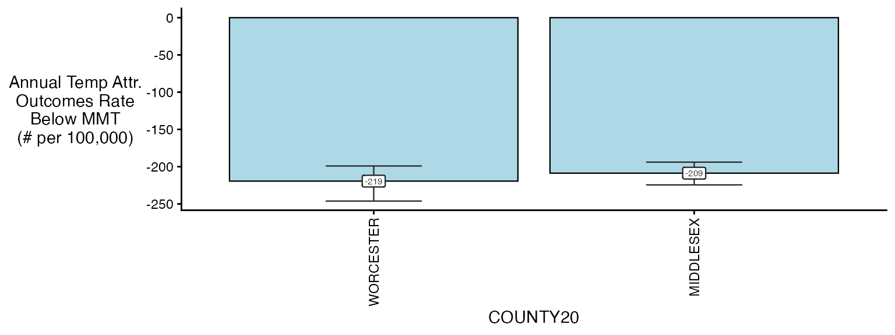
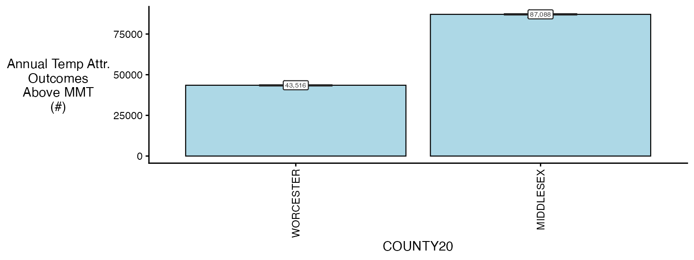
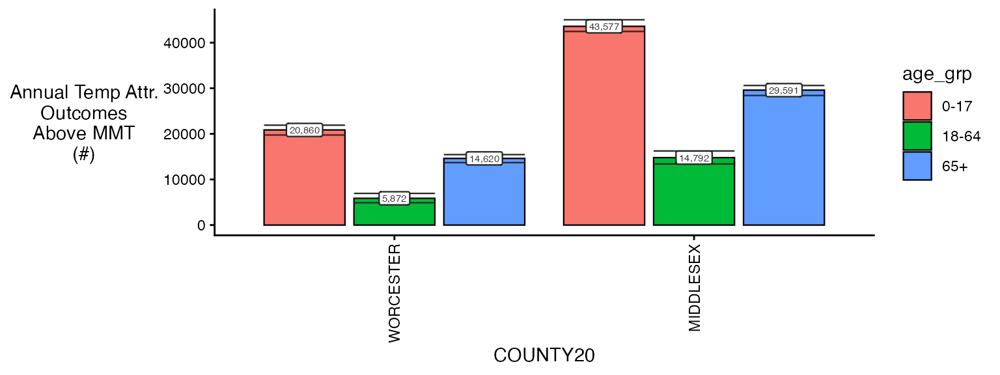
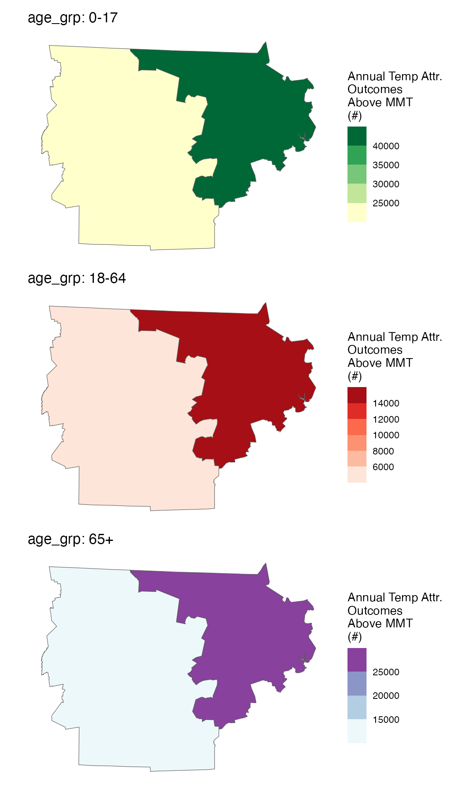

# Calculating attributable numbers and rates in \`cityClimateHealth\`

``` r

library(cityClimateHealth)
```

Estimating Attributable numbers (and rates of attributable numbers) are
a key way that we can translate relative risks into numbers that are
more tangible in public health settings. Below we provide easy
functionality to go from our model objects to estimates of attributable
numbers and rates.

### Setup

The first step of calculating attributable numbers is having a
population data estimate.

This varies a lot by place and dataset, so we don’t include
functionality for it (but an example of how this could be done can be
seen in
[`vignette("get_pop_estimates")`](http://climatehealth.city/articles/get_pop_estimates.md)).

Assume you are starting with a dataset for the entire timeframe that
looks like this:

``` r

library(data.table)
data("ma_pop_data")
setDT(ma_pop_data)
ma_pop_data
#>               TOWN20 Female_0-17 Female_18-64 Female_65+ Male_0-17 Male_18-64
#>               <char>       <num>        <num>      <num>     <num>      <num>
#>   1:      BARNSTABLE        3899        15017       6014      4499      14035
#>   2:          BOURNE        1891         5751       3212      1489       5302
#>   3:        BREWSTER         634         2518       2007       833       2628
#>   4:         CHATHAM         163         1477       1759       480       1265
#>   5:          DENNIS         573         3792       3133       784       4101
#>  ---                                                                         
#> 347:   WEST BOYLSTON         619         2021       1107       604       2554
#> 348: WEST BROOKFIELD         343         1162        578       243       1002
#> 349:     WESTMINSTER         847         2371       1131       762       2028
#> 350:      WINCHENDON        1254         3318        711      1031       3134
#> 351:       WORCESTER       18779        67750      15995     21129      69365
#>      Male_65+
#>         <num>
#>   1:     5458
#>   2:     2810
#>   3:     1721
#>   4:     1463
#>   5:     2359
#>  ---         
#> 347:      790
#> 348:      495
#> 349:     1081
#> 350:      924
#> 351:    11173
```

Need to do some transformations:

- pivot longer
- variable clean

Note again, this processing will vary by application so this approach is
not prescriptive !

Pivot longer:

``` r

ma_pop_data_long <- melt(
  ma_pop_data,
  id.vars = "TOWN20",
  variable.name = "sex_age",
  value.name = "population"
)
```

Variable clean:

``` r

ma_pop_data_long$sex_age <- as.character(ma_pop_data_long$sex_age)
varnames <- strsplit(ma_pop_data_long$sex_age, "_", fixed = T)
varnames <- data.frame(do.call(rbind, varnames))
names(varnames) <- c('sex', 'age_grp')
rr <- which(varnames$sex == 'Female')
varnames$sex[rr] <- 'F'
rr <- which(varnames$sex == 'Male')
varnames$sex[rr] <- 'M'
ma_pop_data_long$sex = varnames$sex
ma_pop_data_long$age_grp = varnames$age_grp
ma_pop_data_long$sex_age <- NULL
ma_pop_data_long
#>                TOWN20 population    sex age_grp
#>                <char>      <num> <char>  <char>
#>    1:      BARNSTABLE       3899      F    0-17
#>    2:          BOURNE       1891      F    0-17
#>    3:        BREWSTER        634      F    0-17
#>    4:         CHATHAM        163      F    0-17
#>    5:          DENNIS        573      F    0-17
#>   ---                                          
#> 2102:   WEST BOYLSTON        790      M     65+
#> 2103: WEST BROOKFIELD        495      M     65+
#> 2104:     WESTMINSTER       1081      M     65+
#> 2105:      WINCHENDON        924      M     65+
#> 2106:       WORCESTER      11173      M     65+
```

We assume that these properties hold for the entire timeframe of our
analysis, but you could also make a version of this dataset with a
‘year’ column.

Now, quickly get a
[`condPois_1stage()`](http://climatehealth.city/reference/condPois_1stage.md)
and
[`condPois_2stage()`](http://climatehealth.city/reference/condPois_2stage.md)
objects to use in testing: exposures

``` r

library(data.table)
exposure_columns <- list(
  "date" = "date",
  "exposure" = "tmax_C",
  "geo_unit" = "TOWN20",
  "geo_unit_grp" = "COUNTY20"
)

ma_exposure_matrix <- make_exposure_matrix(
  subset(ma_exposure, COUNTY20 %in% c('MIDDLESEX', 'WORCESTER') &
           year(date) %in% 2012:2015), 
  exposure_columns)
#> Warning in make_exposure_matrix(subset(ma_exposure, COUNTY20 %in% c("MIDDLESEX", : check about any NA, some corrections for this later,
#>             but only in certain columns
```

outcomes

``` r

outcome_columns <- list(
  "date" = "date",
  "outcome" = "daily_deaths",
  "factor" = 'age_grp',
  "factor" = 'sex',
  "geo_unit" = "TOWN20",
  "geo_unit_grp" = "COUNTY20"
)

ma_outcomes_tbl <- make_outcome_table(
  subset(ma_deaths,COUNTY20 %in% c('MIDDLESEX', 'WORCESTER') &
           year(date) %in% 2012:2015), outcome_columns)
#> Missing values in outcome xgrid were set to 0
```

models

``` r

ma_model <- condPois_2stage(ma_exposure_matrix, ma_outcomes_tbl, verbose = 1, global_cen = 20)
#> -- validation passed
#> -- stage 1
#> 
#> crossbasis args:
#> 
#> maxlag: 5 
#> 
#> argvar:
#> List of 2
#>  $ fun  : chr "ns"
#>  $ knots: Named num [1:2] 25.7 31.4
#>   ..- attr(*, "names")= chr [1:2] "50%" "90%"
#> 
#> arglag:
#> List of 2
#>  $ fun  : chr "ns"
#>  $ knots: num [1:2] 0.878 2.095
#> 
#> strata:
#> ACTON:yr2012:mn05:dow03
#> strata_min: 0 
#> 
#> 
#> -- mixmeta
#> formula: ~ 1 | COUNTY20/TOWN20 
#> -- stage 2
```

### Estimating the AN

Ok so now you pass in `population`.

So now estimate the AN as a full object

Remember that this needs to be compatible for:

- single zone

- ma model with ma_model\$`_`

- ma model with factor ma_model\$`0-17` \> I think you can handle this
  the same way you did before, with recursion

Now in this second step, you can choose the aggregation level that you
want results to.

In this block you need:

- what spatial resolution are you summarizing to: -\>\> ‘geo_unit’,
  ‘geo_unit_grp’, or ‘all’

- are you just getting the impacts that are \> then the centering point:
  -\>\> lets just assume yes for now, can always go back and change it

``` r

ma_AN <- calc_AN(ma_model, ma_outcomes_tbl, ma_pop_data_long,
                 spatial_agg_type = 'TOWN20', 
                 spatial_join_col = 'TOWN20', 
                 nsim = 100,
                 verbose = 2)
#> -- validation passed
#> -- estimate in each geo_unit
#> 5    10  15  20  25  30  35  40  45  50  55  60  65  70  75  80  85  90  95  100     105     110     
#> -- summarize by simulation
#> 5    10  15  20  25  30  35  40  45  50  55  60  65  70  75  80  85  90  95  100     
ma_AN$`_`$rate_table
#>          TOWN20  COUNTY20 population above_MMT mean_annual_attr_rate_est
#>          <char>    <char>      <num>    <lgcl>                     <num>
#>   1:      ACTON MIDDLESEX      23864      TRUE                 3514.7083
#>   2:      ACTON MIDDLESEX      23864     FALSE                 -213.7110
#>   3:  ARLINGTON MIDDLESEX      45906      TRUE                 3563.2597
#>   4:  ARLINGTON MIDDLESEX      45906     FALSE                 -245.8829
#>   5: ASHBURNHAM WORCESTER       6337      TRUE                 2426.2269
#>  ---                                                                    
#> 224: WINCHESTER MIDDLESEX      22809     FALSE                 -311.2806
#> 225:     WOBURN MIDDLESEX      40992      TRUE                 3408.8969
#> 226:     WOBURN MIDDLESEX      40992     FALSE                 -161.3120
#> 227:  WORCESTER WORCESTER     204191      TRUE                 3107.4460
#> 228:  WORCESTER WORCESTER     204191     FALSE                 -268.1925
#>      mean_annual_attr_rate_lb mean_annual_attr_rate_ub
#>                         <num>                    <num>
#>   1:                2774.7339                4245.6996
#>   2:                -333.7663                -108.3483
#>   3:                2801.4720                4172.5483
#>   4:                -335.8902                -159.0887
#>   5:                1739.4864                3013.5514
#>  ---                                                  
#> 224:                -423.6540                -211.3749
#> 225:                2853.8648                3965.4689
#> 226:                -233.6127                 -79.8479
#> 227:                2674.7567                3591.4842
#> 228:                -380.2537                -179.2960
ma_AN$`_`$number_table
#>          TOWN20  COUNTY20 population above_MMT mean_annual_attr_num_est
#>          <char>    <char>      <num>    <lgcl>                    <num>
#>   1:      ACTON MIDDLESEX      23864      TRUE                  838.750
#>   2:      ACTON MIDDLESEX      23864     FALSE                  -51.000
#>   3:  ARLINGTON MIDDLESEX      45906      TRUE                 1635.750
#>   4:  ARLINGTON MIDDLESEX      45906     FALSE                 -112.875
#>   5: ASHBURNHAM WORCESTER       6337      TRUE                  153.750
#>  ---                                                                   
#> 224: WINCHESTER MIDDLESEX      22809     FALSE                  -71.000
#> 225:     WOBURN MIDDLESEX      40992      TRUE                 1397.375
#> 226:     WOBURN MIDDLESEX      40992     FALSE                  -66.125
#> 227:  WORCESTER WORCESTER     204191      TRUE                 6345.125
#> 228:  WORCESTER WORCESTER     204191     FALSE                 -547.625
#>      mean_annual_attr_num_lb mean_annual_attr_num_ub
#>                        <num>                   <num>
#>   1:               662.16250              1013.19375
#>   2:               -79.65000               -25.85625
#>   3:              1286.04375              1915.45000
#>   4:              -154.19375               -73.03125
#>   5:               110.23125               190.96875
#>  ---                                                
#> 224:               -96.63125               -48.21250
#> 225:              1169.85625              1625.52500
#> 226:               -95.76250               -32.73125
#> 227:              5461.61250              7333.48750
#> 228:              -776.44375              -366.10625
```

you can change `spatial_agg_type` to be a different spatial resolution –
either whatever the group variable was or “all”

``` r

ma_AN <- calc_AN(ma_model, ma_outcomes_tbl, ma_pop_data_long,
                 spatial_agg_type = 'COUNTY20', 
                 spatial_join_col = 'TOWN20', 
                 nsim = 100,
                 verbose = 2)
#> -- validation passed
#> -- estimate in each geo_unit
#> 5    10  15  20  25  30  35  40  45  50  55  60  65  70  75  80  85  90  95  100     105     110     
#> -- summarize by simulation
#> 5    10  15  20  25  30  35  40  45  50  55  60  65  70  75  80  85  90  95  100     
ma_AN$`_`$rate_table
#>     COUNTY20 population above_MMT mean_annual_attr_rate_est
#>       <char>      <num>    <lgcl>                     <num>
#> 1: MIDDLESEX    1623109      TRUE                 3453.4957
#> 2: MIDDLESEX    1623109     FALSE                 -210.3140
#> 3: WORCESTER     858898      TRUE                 3007.8804
#> 4: WORCESTER     858898     FALSE                 -219.9912
#>    mean_annual_attr_rate_lb mean_annual_attr_rate_ub
#>                       <num>                    <num>
#> 1:                3347.3387                3581.1705
#> 2:                -223.1200                -195.3061
#> 3:                2857.9740                3153.6261
#> 4:                -247.0106                -196.4167
ma_AN$`_`$number_table
#>     COUNTY20 population above_MMT mean_annual_attr_num_est
#>       <char>      <num>    <lgcl>                    <num>
#> 1: MIDDLESEX    1623109      TRUE                56054.000
#> 2: MIDDLESEX    1623109     FALSE                -3413.625
#> 3: WORCESTER     858898      TRUE                25834.625
#> 4: WORCESTER     858898     FALSE                -1889.500
#>    mean_annual_attr_num_lb mean_annual_attr_num_ub
#>                      <num>                   <num>
#> 1:               54330.956               58126.300
#> 2:               -3621.481               -3170.031
#> 3:               24547.081               27086.431
#> 4:               -2121.569               -1687.019
```

See that the numbers are roughly the same for Suffolk county ? They
won’t be exactly the same because of how the averaging works.

Some plot functions exist:

``` r

plot(ma_AN, table_type = 'rate', above_MMT = T)
```



``` r

plot(ma_AN, table_type = 'rate', above_MMT = F)
```



### Estimating the AN - single

check of single

``` r


# run the model
m2 <- condPois_1stage(exposure_matrix = ma_exposure_matrix, 
                  outcomes_tbl = ma_outcomes_tbl, 
                  multi_zone = TRUE, global_cen = 15)
#> 
#> crossbasis args:
#> 
#> maxlag: 5 
#> 
#> argvar:
#> List of 2
#>  $ fun  : chr "ns"
#>  $ knots: Named num [1:2] 25.4 30.5
#>   ..- attr(*, "names")= chr [1:2] "50%" "90%"
#> 
#> arglag:
#> List of 2
#>  $ fun  : chr "ns"
#>  $ knots: num [1:2] 0.878 2.095
#> 
#> strata:
#> ACTON:yr2012:mn05:dow03
#> strata_min: 0

ma_AN_s1 <- calc_AN(m2, ma_outcomes_tbl, ma_pop_data_long,
                 spatial_agg_type = 'COUNTY20', 
                 spatial_join_col = 'TOWN20', 
                 nsim = 100,
                 verbose = 2)
#> -- validation passed
#> -- estimate in each geo_unit
#> 5    10  15  20  25  30  35  40  45  50  55  60  65  70  75  80  85  90  95  100     105     110     
#> -- summarize by simulation
#> 5    10  15  20  25  30  35  40  45  50  55  60  65  70  75  80  85  90  95  100     

ma_AN_s1$`_`$rate_table
#>     COUNTY20 population above_MMT mean_annual_attr_rate_est
#>       <char>      <num>    <lgcl>                     <num>
#> 1: MIDDLESEX    1623109      TRUE                5365.52074
#> 2: MIDDLESEX    1623109     FALSE                 -29.68069
#> 3: WORCESTER     858898      TRUE                5066.43397
#> 4: WORCESTER     858898     FALSE                 -36.54392
#>    mean_annual_attr_rate_lb mean_annual_attr_rate_ub
#>                       <num>                    <num>
#> 1:               5342.12274               5390.11667
#> 2:                -30.33646                -28.96332
#> 3:               5015.17133               5100.83051
#> 4:                -37.79625                -34.98524
plot(ma_AN_s1, "num", above_MMT = T)
```



### Estimating the AN - with factors

In the case where you have factors, you can easily extend this

``` r

ma_outcomes_tbl_fct <- make_outcome_table(
  subset(ma_deaths,COUNTY20 %in% c('MIDDLESEX', 'WORCESTER') &
           year(date) %in% 2012:2015), 
  outcome_columns, collapse_to = 'age_grp')
#> Missing values in outcome xgrid were set to 0

ma_model_fct <- condPois_2stage(ma_exposure_matrix, 
                                ma_outcomes_tbl_fct, 
                                global_cen = 15,
                                verbose = 1)
#> < age_grp : 0-17 >
#> -- validation passed
#> -- stage 1
#> 
#> crossbasis args:
#> 
#> maxlag: 5 
#> 
#> argvar:
#> List of 2
#>  $ fun  : chr "ns"
#>  $ knots: Named num [1:2] 25.7 31.4
#>   ..- attr(*, "names")= chr [1:2] "50%" "90%"
#> 
#> arglag:
#> List of 2
#>  $ fun  : chr "ns"
#>  $ knots: num [1:2] 0.878 2.095
#> 
#> strata:
#> ACTON:yr2012:mn05:dow03
#> strata_min: 0 
#> 
#> 
#> -- mixmeta
#> formula: ~ 1 | COUNTY20/TOWN20 
#> -- stage 2
#> 
#> < age_grp : 18-64 >
#> -- validation passed
#> -- stage 1
#> 
#> crossbasis args:
#> 
#> maxlag: 5 
#> 
#> argvar:
#> List of 2
#>  $ fun  : chr "ns"
#>  $ knots: Named num [1:2] 25.7 31.4
#>   ..- attr(*, "names")= chr [1:2] "50%" "90%"
#> 
#> arglag:
#> List of 2
#>  $ fun  : chr "ns"
#>  $ knots: num [1:2] 0.878 2.095
#> 
#> strata:
#> ACTON:yr2012:mn05:dow03
#> strata_min: 0 
#> 
#> 
#> -- mixmeta
#> formula: ~ 1 | COUNTY20/TOWN20 
#> -- stage 2
#> 
#> < age_grp : 65+ >
#> -- validation passed
#> -- stage 1
#> 
#> crossbasis args:
#> 
#> maxlag: 5 
#> 
#> argvar:
#> List of 2
#>  $ fun  : chr "ns"
#>  $ knots: Named num [1:2] 25.7 31.4
#>   ..- attr(*, "names")= chr [1:2] "50%" "90%"
#> 
#> arglag:
#> List of 2
#>  $ fun  : chr "ns"
#>  $ knots: num [1:2] 0.878 2.095
#> 
#> strata:
#> ACTON:yr2012:mn05:dow03
#> strata_min: 0 
#> 
#> 
#> -- mixmeta
#> formula: ~ 1 | COUNTY20/TOWN20 
#> -- stage 2

ma_AN_fct <- calc_AN(ma_model_fct, ma_outcomes_tbl_fct,
                     ma_pop_data_long,
                 spatial_agg_type = 'COUNTY20', 
                 spatial_join_col = 'TOWN20', 
                 nsim = 100,
                 verbose = 1)
#> < age_grp : 0-17 >
#> Warning in calc_AN(sub_model, sub_outcomes_tbl, sub_pop_data, spatial_agg_type,
#> : some pop data are zero
#> -- validation passed
#> -- estimate in each geo_unit
#> -- summarize by simulation
#> < age_grp : 18-64 >
#> -- validation passed
#> -- estimate in each geo_unit
#> -- summarize by simulation
#> < age_grp : 65+ >
#> -- validation passed
#> -- estimate in each geo_unit
#> -- summarize by simulation

plot(ma_AN_fct, "num", above_MMT = T)
```



These results are fictional of course but show what kind of outputs can
be made easily.

``` r

spatial_plot(ma_AN_fct, shp = ma_counties, table_type = "num", above_MMT = T)
```


