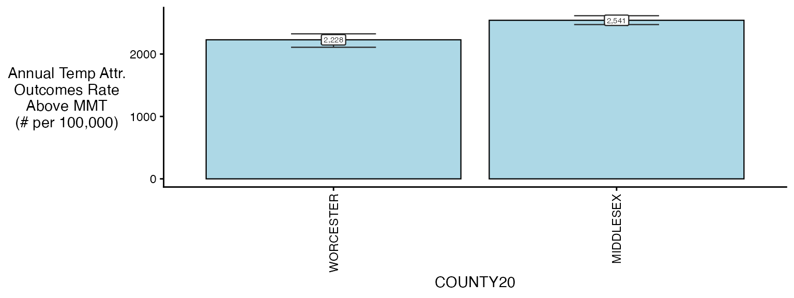
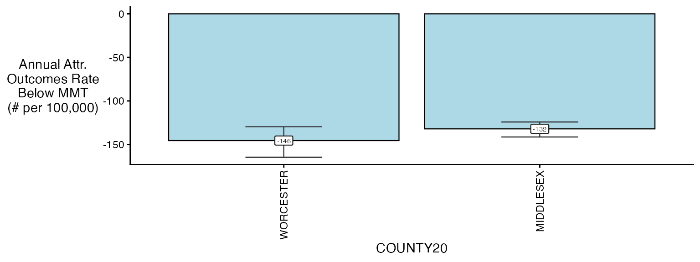
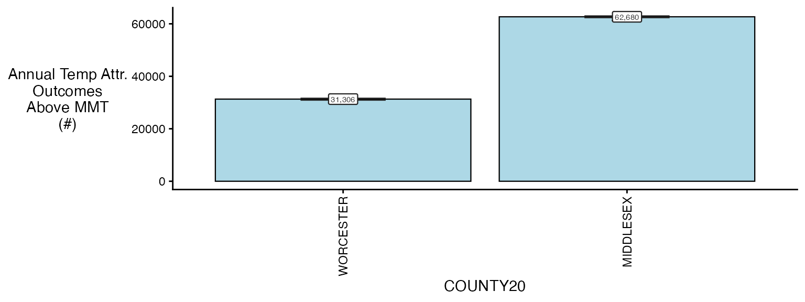
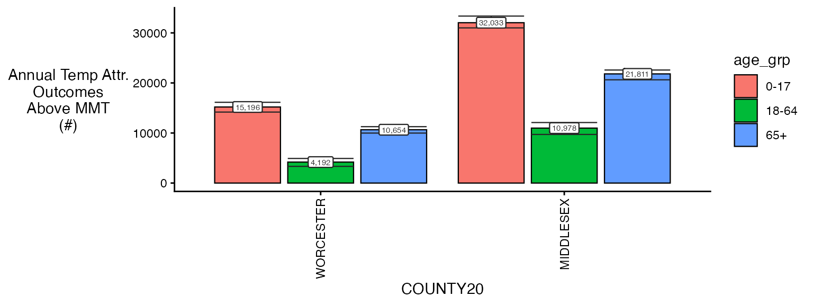
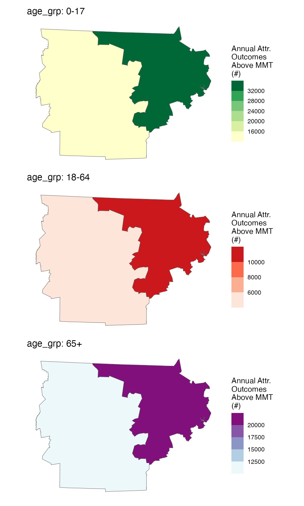

# Calculating attributable numbers and rates in \`cityClimateHealth\`

``` r

library(cityClimateHealth)
```

Estimating Attributable numbers (and rates of attributable numbers) are
a key way that we can translate relative risks into numbers that are
more tangible in public health settings. Below we provide easy
functionality to go from our model objects to estimates of attributable
numbers and rates.

### Setup

The first step of calculating attributable numbers is having a
population data estimate.

This varies a lot by place and dataset, so we don’t include
functionality for it (but an example of how this could be done can be
seen in
[`vignette("get_pop_estimates")`](http://climatehealth.city/articles/get_pop_estimates.md)).

Reminder - the data used in this example are **simulated**.

Assume you are starting with a dataset for the entire timeframe that
looks like this:

``` r

library(data.table)
data("ma_pop_data")
setDT(ma_pop_data)
ma_pop_data
#>               TOWN20 Female_0-17 Female_18-64 Female_65+ Male_0-17 Male_18-64
#>               <char>       <num>        <num>      <num>     <num>      <num>
#>   1:      BARNSTABLE        3899        15017       6014      4499      14035
#>   2:          BOURNE        1891         5751       3212      1489       5302
#>   3:        BREWSTER         634         2518       2007       833       2628
#>   4:         CHATHAM         163         1477       1759       480       1265
#>   5:          DENNIS         573         3792       3133       784       4101
#>  ---                                                                         
#> 347:   WEST BOYLSTON         619         2021       1107       604       2554
#> 348: WEST BROOKFIELD         343         1162        578       243       1002
#> 349:     WESTMINSTER         847         2371       1131       762       2028
#> 350:      WINCHENDON        1254         3318        711      1031       3134
#> 351:       WORCESTER       18779        67750      15995     21129      69365
#>      Male_65+
#>         <num>
#>   1:     5458
#>   2:     2810
#>   3:     1721
#>   4:     1463
#>   5:     2359
#>  ---         
#> 347:      790
#> 348:      495
#> 349:     1081
#> 350:      924
#> 351:    11173
```

Need to do some transformations:

- pivot longer
- variable clean

Note again, this processing will vary by application so this approach is
not prescriptive !

Pivot longer:

``` r

ma_pop_data_long <- melt(
  ma_pop_data,
  id.vars = "TOWN20",
  variable.name = "sex_age",
  value.name = "population"
)
```

Variable clean:

``` r

ma_pop_data_long$sex_age <- as.character(ma_pop_data_long$sex_age)
varnames <- strsplit(ma_pop_data_long$sex_age, "_", fixed = T)
varnames <- data.frame(do.call(rbind, varnames))
names(varnames) <- c('sex', 'age_grp')
rr <- which(varnames$sex == 'Female')
varnames$sex[rr] <- 'F'
rr <- which(varnames$sex == 'Male')
varnames$sex[rr] <- 'M'
ma_pop_data_long$sex = varnames$sex
ma_pop_data_long$age_grp = varnames$age_grp
ma_pop_data_long$sex_age <- NULL
ma_pop_data_long
#>                TOWN20 population    sex age_grp
#>                <char>      <num> <char>  <char>
#>    1:      BARNSTABLE       3899      F    0-17
#>    2:          BOURNE       1891      F    0-17
#>    3:        BREWSTER        634      F    0-17
#>    4:         CHATHAM        163      F    0-17
#>    5:          DENNIS        573      F    0-17
#>   ---                                          
#> 2102:   WEST BOYLSTON        790      M     65+
#> 2103: WEST BROOKFIELD        495      M     65+
#> 2104:     WESTMINSTER       1081      M     65+
#> 2105:      WINCHENDON        924      M     65+
#> 2106:       WORCESTER      11173      M     65+
```

We assume that these properties hold for the entire timeframe of our
analysis, but you could also make a version of this dataset with a
‘year’ column.

Now, quickly get a
[`condPois_1stage()`](http://climatehealth.city/reference/condPois_1stage.md)
and
[`condPois_2stage()`](http://climatehealth.city/reference/condPois_2stage.md)
objects to use in testing: exposures

``` r

library(data.table)
exposure_columns <- list(
  "date" = "date",
  "exposure" = "tmax_C",
  "geo_unit" = "TOWN20",
  "geo_unit_grp" = "COUNTY20"
)

ma_exposure_matrix <- make_exposure_matrix(
  subset(ma_exposure, COUNTY20 %in% c('MIDDLESEX', 'WORCESTER')), 
  exposure_columns,
  time_subset = list(month = 5:9,
                     year = 2013:2015))
#> -- NA values automatically removed
#> > No factors to collapse to, using all data
#> > grp_level == FALSE, so using geo_unit as strata
#> strata dt_by = 'day', setting strata as geo_unit:yr:mn:dow
```

outcomes

``` r

outcome_columns <- list(
  "date" = "date",
  "outcome" = "daily_deaths",
  "factor" = 'age_grp',
  "factor" = 'sex',
  "geo_unit" = "TOWN20",
  "geo_unit_grp" = "COUNTY20"
)

ma_outcomes_tbl <- make_outcome_table(
  subset(ma_deaths,COUNTY20 %in% c('MIDDLESEX', 'WORCESTER')),
  outcome_columns,
  time_subset = list(month = 5:9,
                   year = 2012:2015))
#> > No factors to collapse to, using all data
#> > grp_level == FALSE, so using geo_unit as strata
#> Missing outcome values introduced by xgrid were set to 0;
#>             assumes that every time in the dataset should have an outcome value
#> strata dt_by = 'day', setting strata as geo_unit:yr:mn:dow
```

models

``` r

ma_model <- condPois_2stage(ma_exposure_matrix, ma_outcomes_tbl, verbose = 1, global_cen = 20)
#> -- validation passed
#> -- stage 1
#> 
#> crossbasis args for geo_unit  ACTON :
#> 
#> maxlag: 5 
#> 
#> argvar:
#> List of 2
#>  $ fun  : chr "ns"
#>  $ knots: Named num [1:2] 25.6 31.3
#>   ..- attr(*, "names")= chr [1:2] "50%" "90%"
#> 
#> arglag:
#> List of 2
#>  $ fun  : chr "ns"
#>  $ knots: num [1:2] 0.878 2.095
#> 
#> strata:
#> ACTON:yr2013:mn05:dow04
#> strata_min: 0 
#> 
#> min_n: 50 
#> 
#> formula:
#>    daily_deaths ~ cb
#> family: quasipoisson
#> 
#> -- mixmeta
#> formula: ~ 1 | COUNTY20/TOWN20 
#> -- stage 2
```

### Estimating the AN

Ok so now you pass in `population`.

So now estimate the AN as a full object

Remember that this needs to be compatible for:

- single zone

- ma model with ma_model\$`_`

- ma model with factor ma_model\$`0-17` \> I think you can handle this
  the same way you did before, with recursion

Now in this second step, you can choose the aggregation level that you
want results to.

In this block you need:

- what spatial resolution are you summarizing to: -\>\> ‘geo_unit’,
  ‘geo_unit_grp’, or ‘all’

- are you just getting the impacts that are \> then the centering point:
  -\>\> lets just assume yes for now, can always go back and change it

``` r

ma_AN <- calc_AN(ma_model, ma_outcomes_tbl, ma_pop_data_long,
                 spatial_agg_type = 'TOWN20', 
                 spatial_join_col = 'TOWN20', 
                 nsim = 100,
                 verbose = 2)
#> -- validation passed
#> -- estimate in each geo_unit
#> 5    10  15  20  25  30  35  40  45  50  55  60  65  70  75  80  85  90  95  100     105     110     
#> -- summarize by simulation
#> 5    10  15  20  25  30  35  40  45  50  55  60  65  70  75  80  85  90  95  100     
#> -- applying scale of :  1
ma_AN$`_`$rate_table
#>          TOWN20  COUNTY20 population above_MMT mean_annual_attr_rate_est
#>          <char>    <char>      <num>    <lgcl>                     <num>
#>   1:      ACTON MIDDLESEX      23864      TRUE                 2514.2474
#>   2:      ACTON MIDDLESEX      23864     FALSE                 -144.5692
#>   3:  ARLINGTON MIDDLESEX      45906      TRUE                 2610.7698
#>   4:  ARLINGTON MIDDLESEX      45906     FALSE                 -157.1145
#>   5: ASHBURNHAM WORCESTER       6337      TRUE                 1710.1941
#>  ---                                                                    
#> 224: WINCHESTER MIDDLESEX      22809     FALSE                 -216.4716
#> 225:     WOBURN MIDDLESEX      40992      TRUE                 2522.7483
#> 226:     WOBURN MIDDLESEX      40992     FALSE                 -112.8269
#> 227:  WORCESTER WORCESTER     204191      TRUE                 2284.5032
#> 228:  WORCESTER WORCESTER     204191     FALSE                 -182.3660
#>      mean_annual_attr_rate_lb mean_annual_attr_rate_ub
#>                         <num>                    <num>
#>   1:                1893.4378               3101.63845
#>   2:                -226.5442                -73.77745
#>   3:                2165.2398               3052.66468
#>   4:                -223.0781                -98.95221
#>   5:                1236.4881               2130.54284
#>  ---                                                  
#> 224:                -290.5103               -144.57013
#> 225:                1947.1482               3030.16442
#> 226:                -169.2861                -52.43401
#> 227:                1952.5530               2690.48342
#> 228:                -271.4432               -119.06438
ma_AN$`_`$number_table
#>          TOWN20  COUNTY20 population above_MMT mean_annual_attr_num_est
#>          <char>    <char>      <num>    <lgcl>                    <num>
#>   1:      ACTON MIDDLESEX      23864      TRUE                  600.000
#>   2:      ACTON MIDDLESEX      23864     FALSE                  -34.500
#>   3:  ARLINGTON MIDDLESEX      45906      TRUE                 1198.500
#>   4:  ARLINGTON MIDDLESEX      45906     FALSE                  -72.125
#>   5: ASHBURNHAM WORCESTER       6337      TRUE                  108.375
#>  ---                                                                   
#> 224: WINCHESTER MIDDLESEX      22809     FALSE                  -49.375
#> 225:     WOBURN MIDDLESEX      40992      TRUE                 1034.125
#> 226:     WOBURN MIDDLESEX      40992     FALSE                  -46.250
#> 227:  WORCESTER WORCESTER     204191      TRUE                 4664.750
#> 228:  WORCESTER WORCESTER     204191     FALSE                 -372.375
#>      mean_annual_attr_num_lb mean_annual_attr_num_ub
#>                        <num>                   <num>
#>   1:               451.85000               740.17500
#>   2:               -54.06250               -17.60625
#>   3:               993.97500              1401.35625
#>   4:              -102.40625               -45.42500
#>   5:                78.35625               135.01250
#>  ---                                                
#> 224:               -66.26250               -32.97500
#> 225:               798.17500              1242.12500
#> 226:               -69.39375               -21.49375
#> 227:              3986.93750              5493.72500
#> 228:              -554.26250              -243.11875
```

you can change `spatial_agg_type` to be a different spatial resolution –
either whatever the group variable was or “all”

``` r

ma_AN <- calc_AN(ma_model, ma_outcomes_tbl, ma_pop_data_long,
                 spatial_agg_type = 'COUNTY20', 
                 spatial_join_col = 'TOWN20', 
                 nsim = 100,
                 verbose = 2)
#> -- validation passed
#> -- estimate in each geo_unit
#> 5    10  15  20  25  30  35  40  45  50  55  60  65  70  75  80  85  90  95  100     105     110     
#> -- summarize by simulation
#> 5    10  15  20  25  30  35  40  45  50  55  60  65  70  75  80  85  90  95  100     
#> -- applying scale of :  1
ma_AN$`_`$rate_table
#>     COUNTY20 population above_MMT mean_annual_attr_rate_est
#>       <char>      <num>    <lgcl>                     <num>
#> 1: MIDDLESEX    1623109      TRUE                 2545.8241
#> 2: MIDDLESEX    1623109     FALSE                 -140.3633
#> 3: WORCESTER     858898      TRUE                 2232.2063
#> 4: WORCESTER     858898     FALSE                 -150.3671
#>    mean_annual_attr_rate_lb mean_annual_attr_rate_ub
#>                       <num>                    <num>
#> 1:                2477.4584                2618.8606
#> 2:                -150.5837                -131.6601
#> 3:                2112.4802                2327.7961
#> 4:                -171.3693                -132.9130
ma_AN$`_`$number_table
#>     COUNTY20 population above_MMT mean_annual_attr_num_est
#>       <char>      <num>    <lgcl>                    <num>
#> 1: MIDDLESEX    1623109      TRUE                 41321.50
#> 2: MIDDLESEX    1623109     FALSE                 -2278.25
#> 3: WORCESTER     858898      TRUE                 19172.38
#> 4: WORCESTER     858898     FALSE                 -1291.50
#>    mean_annual_attr_num_lb mean_annual_attr_num_ub
#>                      <num>                   <num>
#> 1:               40211.850               42506.962
#> 2:               -2444.137               -2136.988
#> 3:               18144.050               19993.394
#> 4:               -1471.887               -1141.588
```

See that the numbers are roughly the same for Suffolk county ? They
won’t be exactly the same because of how the averaging works.

Some plot functions exist:

``` r

plot(ma_AN, table_type = 'rate', above_MMT = T)
```



``` r

plot(ma_AN, table_type = 'rate', above_MMT = F)
```



### Estimating the AN - single

check of single

``` r


# run the model
m2 <- condPois_1stage(exposure_matrix = ma_exposure_matrix, 
                  outcomes_tbl = ma_outcomes_tbl, 
                  multi_zone = TRUE, global_cen = 15)
#> 
#> crossbasis args for geo_unit  ACTON,ARLINGTON,ASHBURNHAM,ASHBY,ASHLAND,ATHOL,AUBURN,AYER,BARRE,BEDFORD,BELMONT,BERLIN,BILLERICA,BLACKSTONE,BOLTON,BOXBOROUGH,BOYLSTON,BROOKFIELD,BURLINGTON,CAMBRIDGE,CARLISLE,CHARLTON,CHELMSFORD,CLINTON,CONCORD,DOUGLAS,DRACUT,DUDLEY,DUNSTABLE,EAST BROOKFIELD,EVERETT,FITCHBURG,FRAMINGHAM,GARDNER,GRAFTON,GROTON,HARDWICK,HARVARD,HOLDEN,HOLLISTON,HOPEDALE,HOPKINTON,HUBBARDSTON,HUDSON,LANCASTER,LEICESTER,LEOMINSTER,LEXINGTON,LINCOLN,LITTLETON,LOWELL,LUNENBURG,MALDEN,MARLBOROUGH,MAYNARD,MEDFORD,MELROSE,MENDON,MILFORD,MILLBURY,MILLVILLE,NATICK,NEW BRAINTREE,NEWTON,NORTH BROOKFIELD,NORTH READING,NORTHBOROUGH,NORTHBRIDGE,OAKHAM,OXFORD,PAXTON,PEPPERELL,PETERSHAM,PHILLIPSTON,PRINCETON,READING,ROYALSTON,RUTLAND,SHERBORN,SHIRLEY,SHREWSBURY,SOMERVILLE,SOUTHBOROUGH,SOUTHBRIDGE,SPENCER,STERLING,STONEHAM,STOW,STURBRIDGE,SUDBURY,SUTTON,TEMPLETON,TEWKSBURY,TOWNSEND,TYNGSBOROUGH,UPTON,UXBRIDGE,WAKEFIELD,WALTHAM,WARREN,WATERTOWN,WAYLAND,WEBSTER,WEST BOYLSTON,WEST BROOKFIELD,WESTBOROUGH,WESTFORD,WESTMINSTER,WESTON,WILMINGTON,WINCHENDON,WINCHESTER,WOBURN,WORCESTER :
#> 
#> maxlag: 5 
#> 
#> argvar:
#> List of 2
#>  $ fun  : chr "ns"
#>  $ knots: Named num [1:2] 25.3 30.3
#>   ..- attr(*, "names")= chr [1:2] "50%" "90%"
#> 
#> arglag:
#> List of 2
#>  $ fun  : chr "ns"
#>  $ knots: num [1:2] 0.878 2.095
#> 
#> strata:
#> ACTON:yr2013:mn05:dow04
#> strata_min: 0 
#> 
#> min_n: 50 
#> 
#> formula:
#>    daily_deaths ~ cb
#> family: quasipoisson

ma_AN_s1 <- calc_AN(m2, ma_outcomes_tbl, ma_pop_data_long,
                 spatial_agg_type = 'COUNTY20', 
                 spatial_join_col = 'TOWN20', 
                 nsim = 100,
                 verbose = 2)
#> -- validation passed
#> -- estimate in each geo_unit
#> 5    10  15  20  25  30  35  40  45  50  55  60  65  70  75  80  85  90  95  100     105     110     
#> -- summarize by simulation
#> 5    10  15  20  25  30  35  40  45  50  55  60  65  70  75  80  85  90  95  100     
#> -- applying scale of :  1

ma_AN_s1$`_`$rate_table
#>     COUNTY20 population above_MMT mean_annual_attr_rate_est
#>       <char>      <num>    <lgcl>                     <num>
#> 1: MIDDLESEX    1623109      TRUE                3861.70152
#> 2: MIDDLESEX    1623109     FALSE                 -17.17383
#> 3: WORCESTER     858898      TRUE                3644.87401
#> 4: WORCESTER     858898     FALSE                 -23.59128
#>    mean_annual_attr_rate_lb mean_annual_attr_rate_ub
#>                       <num>                    <num>
#> 1:               3841.42447               3881.76372
#> 2:                -17.62513                -16.72562
#> 3:               3599.10097               3682.85582
#> 4:                -24.81450                -22.10172
plot(ma_AN_s1, "num", above_MMT = T)
```



### Estimating the AN - with factors

In the case where you have factors, you can easily extend this

``` r

ma_outcomes_tbl_fct <- make_outcome_table(
  subset(ma_deaths,COUNTY20 %in% c('MIDDLESEX', 'WORCESTER')), 
  outcome_columns, 
  time_subset = list(month = 5:9, year = 2012:2015),
  collapse_to = 'age_grp')
#> > Factors in data
#> > grp_level == FALSE, so using geo_unit as strata
#> Missing outcome values introduced by xgrid were set to 0;
#>             assumes that every time in the dataset should have an outcome value
#> strata dt_by = 'day', setting strata as geo_unit:yr:mn:dow

ma_model_fct <- condPois_2stage(ma_exposure_matrix, 
                                ma_outcomes_tbl_fct, 
                                global_cen = 15,
                                verbose = 1)
#> < age_grp : 0-17 >
#> -- validation passed
#> -- stage 1
#> 
#> crossbasis args for geo_unit  ACTON :
#> 
#> maxlag: 5 
#> 
#> argvar:
#> List of 2
#>  $ fun  : chr "ns"
#>  $ knots: Named num [1:2] 25.6 31.3
#>   ..- attr(*, "names")= chr [1:2] "50%" "90%"
#> 
#> arglag:
#> List of 2
#>  $ fun  : chr "ns"
#>  $ knots: num [1:2] 0.878 2.095
#> 
#> strata:
#> ACTON:yr2013:mn05:dow04
#> strata_min: 0 
#> 
#> min_n: 50 
#> 
#> formula:
#>    daily_deaths ~ cb
#> family: quasipoisson
#> 
#> -- mixmeta
#> formula: ~ 1 | COUNTY20/TOWN20 
#> -- stage 2
#> 
#> < age_grp : 18-64 >
#> -- validation passed
#> -- stage 1
#> 
#> crossbasis args for geo_unit  ACTON :
#> 
#> maxlag: 5 
#> 
#> argvar:
#> List of 2
#>  $ fun  : chr "ns"
#>  $ knots: Named num [1:2] 25.6 31.3
#>   ..- attr(*, "names")= chr [1:2] "50%" "90%"
#> 
#> arglag:
#> List of 2
#>  $ fun  : chr "ns"
#>  $ knots: num [1:2] 0.878 2.095
#> 
#> strata:
#> ACTON:yr2013:mn05:dow04
#> strata_min: 0 
#> 
#> min_n: 50 
#> 
#> formula:
#>    daily_deaths ~ cb
#> family: quasipoisson
#> 
#> -- mixmeta
#> formula: ~ 1 | COUNTY20/TOWN20 
#> -- stage 2
#> 
#> < age_grp : 65+ >
#> -- validation passed
#> -- stage 1
#> 
#> crossbasis args for geo_unit  ACTON :
#> 
#> maxlag: 5 
#> 
#> argvar:
#> List of 2
#>  $ fun  : chr "ns"
#>  $ knots: Named num [1:2] 25.6 31.3
#>   ..- attr(*, "names")= chr [1:2] "50%" "90%"
#> 
#> arglag:
#> List of 2
#>  $ fun  : chr "ns"
#>  $ knots: num [1:2] 0.878 2.095
#> 
#> strata:
#> ACTON:yr2013:mn05:dow04
#> strata_min: 0 
#> 
#> min_n: 50 
#> 
#> formula:
#>    daily_deaths ~ cb
#> family: quasipoisson
#> 
#> -- mixmeta
#> formula: ~ 1 | COUNTY20/TOWN20 
#> -- stage 2

ma_AN_fct <- calc_AN(ma_model_fct, ma_outcomes_tbl_fct,
                     ma_pop_data_long,
                 spatial_agg_type = 'COUNTY20', 
                 spatial_join_col = 'TOWN20', 
                 nsim = 100,
                 verbose = 1)
#> -- over-writing `scale` argument with factor scales
#> < age_grp : 0-17 >
#> Warning in calc_AN(model = sub_model, outcomes_tbl = sub_outcomes_tbl, pop_data
#> = sub_pop_data, : some pop data are zero
#> -- validation passed
#> -- estimate in each geo_unit
#> -- summarize by simulation
#> < age_grp : 18-64 >
#> -- validation passed
#> -- estimate in each geo_unit
#> -- summarize by simulation
#> < age_grp : 65+ >
#> -- validation passed
#> -- estimate in each geo_unit
#> -- summarize by simulation

plot(ma_AN_fct, "num", above_MMT = T)
```



These results are fictional of course but show what kind of outputs can
be made easily.

``` r

spatial_plot(ma_AN_fct, shp = ma_counties, table_type = "num", above_MMT = T)
#>     COUNTY20 population above_MMT mean_annual_attr_num_est
#>       <char>      <num>    <lgcl>                    <num>
#> 1: MIDDLESEX     317065      TRUE                 32120.38
#> 2: WORCESTER     178358      TRUE                 15185.25
#>    mean_annual_attr_num_lb mean_annual_attr_num_ub age_grp
#>                      <num>                   <num>  <char>
#> 1:                31065.96                33180.09    0-17
#> 2:                14235.55                16140.26    0-17
#> Simple feature collection with 2 features and 39 fields
#> Geometry type: POLYGON
#> Dimension:     XY
#> Bounding box:  xmin: 132799.7 ymin: 862007.2 xmax: 239462 ymax: 942912.8
#> Projected CRS: NAD83 / Massachusetts Mainland
#>    COUNTY20  ALAND20 AWATER20 TOWN_ID FIPS_STCO2 FOURCOLOR AREA_ACRES SQ_MILES
#> 1 MIDDLESEX 39262628  1104928   167.5      25017       2.5   10159.95   15.875
#> 2 WORCESTER 59652748  2226374   195.0      25027       2.5   15339.02   23.965
#>   POP1960 POP1970 POP1980 POP1990 POP2000 POP2010 POP2020 POPCH10_20 HOUSING20
#> 1 12684.5   16625 17507.5 17761.5 20782.0 21680.5 23296.5     1841.5    8860.5
#> 2  3972.5    5338  6131.5  6644.5  7430.5  8263.0  9016.0      373.5    3442.5
#>   SHAPE_AREA SHAPE_LEN STATEFP20 COUNTYFP20 COUSUBFP20 COUSUBNS20    GEOID20
#> 1   41115882  29498.13        25        017      00380   00618213 2501700380
#> 2   62074807  37978.20        25        027      01885   00618356 2502701885
#>        NAMELSAD20 LSAD20 CLASSFP20 MTFCC20 FUNCSTAT20  INTPTLAT20   INTPTLON20
#> 1      Acton town     43        T1   G4040          A +42.1959508 -071.0546487
#> 2 Ashburnham town     43        T1   G4040          A +42.0366420 -071.5214188
#>       TOWN20 TYPE population above_MMT mean_annual_attr_num_est
#> 1      ACTON    T     317065      TRUE                 32120.38
#> 2 ASHBURNHAM    T     178358      TRUE                 15185.25
#>   mean_annual_attr_num_lb mean_annual_attr_num_ub age_grp
#> 1                31065.96                33180.09    0-17
#> 2                14235.55                16140.26    0-17
#>                         geometry
#> 1 POLYGON ((208990.3 882273, ...
#> 2 POLYGON ((158712.3 864187.3...
#>     COUNTY20 population above_MMT mean_annual_attr_num_est
#>       <char>      <num>    <lgcl>                    <num>
#> 1: MIDDLESEX    1050640      TRUE                 10931.88
#> 2: WORCESTER     541246      TRUE                  4178.00
#>    mean_annual_attr_num_lb mean_annual_attr_num_ub age_grp
#>                      <num>                   <num>  <char>
#> 1:                9820.975               12134.212   18-64
#> 2:                3474.825                5005.444   18-64
#> Simple feature collection with 2 features and 39 fields
#> Geometry type: POLYGON
#> Dimension:     XY
#> Bounding box:  xmin: 132799.7 ymin: 862007.2 xmax: 239462 ymax: 942912.8
#> Projected CRS: NAD83 / Massachusetts Mainland
#>    COUNTY20  ALAND20 AWATER20 TOWN_ID FIPS_STCO2 FOURCOLOR AREA_ACRES SQ_MILES
#> 1 MIDDLESEX 39262628  1104928   167.5      25017       2.5   10159.95   15.875
#> 2 WORCESTER 59652748  2226374   195.0      25027       2.5   15339.02   23.965
#>   POP1960 POP1970 POP1980 POP1990 POP2000 POP2010 POP2020 POPCH10_20 HOUSING20
#> 1 12684.5   16625 17507.5 17761.5 20782.0 21680.5 23296.5     1841.5    8860.5
#> 2  3972.5    5338  6131.5  6644.5  7430.5  8263.0  9016.0      373.5    3442.5
#>   SHAPE_AREA SHAPE_LEN STATEFP20 COUNTYFP20 COUSUBFP20 COUSUBNS20    GEOID20
#> 1   41115882  29498.13        25        017      00380   00618213 2501700380
#> 2   62074807  37978.20        25        027      01885   00618356 2502701885
#>        NAMELSAD20 LSAD20 CLASSFP20 MTFCC20 FUNCSTAT20  INTPTLAT20   INTPTLON20
#> 1      Acton town     43        T1   G4040          A +42.1959508 -071.0546487
#> 2 Ashburnham town     43        T1   G4040          A +42.0366420 -071.5214188
#>       TOWN20 TYPE population above_MMT mean_annual_attr_num_est
#> 1      ACTON    T    1050640      TRUE                 10931.88
#> 2 ASHBURNHAM    T     541246      TRUE                  4178.00
#>   mean_annual_attr_num_lb mean_annual_attr_num_ub age_grp
#> 1                9820.975               12134.212   18-64
#> 2                3474.825                5005.444   18-64
#>                         geometry
#> 1 POLYGON ((208990.3 882273, ...
#> 2 POLYGON ((158712.3 864187.3...
#>     COUNTY20 population above_MMT mean_annual_attr_num_est
#>       <char>      <num>    <lgcl>                    <num>
#> 1: MIDDLESEX     255404      TRUE                 21815.88
#> 2: WORCESTER     139294      TRUE                 10677.25
#>    mean_annual_attr_num_lb mean_annual_attr_num_ub age_grp
#>                      <num>                   <num>  <char>
#> 1:                20545.32                22571.59     65+
#> 2:                10018.87                11316.54     65+
#> Simple feature collection with 2 features and 39 fields
#> Geometry type: POLYGON
#> Dimension:     XY
#> Bounding box:  xmin: 132799.7 ymin: 862007.2 xmax: 239462 ymax: 942912.8
#> Projected CRS: NAD83 / Massachusetts Mainland
#>    COUNTY20  ALAND20 AWATER20 TOWN_ID FIPS_STCO2 FOURCOLOR AREA_ACRES SQ_MILES
#> 1 MIDDLESEX 39262628  1104928   167.5      25017       2.5   10159.95   15.875
#> 2 WORCESTER 59652748  2226374   195.0      25027       2.5   15339.02   23.965
#>   POP1960 POP1970 POP1980 POP1990 POP2000 POP2010 POP2020 POPCH10_20 HOUSING20
#> 1 12684.5   16625 17507.5 17761.5 20782.0 21680.5 23296.5     1841.5    8860.5
#> 2  3972.5    5338  6131.5  6644.5  7430.5  8263.0  9016.0      373.5    3442.5
#>   SHAPE_AREA SHAPE_LEN STATEFP20 COUNTYFP20 COUSUBFP20 COUSUBNS20    GEOID20
#> 1   41115882  29498.13        25        017      00380   00618213 2501700380
#> 2   62074807  37978.20        25        027      01885   00618356 2502701885
#>        NAMELSAD20 LSAD20 CLASSFP20 MTFCC20 FUNCSTAT20  INTPTLAT20   INTPTLON20
#> 1      Acton town     43        T1   G4040          A +42.1959508 -071.0546487
#> 2 Ashburnham town     43        T1   G4040          A +42.0366420 -071.5214188
#>       TOWN20 TYPE population above_MMT mean_annual_attr_num_est
#> 1      ACTON    T     255404      TRUE                 21815.88
#> 2 ASHBURNHAM    T     139294      TRUE                 10677.25
#>   mean_annual_attr_num_lb mean_annual_attr_num_ub age_grp
#> 1                20545.32                22571.59     65+
#> 2                10018.87                11316.54     65+
#>                         geometry
#> 1 POLYGON ((208990.3 882273, ...
#> 2 POLYGON ((158712.3 864187.3...
```


