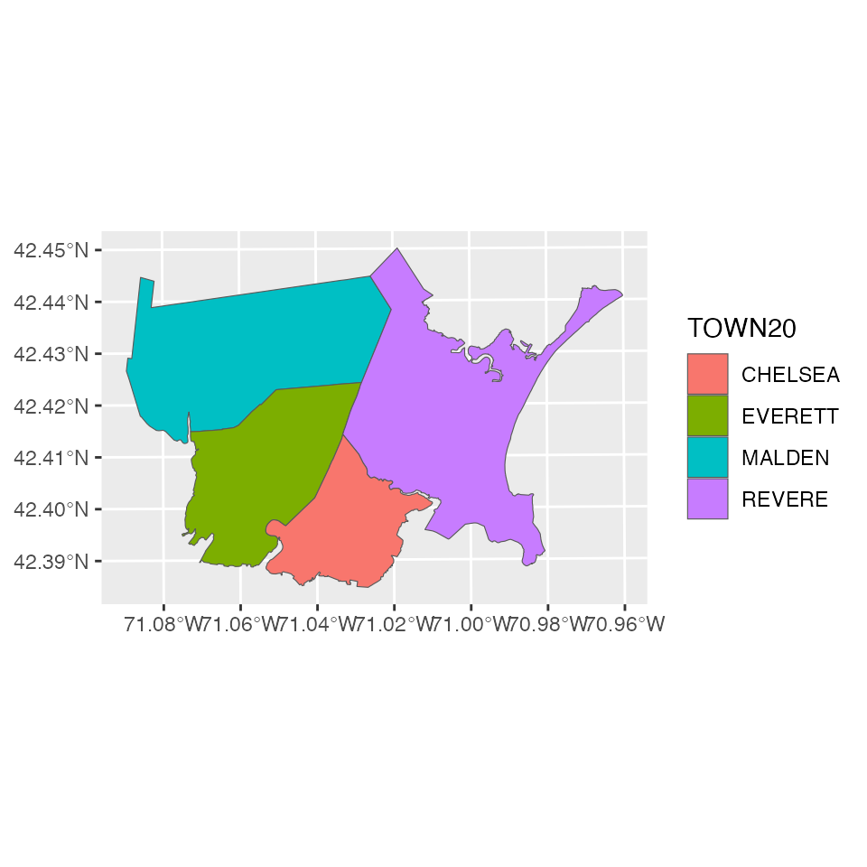
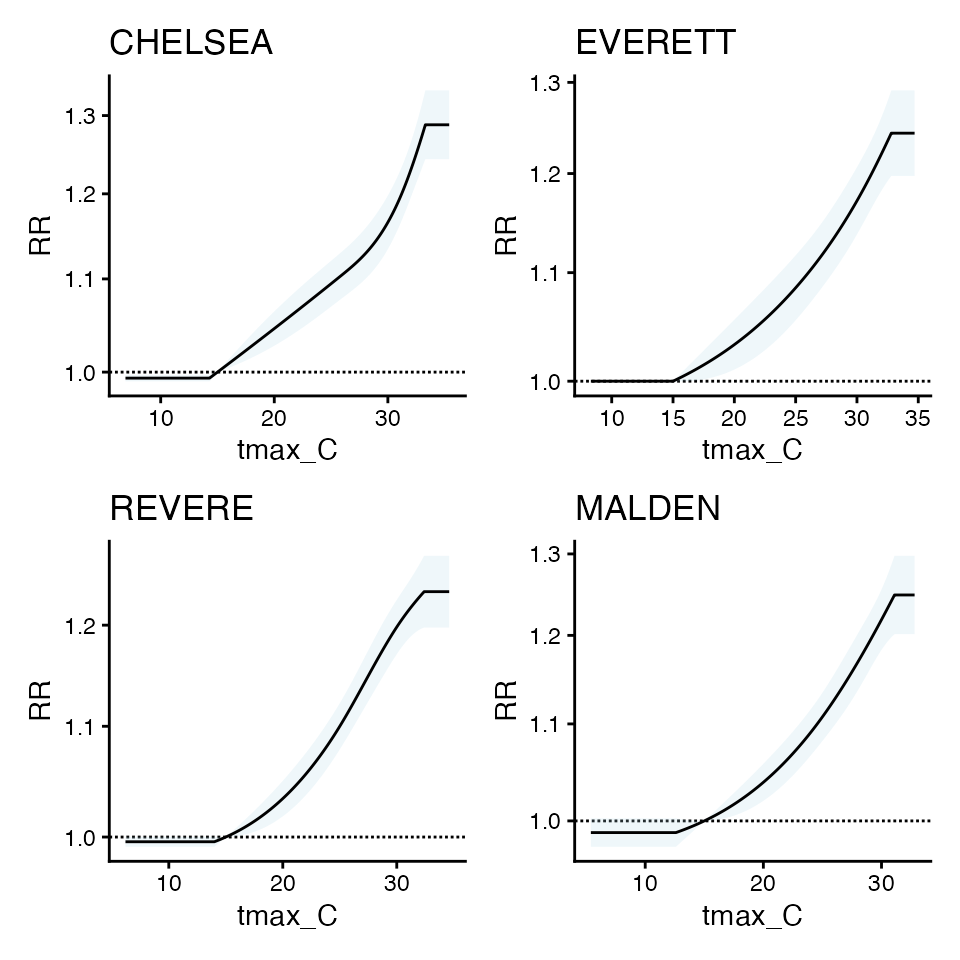

# Using Spatial Bayesian methods in \`cityClimateHealth\`

``` r

library(cityClimateHealth)
```

Another way that this model can be solved is by using Bayesian
inference, implemented in STAN. We are including this implementation
here so that it makes sense why we are including it later on.

The innovation here is combining the method of Armstrong 2014 with a
spatial method, in this case BYM2.

We implemented the spatial bayesian method of BYM2 but instead of
regular poisson as a conditional poisson (i.e., multinomial) which has
performance gains that they articulate in Amrstrong.

This requires bringing in a shapefile, so you can define the network.

The standard application is using MCMC, we also include all STAN model
types:

- MCMC
- laplace
- variational
- pathfinder

You can also experiment with speeding things up (at the risk of less
precise estimates) using the laplace or variational method. see Jack’s
notes as so what is going on here

Sb, basically a combination of these two things:
<https://academic.oup.com/ije/article/53/3/dyae061/7654027?guestAccessKey=>
<https://link.springer.com/article/10.1186/1471-2288-14-122>

A reminder that this data is **simulated**.

``` r

library(data.table)
data("ma_exposure")
data("ma_deaths")

# create exposure matrix
exposure_columns <- list(
  "date" = "date",
  "exposure" = "tmax_C",
  "geo_unit" = "TOWN20",
  "geo_unit_grp" = "COUNTY20"
)

TOWNLIST <- c('CHELSEA', 'EVERETT', 'REVERE', 'MALDEN')

exposure <- subset(ma_exposure, TOWN20 %in% TOWNLIST)

exposure_mat <- make_exposure_matrix(exposure, 
                                     exposure_columns,
                                     time_subset = list(
                                       month = 5:9,
                                       year = 2012:2015
                                     ))
#> -- NA values automatically removed
#> strata dt_by = 'day', setting strata as geo_unit:yr:mn:dow

# create outcome table
outcome_columns <- list(
  "date" = "date",
  "outcome" = "daily_deaths",
  "geo_unit" = "TOWN20",
  "geo_unit_grp" = "COUNTY20"
)
deaths   <- subset(ma_deaths, TOWN20 %in% TOWNLIST)
deaths_tbl <- make_outcome_table(deaths,  outcome_columns,
                                 time_subset = list(
                                       month = 5:9,
                                       year = 2012:2015
                                     ))
#> Missing outcome values introduced by xgrid were set to 0;
#>             assumes that every time in the dataset should have an outcome value
#> strata dt_by = 'day', setting strata as geo_unit:yr:mn:dow

# plot
data("ma_towns")

library(ggplot2)
local_shp <- subset(ma_towns, TOWN20 %in%  TOWNLIST)
ggplot(local_shp) + geom_sf(aes(fill = TOWN20))
```



Now get initial estimates for each `geo_unit`

``` r

beta_l <- vector("list", 4) 
cr_l <- vector("list", 4) 
plot_l <- vector("list", 4)

cb_list <- vector("list", 4)
oo_list <- vector("list", 4)

for(bb in 1:4) {
  m1 <- condPois_1stage(
    subset(exposure_mat, TOWN20 == TOWNLIST[bb]),
    subset(deaths_tbl, TOWN20 == TOWNLIST[bb]),
    global_cen = 15)
  
  cb_list[[bb]] <- m1$`_`$out[[1]]$orig_basis
  oo_list[[bb]] <- m1$`_`$out[[1]]$outcomes
  
  beta_l[[bb]] <- m1$`_`$out[[1]]$orig_coef
  
  cr_l[[bb]] <- m1$`_`$out[[1]]$coef
  
  plot_l[[bb]] <- plot(m1)
  
}
#> 
#> crossbasis args for geo_unit  CHELSEA :
#> 
#> maxlag: 5 
#> 
#> argvar:
#> List of 2
#>  $ fun  : chr "ns"
#>  $ knots: Named num [1:2] 25.8 31.3
#>   ..- attr(*, "names")= chr [1:2] "50%" "90%"
#> 
#> arglag:
#> List of 2
#>  $ fun  : chr "ns"
#>  $ knots: num [1:2] 0.878 2.095
#> 
#> strata:
#> CHELSEA:yr2012:mn05:dow03
#> strata_min: 0 
#> 
#> min_n: 50 
#> 
#> formula:
#>    daily_deaths ~ cb
#> family: quasipoisson
#> 
#> crossbasis args for geo_unit  EVERETT :
#> 
#> maxlag: 5 
#> 
#> argvar:
#> List of 2
#>  $ fun  : chr "ns"
#>  $ knots: Named num [1:2] 25.8 31
#>   ..- attr(*, "names")= chr [1:2] "50%" "90%"
#> 
#> arglag:
#> List of 2
#>  $ fun  : chr "ns"
#>  $ knots: num [1:2] 0.878 2.095
#> 
#> strata:
#> EVERETT:yr2012:mn05:dow03
#> strata_min: 0 
#> 
#> min_n: 50 
#> 
#> formula:
#>    daily_deaths ~ cb
#> family: quasipoisson
#> 
#> crossbasis args for geo_unit  REVERE :
#> 
#> maxlag: 5 
#> 
#> argvar:
#> List of 2
#>  $ fun  : chr "ns"
#>  $ knots: Named num [1:2] 25.1 30.1
#>   ..- attr(*, "names")= chr [1:2] "50%" "90%"
#> 
#> arglag:
#> List of 2
#>  $ fun  : chr "ns"
#>  $ knots: num [1:2] 0.878 2.095
#> 
#> strata:
#> REVERE:yr2012:mn05:dow03
#> strata_min: 0 
#> 
#> min_n: 50 
#> 
#> formula:
#>    daily_deaths ~ cb
#> family: quasipoisson
#> 
#> crossbasis args for geo_unit  MALDEN :
#> 
#> maxlag: 5 
#> 
#> argvar:
#> List of 2
#>  $ fun  : chr "ns"
#>  $ knots: Named num [1:2] 24.4 29
#>   ..- attr(*, "names")= chr [1:2] "50%" "90%"
#> 
#> arglag:
#> List of 2
#>  $ fun  : chr "ns"
#>  $ knots: num [1:2] 0.878 2.095
#> 
#> strata:
#> MALDEN:yr2012:mn05:dow03
#> strata_min: 0 
#> 
#> min_n: 50 
#> 
#> formula:
#>    daily_deaths ~ cb
#> family: quasipoisson
mx <- do.call(cbind, beta_l) # COEFS NOT THE SAME
colnames(mx)  = TOWNLIST
mx
#>               CHELSEA     EVERETT        REVERE       MALDEN
#> cbv1.l1  0.0451309468  0.05298088 -0.0005224117  0.017711625
#> cbv1.l2 -0.0223211761 -0.03592669  0.0184129771  0.012490790
#> cbv1.l3  0.0873424413  0.08593669  0.1029649763  0.093454486
#> cbv1.l4 -0.0335859603 -0.03578575 -0.0337628164 -0.041517343
#> cbv2.l1  0.0852368471  0.05049362 -0.0533811289  0.039648824
#> cbv2.l2  0.0166508607 -0.11934992  0.0747314454  0.055829432
#> cbv2.l3  0.1926712791  0.18510476  0.1393985118  0.118837565
#> cbv2.l4 -0.0462482063 -0.04542133 -0.0608086198 -0.054356689
#> cbv3.l1  0.0170645385  0.07301390  0.0257165131  0.038563344
#> cbv3.l2 -0.0005616437 -0.06948122  0.0223225434 -0.002010598
#> cbv3.l3  0.1718665757  0.12512136  0.1186064940  0.130222731
#> cbv3.l4 -0.0490847643 -0.01913613 -0.0655887549 -0.044893272

mcr <- do.call(cbind, cr_l)   # COEFS THE SAME
colnames(mcr)  = TOWNLIST
mcr
#>      CHELSEA   EVERETT    REVERE    MALDEN
#> b1 0.1847675 0.1774954 0.2034421 0.1922760
#> b2 0.4637942 0.3065562 0.2523009 0.2921484
#> b3 0.3375227 0.2624969 0.2438566 0.2749740

library(patchwork)
wrap_plots(plot_l)
```



the cr coefs are similar

the orig_coefs are not, which is why beta-wise implementation of SB_DLNM
method doesn’t work - because the don’t have to be the same to produce
similar curves.

So, instead of forcing Beta to be similar, we can use bym2

refs:

- <https://mc-stan.org/learn-stan/case-studies/icar_stan.html>
- <https://link.springer.com/article/10.1186/1476-072X-4-31>
- <https://github.com/stan-dev/example-models/blob/e5b7d9e2e9ecc375805c7e49e4a4d4c1882b5e3b/knitr/car-iar-poisson/bym2_predictor_plus_offset.stan#L4>

ok here’s the ref of how LAPLACE works:

- <https://mc-stan.org/cmdstanr/reference/model-method-laplace.html>
- <https://statmodeling.stat.columbia.edu/2023/02/08/implementing-laplace-approximation-in-stan-whats-happening-under-the-hood/>

I think this makes for a good candidate because betas are normal and the
model is not hierarchical

``` r

m_sb1 <- condPois_sb(exposure_mat, deaths_tbl, local_shp, 
                     stan_type = 'mcmc',
                     verbose = 2,
                     global_cen = 15,
                     stan_opts = list(refresh = 200),
                     use_spatial_model = 'none')
#>  STAN TYPE = mcmc 
#>  SPATIAL MODEL = none 
#> -- validation passed
#> -- prepare inputs
#> CHELSEA  
#> crossbasis args for geo_unit  CHELSEA :
#> 
#> maxlag: 5 
#> 
#> argvar:
#> List of 2
#>  $ fun  : chr "ns"
#>  $ knots: Named num [1:2] 25.8 31.3
#>   ..- attr(*, "names")= chr [1:2] "50%" "90%"
#> 
#> arglag:
#> List of 2
#>  $ fun  : chr "ns"
#>  $ knots: num [1:2] 0.878 2.095
#> 
#> strata:
#> CHELSEA:yr2012:mn05:dow03
#> strata_min: 0 
#> 
#> min_n: 50 
#> 
#> formula:
#>    daily_deaths ~ cb
#> family: quasipoisson
#> EVERETT  MALDEN  REVERE  
#> Warning in getSW(shp = shp_sf_safe, ni = 1, include_self = F): has to be one
#> polygon per row in `shp`
#> 
#> -- run STAN
#> ld: warning: object file (/Users/cwm/.cmdstan/cmdstan-2.38.0/src/cmdstan/main.o) was built for newer 'macOS' version (26.0) than being linked (15.5)
#>  ...mcmc... 
#> Running MCMC with 2 parallel chains...
#> 
#> Chain 1 Iteration:    1 / 2000 [  0%]  (Warmup) 
#> Chain 2 Iteration:    1 / 2000 [  0%]  (Warmup) 
#> Chain 1 Iteration:  200 / 2000 [ 10%]  (Warmup) 
#> Chain 2 Iteration:  200 / 2000 [ 10%]  (Warmup) 
#> Chain 1 Iteration:  400 / 2000 [ 20%]  (Warmup) 
#> Chain 2 Iteration:  400 / 2000 [ 20%]  (Warmup) 
#> Chain 1 Iteration:  600 / 2000 [ 30%]  (Warmup) 
#> Chain 2 Iteration:  600 / 2000 [ 30%]  (Warmup) 
#> Chain 1 Iteration:  800 / 2000 [ 40%]  (Warmup) 
#> Chain 2 Iteration:  800 / 2000 [ 40%]  (Warmup) 
#> Chain 1 Iteration: 1000 / 2000 [ 50%]  (Warmup) 
#> Chain 1 Iteration: 1001 / 2000 [ 50%]  (Sampling) 
#> Chain 2 Iteration: 1000 / 2000 [ 50%]  (Warmup) 
#> Chain 2 Iteration: 1001 / 2000 [ 50%]  (Sampling) 
#> Chain 1 Iteration: 1200 / 2000 [ 60%]  (Sampling) 
#> Chain 2 Iteration: 1200 / 2000 [ 60%]  (Sampling) 
#> Chain 1 Iteration: 1400 / 2000 [ 70%]  (Sampling) 
#> Chain 2 Iteration: 1400 / 2000 [ 70%]  (Sampling) 
#> Chain 1 Iteration: 1600 / 2000 [ 80%]  (Sampling) 
#> Chain 2 Iteration: 1600 / 2000 [ 80%]  (Sampling) 
#> Chain 1 Iteration: 1800 / 2000 [ 90%]  (Sampling) 
#> Chain 2 Iteration: 1800 / 2000 [ 90%]  (Sampling) 
#> Chain 1 Iteration: 2000 / 2000 [100%]  (Sampling) 
#> Chain 1 finished in 29.5 seconds.
#> Chain 2 Iteration: 2000 / 2000 [100%]  (Sampling) 
#> Chain 2 finished in 31.0 seconds.
#> 
#> Both chains finished successfully.
#> Mean chain execution time: 30.2 seconds.
#> Total execution time: 31.2 seconds.
#> 
#>  ...mcmc draws... 
#> CHELSEA  EVERETT     MALDEN  REVERE  
#> -- apply estimates
```

Compare, first you can see that with spatial_model = F, there is
similarity in beta coefs

``` r

mx
#>               CHELSEA     EVERETT        REVERE       MALDEN
#> cbv1.l1  0.0451309468  0.05298088 -0.0005224117  0.017711625
#> cbv1.l2 -0.0223211761 -0.03592669  0.0184129771  0.012490790
#> cbv1.l3  0.0873424413  0.08593669  0.1029649763  0.093454486
#> cbv1.l4 -0.0335859603 -0.03578575 -0.0337628164 -0.041517343
#> cbv2.l1  0.0852368471  0.05049362 -0.0533811289  0.039648824
#> cbv2.l2  0.0166508607 -0.11934992  0.0747314454  0.055829432
#> cbv2.l3  0.1926712791  0.18510476  0.1393985118  0.118837565
#> cbv2.l4 -0.0462482063 -0.04542133 -0.0608086198 -0.054356689
#> cbv3.l1  0.0170645385  0.07301390  0.0257165131  0.038563344
#> cbv3.l2 -0.0005616437 -0.06948122  0.0223225434 -0.002010598
#> cbv3.l3  0.1718665757  0.12512136  0.1186064940  0.130222731
#> cbv3.l4 -0.0490847643 -0.01913613 -0.0655887549 -0.044893272

m_sb1$`_`$beta_mat
#>             CHELSEA     EVERETT       MALDEN        REVERE
#>  [1,]  0.0449298239  0.05098583  0.017756650 -5.620109e-05
#>  [2,] -0.0214329543 -0.03426758  0.011841185  1.782888e-02
#>  [3,]  0.0870379276  0.08616681  0.094052657  1.031983e-01
#>  [4,] -0.0338684705 -0.03555364 -0.041411317 -3.358647e-02
#>  [5,]  0.0897929443  0.04970541  0.037003716 -5.185453e-02
#>  [6,]  0.0182988655 -0.11715244  0.055657008  7.507643e-02
#>  [7,]  0.1908459686  0.18290960  0.119302767  1.383370e-01
#>  [8,] -0.0466619763 -0.04527623 -0.053068854 -5.968812e-02
#>  [9,]  0.0171930332  0.07305390  0.037493866  2.501320e-02
#> [10,]  0.0004724395 -0.06957477 -0.001753442  2.245419e-02
#> [11,]  0.1719982821  0.12431039  0.129585861  1.186075e-01
#> [12,] -0.0494709525 -0.01945691 -0.044258216 -6.541213e-02
```

### Compare with spatial model

using laplace in this case, but you could try mcmc

``` r

m_sb2 <- condPois_sb(exposure_mat, deaths_tbl, local_shp, 
                     stan_type = 'laplace',
                     verbose = 2,
                     global_cen = 15,
                     stan_opts = list(refresh = 200),
                     use_spatial_model = 'bym2')
#>  STAN TYPE = laplace 
#>  SPATIAL MODEL = bym2 
#> -- validation passed
#> -- prepare inputs
#> CHELSEA  
#> crossbasis args for geo_unit  CHELSEA :
#> 
#> maxlag: 5 
#> 
#> argvar:
#> List of 2
#>  $ fun  : chr "ns"
#>  $ knots: Named num [1:2] 25.8 31.3
#>   ..- attr(*, "names")= chr [1:2] "50%" "90%"
#> 
#> arglag:
#> List of 2
#>  $ fun  : chr "ns"
#>  $ knots: num [1:2] 0.878 2.095
#> 
#> strata:
#> CHELSEA:yr2012:mn05:dow03
#> strata_min: 0 
#> 
#> min_n: 50 
#> 
#> formula:
#>    daily_deaths ~ cb
#> family: quasipoisson
#> EVERETT  MALDEN  REVERE  
#> Warning in getSW(shp = shp_sf_safe, ni = 1, include_self = F): has to be one
#> polygon per row in `shp`
#> 
#> -- run STAN
#> ld: warning: object file (/Users/cwm/.cmdstan/cmdstan-2.38.0/src/cmdstan/main.o) was built for newer 'macOS' version (26.0) than being linked (15.5)
#>  ...laplace optimize... 
#> Initial log joint probability = -6739.06 
#>     Iter      log prob        ||dx||      ||grad||       alpha      alpha0  # evals  Notes  
#>      142      -6737.27   9.71025e-05        1.0085           1           1      166    
#> Optimization terminated normally:  
#>   Convergence detected: relative gradient magnitude is below tolerance 
#> Finished in  0.1 seconds.
#>  ...laplace sample... 
#> Calculating Hessian 
#> Calculating inverse of Cholesky factor 
#> Generating draws 
#> iteration: 0 
#> iteration: 100 
#> iteration: 200 
#> iteration: 300 
#> iteration: 400 
#> iteration: 500 
#> iteration: 600 
#> iteration: 700 
#> iteration: 800 
#> iteration: 900 
#> Finished in  0.6 seconds.
#>  ...laplace draws... 
#> CHELSEA  EVERETT     MALDEN  REVERE  
#> -- apply estimates
```

Compare, now you can see these are different

``` r

mx
#>               CHELSEA     EVERETT        REVERE       MALDEN
#> cbv1.l1  0.0451309468  0.05298088 -0.0005224117  0.017711625
#> cbv1.l2 -0.0223211761 -0.03592669  0.0184129771  0.012490790
#> cbv1.l3  0.0873424413  0.08593669  0.1029649763  0.093454486
#> cbv1.l4 -0.0335859603 -0.03578575 -0.0337628164 -0.041517343
#> cbv2.l1  0.0852368471  0.05049362 -0.0533811289  0.039648824
#> cbv2.l2  0.0166508607 -0.11934992  0.0747314454  0.055829432
#> cbv2.l3  0.1926712791  0.18510476  0.1393985118  0.118837565
#> cbv2.l4 -0.0462482063 -0.04542133 -0.0608086198 -0.054356689
#> cbv3.l1  0.0170645385  0.07301390  0.0257165131  0.038563344
#> cbv3.l2 -0.0005616437 -0.06948122  0.0223225434 -0.002010598
#> cbv3.l3  0.1718665757  0.12512136  0.1186064940  0.130222731
#> cbv3.l4 -0.0490847643 -0.01913613 -0.0655887549 -0.044893272

m_sb2$`_`$beta_mat
#>           CHELSEA     EVERETT        MALDEN        REVERE
#>  [1,]  0.04560060  0.05114328  0.0192614650  0.0004440692
#>  [2,] -0.02136005 -0.03352721  0.0114673169  0.0170481307
#>  [3,]  0.08604747  0.08582106  0.0919990434  0.1026785924
#>  [4,] -0.03305026 -0.03706412 -0.0404529665 -0.0335976226
#>  [5,]  0.08883740  0.04874329  0.0361070381 -0.0515015870
#>  [6,]  0.02009684 -0.11138718  0.0620480180  0.0753556517
#>  [7,]  0.18716755  0.18245957  0.1163180214  0.1373785018
#>  [8,] -0.04244336 -0.04714689 -0.0540917979 -0.0611999517
#>  [9,]  0.01606870  0.07257075  0.0373433303  0.0263827045
#> [10,]  0.00154234 -0.06652991 -0.0000122011  0.0224258975
#> [11,]  0.17237064  0.12428316  0.1292201394  0.1186875579
#> [12,] -0.04890898 -0.01975545 -0.0451037722 -0.0657143776
```

### Compare with spatial model for leroux

using laplace in this case, but you could try mcmc

``` r

m_sb3 <- condPois_sb(exposure_mat, 
                     deaths_tbl, local_shp, 
                     stan_type = 'laplace',
                     verbose = 2,
                     stan_opts = list(refresh = 200),
                     use_spatial_model = 'leroux')
#>  STAN TYPE = laplace 
#>  SPATIAL MODEL = leroux 
#> -- validation passed
#> -- prepare inputs
#> CHELSEA  
#> crossbasis args for geo_unit  CHELSEA :
#> 
#> maxlag: 5 
#> 
#> argvar:
#> List of 2
#>  $ fun  : chr "ns"
#>  $ knots: Named num [1:2] 25.8 31.3
#>   ..- attr(*, "names")= chr [1:2] "50%" "90%"
#> 
#> arglag:
#> List of 2
#>  $ fun  : chr "ns"
#>  $ knots: num [1:2] 0.878 2.095
#> 
#> strata:
#> CHELSEA:yr2012:mn05:dow03
#> strata_min: 0 
#> 
#> min_n: 50 
#> 
#> formula:
#>    daily_deaths ~ cb
#> family: quasipoisson
#> Warning in condPois_1stage(exposure_matrix = single_exposure_matrix, outcomes_tbl = single_outcomes_tbl, : Centering point is outside the range of exposures in geo-unit CHELSEA: Cen = 6.90, x_b = (7.00, 36.00).
#>         This means your zones are across too large of an area, or if exposure is factor there could
#>         be too few events in this area, or
#>         there are differences in exposures so much that the bases are quite different. Try limiting the geo-units passed in to those that are more similar, manually setting a centering point that you know each geo-unit has, or changing your exposure variable.
#> EVERETT  MALDEN  REVERE  
#> Warning in condPois_1stage(exposure_matrix = single_exposure_matrix, outcomes_tbl = single_outcomes_tbl, : Centering point is outside the range of exposures in geo-unit REVERE: Cen = 6.20, x_b = (7.00, 35.00).
#>         This means your zones are across too large of an area, or if exposure is factor there could
#>         be too few events in this area, or
#>         there are differences in exposures so much that the bases are quite different. Try limiting the geo-units passed in to those that are more similar, manually setting a centering point that you know each geo-unit has, or changing your exposure variable.
#> Warning in getSW(shp = shp_sf_safe, ni = 1, include_self = F): has to be one
#> polygon per row in `shp`
#> 
#> -- run STAN
#> ld: warning: object file (/Users/cwm/.cmdstan/cmdstan-2.38.0/src/cmdstan/main.o) was built for newer 'macOS' version (26.0) than being linked (15.5)
#>  ...laplace optimize... 
#> Initial log joint probability = -7000.25 
#>     Iter      log prob        ||dx||      ||grad||       alpha      alpha0  # evals  Notes  
#>      199      -6469.49      0.011165       3656.03      0.1727      0.1727      221    
#>     Iter      log prob        ||dx||      ||grad||       alpha      alpha0  # evals  Notes  
#>      399      -6429.55   0.000217749       1936.21      0.4995           1      434    
#>     Iter      log prob        ||dx||      ||grad||       alpha      alpha0  # evals  Notes  
#>      599      -6428.11   0.000275851       2066.37           1           1      640    
#>     Iter      log prob        ||dx||      ||grad||       alpha      alpha0  # evals  Notes  
#>      799      -6426.87   6.85942e-05       359.465           1           1      846    
#>     Iter      log prob        ||dx||      ||grad||       alpha      alpha0  # evals  Notes  
#>      999      -6426.48   3.10879e-05       565.572      0.3176           1     1059    
#>     Iter      log prob        ||dx||      ||grad||       alpha      alpha0  # evals  Notes  
#>     1199      -6426.25   1.68203e-05       300.567           1           1     1267    
#>     Iter      log prob        ||dx||      ||grad||       alpha      alpha0  # evals  Notes  
#>     1399      -6426.09   6.97945e-05       548.354           1           1     1474    
#>     Iter      log prob        ||dx||      ||grad||       alpha      alpha0  # evals  Notes  
#>     1599      -6425.76   3.08219e-05       215.838           1           1     1686    
#>     Iter      log prob        ||dx||      ||grad||       alpha      alpha0  # evals  Notes  
#>     1799      -6425.66    1.4608e-05       387.062      0.4803           1     1901    
#>     Iter      log prob        ||dx||      ||grad||       alpha      alpha0  # evals  Notes  
#>     1999       -6425.6   4.25635e-05       151.952           1           1     2114    
#>     Iter      log prob        ||dx||      ||grad||       alpha      alpha0  # evals  Notes  
#>     2199      -6425.54   7.76889e-05       286.337           1           1     2326    
#>     Iter      log prob        ||dx||      ||grad||       alpha      alpha0  # evals  Notes  
#>     2399      -6424.79    0.00112198       799.851           1           1     2535    
#>     Iter      log prob        ||dx||      ||grad||       alpha      alpha0  # evals  Notes  
#>     2599      -6424.39   0.000332899       442.868           1           1     2743    
#>     Iter      log prob        ||dx||      ||grad||       alpha      alpha0  # evals  Notes  
#>     2799      -6424.24     9.566e-05       212.971           1           1     2950    
#>     Iter      log prob        ||dx||      ||grad||       alpha      alpha0  # evals  Notes  
#>     2999      -6424.07   7.34774e-06       288.903      0.7361      0.7361     3163    
#>     Iter      log prob        ||dx||      ||grad||       alpha      alpha0  # evals  Notes  
#>     3199      -6423.96   1.20432e-05       170.227           1           1     3371    
#>     Iter      log prob        ||dx||      ||grad||       alpha      alpha0  # evals  Notes  
#>     3310      -6423.86   7.02828e-07       42.1594           1           1     3488    
#> Optimization terminated normally:  
#>   Convergence detected: relative gradient magnitude is below tolerance 
#> Finished in  2.0 seconds.
#>  ...laplace sample... 
#> Calculating Hessian 
#> Calculating inverse of Cholesky factor 
#> Generating draws 
#> iteration: 0 
#> iteration: 100 
#> iteration: 200 
#> iteration: 300 
#> iteration: 400 
#> iteration: 500 
#> iteration: 600 
#> iteration: 700 
#> iteration: 800 
#> iteration: 900 
#> Finished in  0.9 seconds.
#>  ...laplace draws... 
#> CHELSEA  EVERETT     MALDEN  REVERE  
#> -- apply estimates
```

As you can see, lots of smoothing to a central estimate !

``` r

mx
#>               CHELSEA     EVERETT        REVERE       MALDEN
#> cbv1.l1  0.0451309468  0.05298088 -0.0005224117  0.017711625
#> cbv1.l2 -0.0223211761 -0.03592669  0.0184129771  0.012490790
#> cbv1.l3  0.0873424413  0.08593669  0.1029649763  0.093454486
#> cbv1.l4 -0.0335859603 -0.03578575 -0.0337628164 -0.041517343
#> cbv2.l1  0.0852368471  0.05049362 -0.0533811289  0.039648824
#> cbv2.l2  0.0166508607 -0.11934992  0.0747314454  0.055829432
#> cbv2.l3  0.1926712791  0.18510476  0.1393985118  0.118837565
#> cbv2.l4 -0.0462482063 -0.04542133 -0.0608086198 -0.054356689
#> cbv3.l1  0.0170645385  0.07301390  0.0257165131  0.038563344
#> cbv3.l2 -0.0005616437 -0.06948122  0.0223225434 -0.002010598
#> cbv3.l3  0.1718665757  0.12512136  0.1186064940  0.130222731
#> cbv3.l4 -0.0490847643 -0.01913613 -0.0655887549 -0.044893272

m_sb3$`_`$beta_mat
#>           CHELSEA     EVERETT      MALDEN      REVERE
#>  [1,]  0.03715796  0.03715809  0.03715812  0.03715815
#>  [2,] -0.01298288 -0.01298270 -0.01298258 -0.01298252
#>  [3,]  0.09122640  0.09122647  0.09122681  0.09122685
#>  [4,] -0.03428302 -0.03428300 -0.03428290 -0.03428279
#>  [5,]  0.07403632  0.07403232  0.07403180  0.07403105
#>  [6,] -0.03436285 -0.03436365 -0.03436415 -0.03436368
#>  [7,]  0.14257325  0.14257324  0.14257310  0.14257299
#>  [8,] -0.03692764 -0.03692765 -0.03692761 -0.03692762
#>  [9,]  0.05283356  0.05283356  0.05283373  0.05283381
#> [10,] -0.02389770 -0.02389777 -0.02389762 -0.02389754
#> [11,]  0.13000907  0.13000880  0.13000897  0.13000891
#> [12,] -0.03937868 -0.03937865 -0.03937873 -0.03937892
```

And you can also see that the leroux `q` value is quite high

``` r

subset(m_sb3$`_`$stan_summary, variable == 'q')
#> # A tibble: 1 × 7
#>   variable  mean median    sd      mad       q5   q95
#>   <chr>    <dbl>  <dbl> <dbl>    <dbl>    <dbl> <dbl>
#> 1 q        0.691  0.999 0.440 0.000203 6.75e-11 0.999
```

All of the other objects associated with `condPois_1stage` or
`condPois_2stage` will also work here, along with the `_list` and factor
coding
