# Getting started with \`cityClimateHealth\`

## Getting started with `cityClimateHealth`

Here is code that shows the basic skeleton of how this package works. We
can run the model and then calculate attributable numbers easily, and
provide a number of outputs.

``` r

library(cityClimateHealth)
```

## Run the model

### Exposure

First, create the exposure object - you will need to define the
`exposure_columns`.

``` r

library(data.table)
#> 
#> Attaching package: 'data.table'
#> The following object is masked from 'package:base':
#> 
#>     %notin%

# load a built-in dataset and get a subset
data("ma_exposure") 

exposure_sub <- 
  subset(ma_exposure,
         COUNTY20 %in% c('MIDDLESEX', 'WORCESTER') &
           year(date) %in% 2012:2015)

# define columns of ma_exposure
exposure_columns <- list(
  "date" = "date",
  "exposure" = "tmax_C",
  "geo_unit" = "TOWN20",
  "geo_unit_grp" = "COUNTY20"
)

# create the object
ma_exposure_matrix <- make_exposure_matrix(exposure_sub, exposure_columns)
#> Warning in make_exposure_matrix(exposure_sub, exposure_columns): check about any NA, some corrections for this later,
#>             but only in certain columns
```

And lets preview this

``` r

head(ma_exposure_matrix)
#>          date  tmax_C TOWN20  COUNTY20                  strata     match_strata
#>        <IDat>   <num> <char>    <char>                  <char>           <char>
#> 1: 2012-05-01 16.4633  ACTON MIDDLESEX ACTON:yr2012:mn05:dow03 ACTON:2012-05-01
#> 2: 2012-05-02  8.6743  ACTON MIDDLESEX ACTON:yr2012:mn05:dow04 ACTON:2012-05-02
#> 3: 2012-05-03 11.1778  ACTON MIDDLESEX ACTON:yr2012:mn05:dow05 ACTON:2012-05-03
#> 4: 2012-05-04 12.4253  ACTON MIDDLESEX ACTON:yr2012:mn05:dow06 ACTON:2012-05-04
#> 5: 2012-05-05 12.8489  ACTON MIDDLESEX ACTON:yr2012:mn05:dow07 ACTON:2012-05-05
#> 6: 2012-05-06 17.7602  ACTON MIDDLESEX ACTON:yr2012:mn05:dow01 ACTON:2012-05-06
#>    explag1 explag2 explag3 explag4 explag5
#>      <num>   <num>   <num>   <num>   <num>
#> 1: 14.0179 14.1931 12.7975 17.5538 16.2753
#> 2: 16.4633 14.0179 14.1931 12.7975 17.5538
#> 3:  8.6743 16.4633 14.0179 14.1931 12.7975
#> 4: 11.1778  8.6743 16.4633 14.0179 14.1931
#> 5: 12.4253 11.1778  8.6743 16.4633 14.0179
#> 6: 12.8489 12.4253 11.1778  8.6743 16.4633
```

### Outcome

Next, create the outcome object. As seen in other tutorials, you can
`collapse_to` a factor level and get outputs that way later on.

``` r

# load a built-in dataset, and get a subset, for speed
data("ma_deaths") 

deaths_sub <- 
  subset(ma_deaths,
        COUNTY20 %in% c('MIDDLESEX', 'WORCESTER') &
           year(date) %in% 2012:2015)

# define columns of ma_deaths
outcome_columns <- list(
  "date" = "date",
  "outcome" = "daily_deaths",
  "factor" = 'age_grp',
  "factor" = 'sex',
  "geo_unit" = "TOWN20",
  "geo_unit_grp" = "COUNTY20"
)

# create the object
ma_outcomes_tbl <- make_outcome_table(deaths_sub, outcome_columns)
#> Missing values in outcome xgrid were set to 0
```

And lets preview this

``` r

head(ma_outcomes_tbl)
#>          date TOWN20  COUNTY20 daily_deaths                  strata
#>        <IDat> <char>    <char>        <int>                  <char>
#> 1: 2012-05-01  ACTON MIDDLESEX           73 ACTON:yr2012:mn05:dow03
#> 2: 2012-05-02  ACTON MIDDLESEX           78 ACTON:yr2012:mn05:dow04
#> 3: 2012-05-03  ACTON MIDDLESEX           78 ACTON:yr2012:mn05:dow05
#> 4: 2012-05-04  ACTON MIDDLESEX           78 ACTON:yr2012:mn05:dow06
#> 5: 2012-05-05  ACTON MIDDLESEX           78 ACTON:yr2012:mn05:dow07
#> 6: 2012-05-06  ACTON MIDDLESEX           72 ACTON:yr2012:mn05:dow01
#>    strata_total     match_strata
#>           <num>           <char>
#> 1:          423 ACTON:2012-05-01
#> 2:          420 ACTON:2012-05-02
#> 3:          414 ACTON:2012-05-03
#> 4:          327 ACTON:2012-05-04
#> 5:          334 ACTON:2012-05-05
#> 6:          334 ACTON:2012-05-06
```

### Run the conditional poisson model

we then run a conditional poisson model.

#### Cross-basis arguments

There are built-in arguments for `argvar` and `arglag` that you can
override if you’d like, but the defaults are:

- `maxlag`: default is 5 (days)
- `argvar`: default is `ns()` and knots at the 50th and 90th percentile
  of unit-specific exposure.
- `arglag`: default is
  `list(fun = 'ns', knots = logknots(maxlag, nk = 2))`

You can also affect the global centering point:

- the default behavior is `global_cen = NULL`, meaning that the mininum
  RR will be used
- you can override this by setting `global_cen`

#### Model types

Now you have several options for running the conditional poisson model:

| Design | Function | Description |
|----|----|----|
| **1-stage design** | `condPois_1stage` | Produces a single set of beta coefficients across all included spatial units. If multiple `geo_units` are present in the input objects, `multi_zone = TRUE` must be set. This option does not use `mixmeta` or `blup`. |
| **2-stage design** | `condPois_2stage` | Estimates beta coefficients for each spatial unit and then uses `mixmeta` and `blup` to obtain more stable estimates. |
| **Spatial Bayes** | `condPois_sb` | Also estimates beta coefficients for each spatial unit, but applies Bayesian methods to stabilize estimates by borrowing information from neighboring spatial units, rather than from the full dataset as in `mixmeta`. This approach is especially useful in settings with small outcome numbers. |

We show code for each but just run `condPois_2stage` in this vignette.

``` r

ma_model <- condPois_2stage(ma_exposure_matrix, 
                            ma_outcomes_tbl,
                            verbose = 1,
                            global_cen = 15)
#> -- validation passed
#> -- stage 1
#> 
#> crossbasis args:
#> 
#> maxlag: 5 
#> 
#> argvar:
#> List of 2
#>  $ fun  : chr "ns"
#>  $ knots: Named num [1:2] 25.7 31.4
#>   ..- attr(*, "names")= chr [1:2] "50%" "90%"
#> 
#> arglag:
#> List of 2
#>  $ fun  : chr "ns"
#>  $ knots: num [1:2] 0.878 2.095
#> 
#> strata:
#> ACTON:yr2012:mn05:dow03
#> strata_min: 0 
#> 
#> 
#> -- mixmeta
#> formula: ~ 1 | COUNTY20/TOWN20 
#> -- stage 2
```

For `condPois_1stage` the call would look like this, where you’d need to
add the argument `multi_zone = T` because there are multiple `geo_units`
in `ma_exposure_matrix`:

``` r

ma_model <- condPois_1stage(ma_exposure_matrix, ma_outcomes_tbl, 
                            multi_zone = T,
                            global_cen = 15)
```

See
[`vignette("one_stage_demo")`](http://chadmilando.com/cityClimateHealth/articles/one_stage_demo.md)
for more details. Note that `forest_plot` and `spatial_plot` are not
implemented for `condPois_1stage` since you can get all of that
information from the RR plot.

And for `condPois_sb`, the only additional information you’d need is a
shapefile showing how the `geo_unit`s are arranged, in this case
`ma_towns` (in a test run this code took 20 minutes to complete for the
full MA dataset \[with maybe some additional bugs to work out\]):

``` r

data("ma_towns")
ma_model <- condPois_sb(ma_exposure_matrix, ma_outcomes_tbl, 
                        global_cen = 15, ma_towns)
```

See
[`vignette("bayesian_demo")`](http://chadmilando.com/cityClimateHealth/articles/bayesian_demo.md)
for more details.

### Plot outputs

And are several plots you can make.

First, a basic RR plot by `geo_unit`:

``` r

plot(ma_model, "CAMBRIDGE")
```

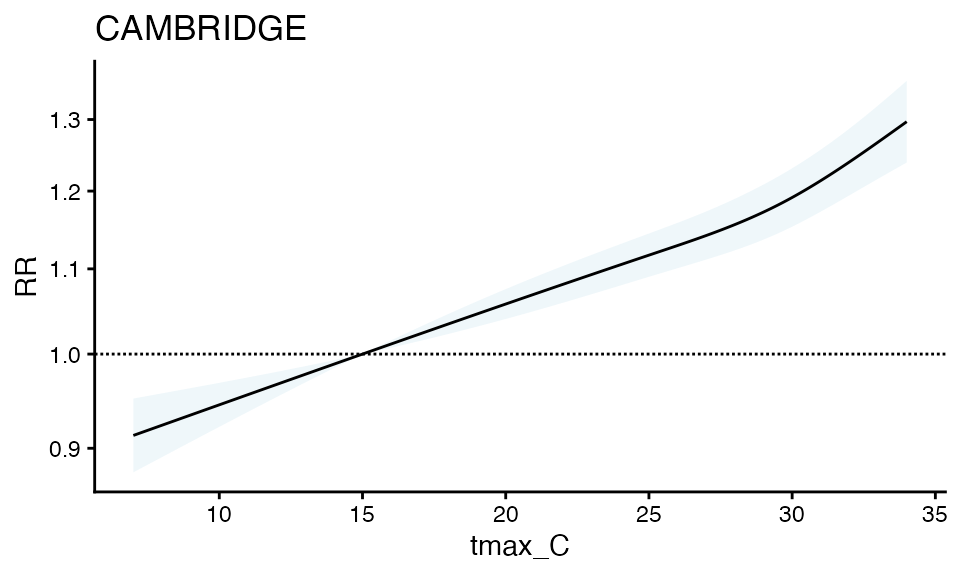

You can also make a forest plot at a specific exposure value

``` r

forest_plot(ma_model, exposure_val = 25.1)
#> Warning in forest_plot.condPois_2stage(ma_model, exposure_val = 25.1): plotting
#> by group since n_geos > 20
```

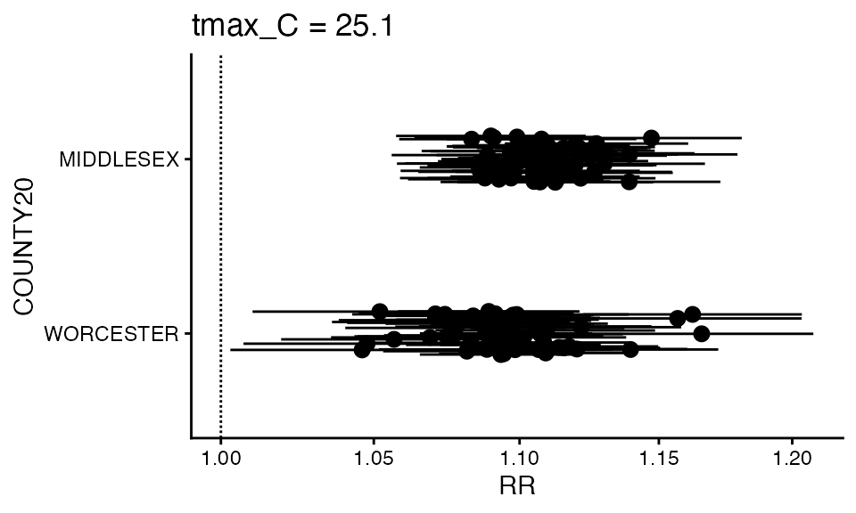

You can also make a spatial plot at a specific exposure value:

``` r

spatial_plot(ma_model, shp = ma_towns, exposure_val = 25.1)
```

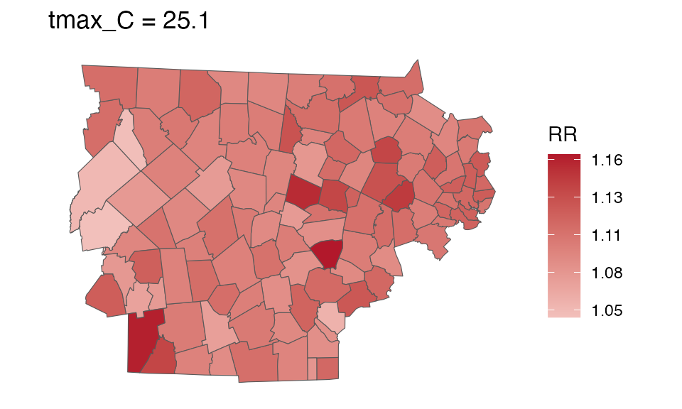

### getRR

For your own purposes, each of these objects has a `getRR` function

``` r

getRR(ma_model)
#>           TOWN20  COUNTY20 tmax_C        RR      RRlb      RRub     model_class
#>           <char>    <char>  <num>     <num>     <num>     <num>          <char>
#>     1:     ACTON MIDDLESEX    7.0 0.9563939 0.9169757 0.9975065 condPois_2stage
#>     2:     ACTON MIDDLESEX    7.1 0.9568875 0.9179730 0.9974517 condPois_2stage
#>     3:     ACTON MIDDLESEX    7.2 0.9573815 0.9189714 0.9973970 condPois_2stage
#>     4:     ACTON MIDDLESEX    7.3 0.9578757 0.9199708 0.9973425 condPois_2stage
#>     5:     ACTON MIDDLESEX    7.4 0.9583704 0.9209713 0.9972882 condPois_2stage
#>    ---                                                                         
#> 32510: WORCESTER WORCESTER   33.6 1.2260190 1.1798181 1.2740291 condPois_2stage
#> 32511: WORCESTER WORCESTER   33.7 1.2277178 1.1808892 1.2764033 condPois_2stage
#> 32512: WORCESTER WORCESTER   33.8 1.2294189 1.1819524 1.2787916 condPois_2stage
#> 32513: WORCESTER WORCESTER   33.9 1.2311225 1.1830083 1.2811935 condPois_2stage
#> 32514: WORCESTER WORCESTER   34.0 1.2328284 1.1840574 1.2836083 condPois_2stage
```

## Calculate attributable numbers

See more details in
[`vignette("attributable_number")`](http://chadmilando.com/cityClimateHealth/articles/attributable_number.md),
but here is a brief demo

### Population data

The first step of calculating attributable numbers is having a
population data estimate.

This varies a lot by place and dataset, so we don’t include
functionality for it (but an example of how this could be done can be
seen in
[`vignette("get_pop_estimates")`](http://chadmilando.com/cityClimateHealth/articles/get_pop_estimates.md)).

Assume you are starting with a dataset for the entire timeframe that
looks like this:

``` r

library(data.table)
data("ma_pop_data")
setDT(ma_pop_data)
ma_pop_data
#>               TOWN20 Female_0-17 Female_18-64 Female_65+ Male_0-17 Male_18-64
#>               <char>       <num>        <num>      <num>     <num>      <num>
#>   1:      BARNSTABLE        3899        15017       6014      4499      14035
#>   2:          BOURNE        1891         5751       3212      1489       5302
#>   3:        BREWSTER         634         2518       2007       833       2628
#>   4:         CHATHAM         163         1477       1759       480       1265
#>   5:          DENNIS         573         3792       3133       784       4101
#>  ---                                                                         
#> 347:   WEST BOYLSTON         619         2021       1107       604       2554
#> 348: WEST BROOKFIELD         343         1162        578       243       1002
#> 349:     WESTMINSTER         847         2371       1131       762       2028
#> 350:      WINCHENDON        1254         3318        711      1031       3134
#> 351:       WORCESTER       18779        67750      15995     21129      69365
#>      Male_65+
#>         <num>
#>   1:     5458
#>   2:     2810
#>   3:     1721
#>   4:     1463
#>   5:     2359
#>  ---         
#> 347:      790
#> 348:      495
#> 349:     1081
#> 350:      924
#> 351:    11173
```

Need to do some transformations:

- pivot longer
- variable clean

Note again, this processing will vary by application so this approach is
not prescriptive !

Pivot longer:

``` r

ma_pop_data_long <- melt(
  ma_pop_data,
  id.vars = "TOWN20",
  variable.name = "sex_age",
  value.name = "population"
)
```

Variable clean:

``` r

ma_pop_data_long$sex_age <- as.character(ma_pop_data_long$sex_age)
varnames <- strsplit(ma_pop_data_long$sex_age, "_", fixed = T)
varnames <- data.frame(do.call(rbind, varnames))
names(varnames) <- c('sex', 'age_grp')
rr <- which(varnames$sex == 'Female')
varnames$sex[rr] <- 'F'
rr <- which(varnames$sex == 'Male')
varnames$sex[rr] <- 'M'
ma_pop_data_long$sex = varnames$sex
ma_pop_data_long$age_grp = varnames$age_grp
ma_pop_data_long$sex_age <- NULL
```

Lets look at it:

``` r

ma_pop_data_long
#>                TOWN20 population    sex age_grp
#>                <char>      <num> <char>  <char>
#>    1:      BARNSTABLE       3899      F    0-17
#>    2:          BOURNE       1891      F    0-17
#>    3:        BREWSTER        634      F    0-17
#>    4:         CHATHAM        163      F    0-17
#>    5:          DENNIS        573      F    0-17
#>   ---                                          
#> 2102:   WEST BOYLSTON        790      M     65+
#> 2103: WEST BROOKFIELD        495      M     65+
#> 2104:     WESTMINSTER       1081      M     65+
#> 2105:      WINCHENDON        924      M     65+
#> 2106:       WORCESTER      11173      M     65+
```

We assume that these properties hold for the entire timeframe of our
analysis, but you could also make a version of this dataset with a
‘year’ column.

### Calculate AN

Now, you can easily calculate attributrable numbers (and rates) using
`calcAN()`.

There are two new inputs that this function needs, in addition to
population data:

- `spatial_agg_type` - what spatial resolution are you summarizing to:
  ‘geo_unit’, ‘geo_unit_grp’, or ‘all’
- `spatial_join_col` - which columns in `ma_outcomes_tbl` are you
  joining `ma_pop_data_long` by

``` r

ma_AN <- calc_AN(ma_model, ma_outcomes_tbl, ma_pop_data_long,
                 spatial_agg_type = 'TOWN20', spatial_join_col = 'TOWN20')
```

From this you get a `rate_table` :

``` r

ma_AN$`_`$rate_table
#>          TOWN20  COUNTY20 population above_MMT mean_annual_attr_rate_est
#>          <char>    <char>      <num>    <lgcl>                     <num>
#>   1:      ACTON MIDDLESEX      23864      TRUE                5222.30137
#>   2:      ACTON MIDDLESEX      23864     FALSE                 -30.38049
#>   3:  ARLINGTON MIDDLESEX      45906      TRUE                5854.89914
#>   4:  ARLINGTON MIDDLESEX      45906     FALSE                 -43.02270
#>   5: ASHBURNHAM WORCESTER       6337      TRUE                4025.95866
#>  ---                                                                    
#> 224: WINCHESTER MIDDLESEX      22809     FALSE                 -51.51475
#> 225:     WOBURN MIDDLESEX      40992      TRUE                5067.45219
#> 226:     WOBURN MIDDLESEX      40992     FALSE                 -21.95550
#> 227:  WORCESTER WORCESTER     204191      TRUE                5012.28017
#> 228:  WORCESTER WORCESTER     204191     FALSE                 -36.36301
#>      mean_annual_attr_rate_lb mean_annual_attr_rate_ub
#>                         <num>                    <num>
#>   1:               4132.79417              6406.250000
#>   2:                -62.85619                -1.047603
#>   3:               4769.62434              6928.751144
#>   4:                -67.01194               -20.408552
#>   5:               3161.88654              4983.036137
#>  ---                                                  
#> 224:                -78.91622               -23.017230
#> 225:               3953.21038              6227.953015
#> 226:                -38.74232                -4.269126
#> 227:               4032.24799              5995.700716
#> 228:                -60.13365               -15.512437
```

and a `number_table`:

``` r

ma_AN$`_`$number_table
#>          TOWN20  COUNTY20 population above_MMT mean_annual_attr_num_est
#>          <char>    <char>      <num>    <lgcl>                    <num>
#>   1:      ACTON MIDDLESEX      23864      TRUE                 1246.250
#>   2:      ACTON MIDDLESEX      23864     FALSE                   -7.250
#>   3:  ARLINGTON MIDDLESEX      45906      TRUE                 2687.750
#>   4:  ARLINGTON MIDDLESEX      45906     FALSE                  -19.750
#>   5: ASHBURNHAM WORCESTER       6337      TRUE                  255.125
#>  ---                                                                   
#> 224: WINCHESTER MIDDLESEX      22809     FALSE                  -11.750
#> 225:     WOBURN MIDDLESEX      40992      TRUE                 2077.250
#> 226:     WOBURN MIDDLESEX      40992     FALSE                   -9.000
#> 227:  WORCESTER WORCESTER     204191      TRUE                10234.625
#> 228:  WORCESTER WORCESTER     204191     FALSE                  -74.250
#>      mean_annual_attr_num_lb mean_annual_attr_num_ub
#>                        <num>                   <num>
#>   1:               986.25000              1528.78750
#>   2:               -15.00000                -0.25000
#>   3:              2189.54375              3180.71250
#>   4:               -30.76250                -9.36875
#>   5:               200.36875               315.77500
#>  ---                                                
#> 224:               -18.00000                -5.25000
#> 225:              1620.50000              2552.96250
#> 226:               -15.88125                -1.75000
#> 227:              8233.48750             12242.68125
#> 228:              -122.78750               -31.67500
```

And you can plot either one

``` r

plot(ma_AN, "num", above_MMT = T)
#> Warning in plot.calcAN(ma_AN, "num", above_MMT = T): plot elements > 20,
#> subsetting to top 20
```

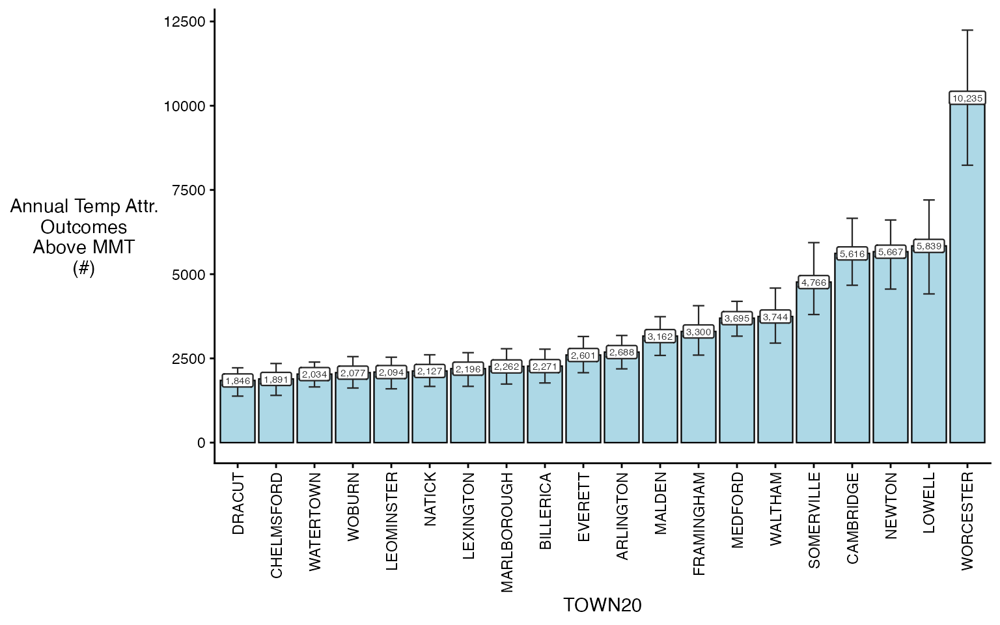

You can also plot spatially

``` r

spatial_plot(ma_AN, shp = ma_towns, table_type = "num", above_MMT = T)
```

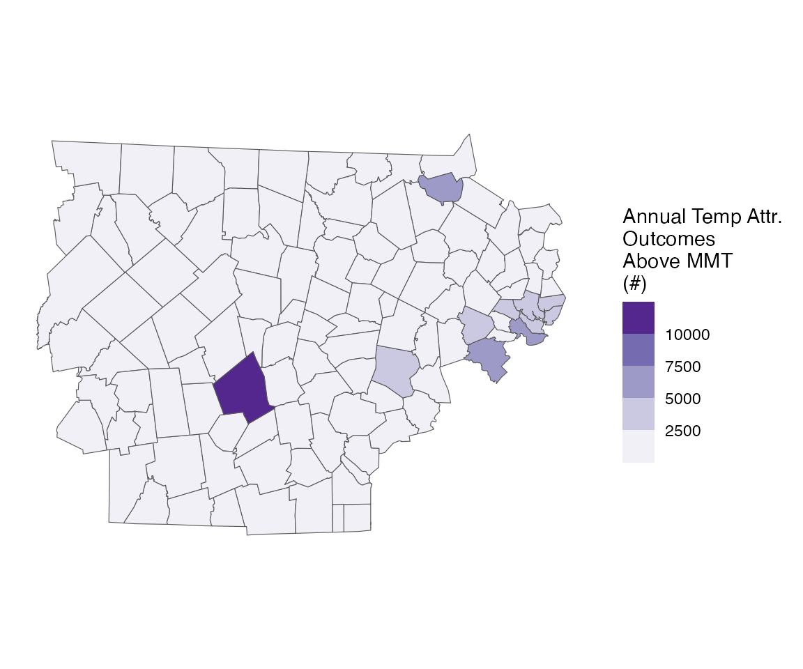

## Running with factors

Very often, we also get asked to run these results, with differences by
both modifiable and non-modifiable factors:

- age group
- sex
- the prevalence of air conditioning in a certain town

We can easily do this, by using the `collapse_to` argument:

``` r

ma_outcomes_tbl_fct <- make_outcome_table(
  deaths_sub, outcome_columns, collapse_to = 'age_grp')
#> Missing values in outcome xgrid were set to 0
```

Lets look at the result:

``` r

head(ma_outcomes_tbl_fct)
#>          date TOWN20  COUNTY20 age_grp daily_deaths                  strata
#>        <IDat> <char>    <char>  <char>        <int>                  <char>
#> 1: 2012-05-01  ACTON MIDDLESEX    0-17           25 ACTON:yr2012:mn05:dow03
#> 2: 2012-05-01  ACTON MIDDLESEX   18-64           24 ACTON:yr2012:mn05:dow03
#> 3: 2012-05-01  ACTON MIDDLESEX     65+           24 ACTON:yr2012:mn05:dow03
#> 4: 2012-05-02  ACTON MIDDLESEX    0-17           26 ACTON:yr2012:mn05:dow04
#> 5: 2012-05-02  ACTON MIDDLESEX   18-64           26 ACTON:yr2012:mn05:dow04
#> 6: 2012-05-02  ACTON MIDDLESEX     65+           26 ACTON:yr2012:mn05:dow04
#>    strata_total     match_strata
#>           <num>           <char>
#> 1:          423 ACTON:2012-05-01
#> 2:          423 ACTON:2012-05-01
#> 3:          423 ACTON:2012-05-01
#> 4:          420 ACTON:2012-05-02
#> 5:          420 ACTON:2012-05-02
#> 6:          420 ACTON:2012-05-02
```

Now, all of our other functions can stay the same:

Running the model (adding the `verbose` argument so you can follow
along)

``` r

ma_model_fct <- condPois_2stage(ma_exposure_matrix, ma_outcomes_tbl_fct,
                                verbose = 1, global_cen = 15)
#> < age_grp : 0-17 >
#> -- validation passed
#> -- stage 1
#> 
#> crossbasis args:
#> 
#> maxlag: 5 
#> 
#> argvar:
#> List of 2
#>  $ fun  : chr "ns"
#>  $ knots: Named num [1:2] 25.7 31.4
#>   ..- attr(*, "names")= chr [1:2] "50%" "90%"
#> 
#> arglag:
#> List of 2
#>  $ fun  : chr "ns"
#>  $ knots: num [1:2] 0.878 2.095
#> 
#> strata:
#> ACTON:yr2012:mn05:dow03
#> strata_min: 0 
#> 
#> 
#> -- mixmeta
#> formula: ~ 1 | COUNTY20/TOWN20 
#> -- stage 2
#> 
#> < age_grp : 18-64 >
#> -- validation passed
#> -- stage 1
#> 
#> crossbasis args:
#> 
#> maxlag: 5 
#> 
#> argvar:
#> List of 2
#>  $ fun  : chr "ns"
#>  $ knots: Named num [1:2] 25.7 31.4
#>   ..- attr(*, "names")= chr [1:2] "50%" "90%"
#> 
#> arglag:
#> List of 2
#>  $ fun  : chr "ns"
#>  $ knots: num [1:2] 0.878 2.095
#> 
#> strata:
#> ACTON:yr2012:mn05:dow03
#> strata_min: 0 
#> 
#> 
#> -- mixmeta
#> formula: ~ 1 | COUNTY20/TOWN20 
#> -- stage 2
#> 
#> < age_grp : 65+ >
#> -- validation passed
#> -- stage 1
#> 
#> crossbasis args:
#> 
#> maxlag: 5 
#> 
#> argvar:
#> List of 2
#>  $ fun  : chr "ns"
#>  $ knots: Named num [1:2] 25.7 31.4
#>   ..- attr(*, "names")= chr [1:2] "50%" "90%"
#> 
#> arglag:
#> List of 2
#>  $ fun  : chr "ns"
#>  $ knots: num [1:2] 0.878 2.095
#> 
#> strata:
#> ACTON:yr2012:mn05:dow03
#> strata_min: 0 
#> 
#> 
#> -- mixmeta
#> formula: ~ 1 | COUNTY20/TOWN20 
#> -- stage 2
```

And plotting the output

``` r

plot(ma_model_fct, "CAMBRIDGE")
```

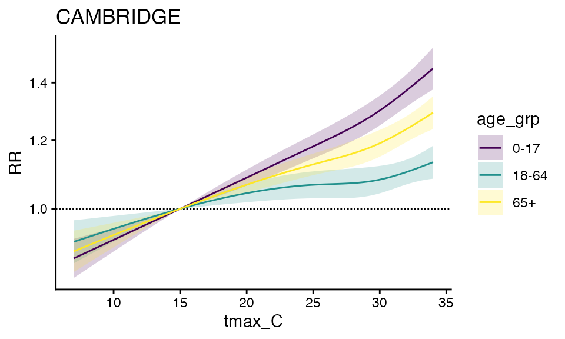

``` r

forest_plot(ma_model_fct, exposure_val = 25.1)
#> Warning in forest_plot.condPois_2stage_list(ma_model_fct, exposure_val = 25.1):
#> plotting by group since n_geos > 20
```

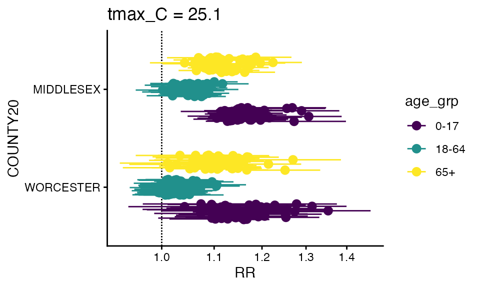

You can also make a spatial plot at a specific exposure value:

``` r

spatial_plot(ma_model_fct, shp = ma_towns, exposure_val = 25.1)
```

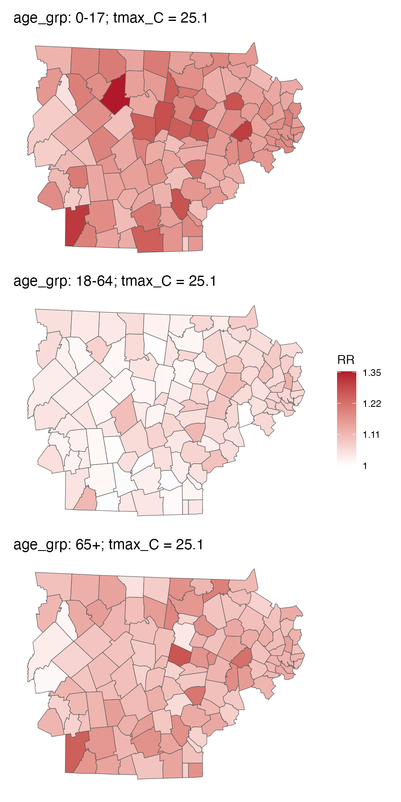

You can also getRR:

``` r

getRR(ma_model_fct)
#>           TOWN20  COUNTY20 tmax_C        RR      RRlb      RRub age_grp
#>           <char>    <char>  <num>     <num>     <num>     <num>  <char>
#>     1:     ACTON MIDDLESEX    7.0 0.9414289 0.8898588 0.9959876    0-17
#>     2:     ACTON MIDDLESEX    7.1 0.9420825 0.8911541 0.9959214    0-17
#>     3:     ACTON MIDDLESEX    7.2 0.9427367 0.8924513 0.9958554    0-17
#>     4:     ACTON MIDDLESEX    7.3 0.9433914 0.8937504 0.9957895    0-17
#>     5:     ACTON MIDDLESEX    7.4 0.9440467 0.8950514 0.9957240    0-17
#>    ---                                                                 
#> 97538: WORCESTER WORCESTER   33.6 1.2231257 1.1800147 1.2678116     65+
#> 97539: WORCESTER WORCESTER   33.7 1.2246071 1.1807440 1.2700996     65+
#> 97540: WORCESTER WORCESTER   33.8 1.2260900 1.1814480 1.2724190     65+
#> 97541: WORCESTER WORCESTER   33.9 1.2275747 1.1821281 1.2747685     65+
#> 97542: WORCESTER WORCESTER   34.0 1.2290611 1.1827859 1.2771468     65+
#>                 model_class
#>                      <char>
#>     1: condPois_2stage_list
#>     2: condPois_2stage_list
#>     3: condPois_2stage_list
#>     4: condPois_2stage_list
#>     5: condPois_2stage_list
#>    ---                     
#> 97538: condPois_2stage_list
#> 97539: condPois_2stage_list
#> 97540: condPois_2stage_list
#> 97541: condPois_2stage_list
#> 97542: condPois_2stage_list
```

And finally, you can `calcAN`, note that both `ma_outcomes_tbl_fct` and
`ma_model_fct` need to have factors, again adding the verbose so you can
see the progress

``` r

ma_AN_fct <- calc_AN(ma_model_fct, 
                     ma_outcomes_tbl_fct, 
                     ma_pop_data_long,
                 spatial_agg_type = 'TOWN20', spatial_join_col = 'TOWN20',
                 verbose = 1)
#> < age_grp : 0-17 >
#> Warning in calc_AN(sub_model, sub_outcomes_tbl, sub_pop_data, spatial_agg_type,
#> : some pop data are zero
#> -- validation passed
#> -- estimate in each geo_unit
#> -- summarize by simulation
#> < age_grp : 18-64 >
#> -- validation passed
#> -- estimate in each geo_unit
#> -- summarize by simulation
#> < age_grp : 65+ >
#> -- validation passed
#> -- estimate in each geo_unit
#> -- summarize by simulation
```

And you can plot either one – some empty bars not because there are no
adults there but because this takes the top 20 in each bin, which don’t
have to overlap. Probably a better way to do this in the future but fine
for diagnostics.

``` r

plot(ma_AN_fct, "num", above_MMT = T)
#> Warning in plot.calcAN_list(ma_AN_fct, "num", above_MMT = T): plot elements >
#> 20, subsetting to top 20
#> Warning in plot.calcAN_list(ma_AN_fct, "num", above_MMT = T): plot elements >
#> 20, subsetting to top 20
#> Warning in plot.calcAN_list(ma_AN_fct, "num", above_MMT = T): plot elements >
#> 20, subsetting to top 20
```

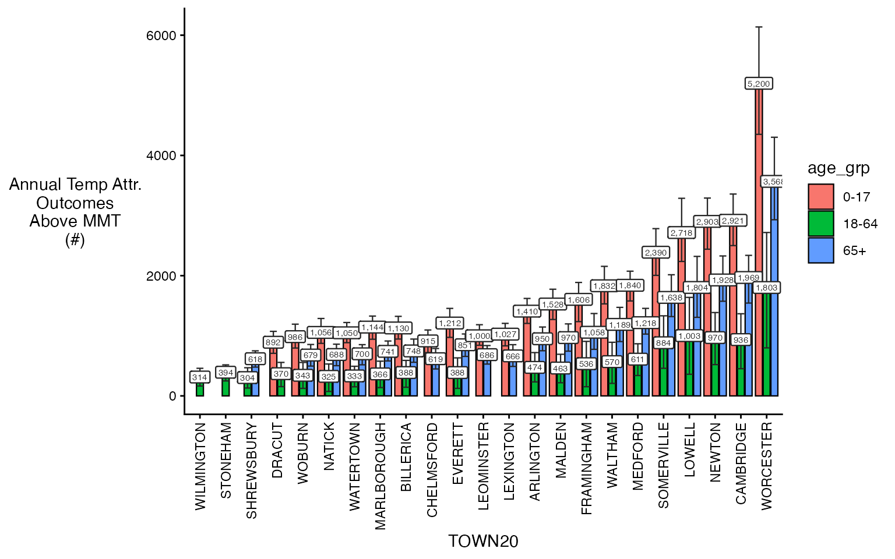

You can also make use of some additional arguments to get plot subsets,
including `spatial_sub` and `ordered_levels`.

``` r

plot(ma_AN_fct, 'rate', above_MMT = T, 
     spatial_sub = c('BOSTON', 'CAMBRIDGE'),
     ordered_levels = c("0-17", "18-64", "65+"))
```

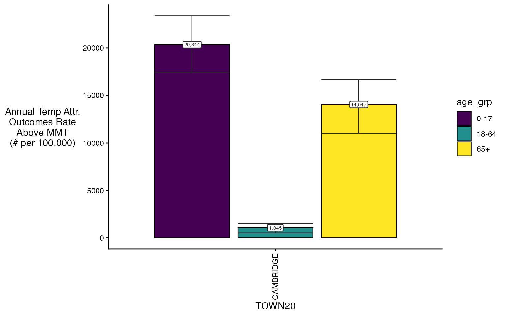

You can also plot spatially

``` r

spatial_plot(ma_AN_fct, shp = ma_towns, table_type = "num", above_MMT = T)
```

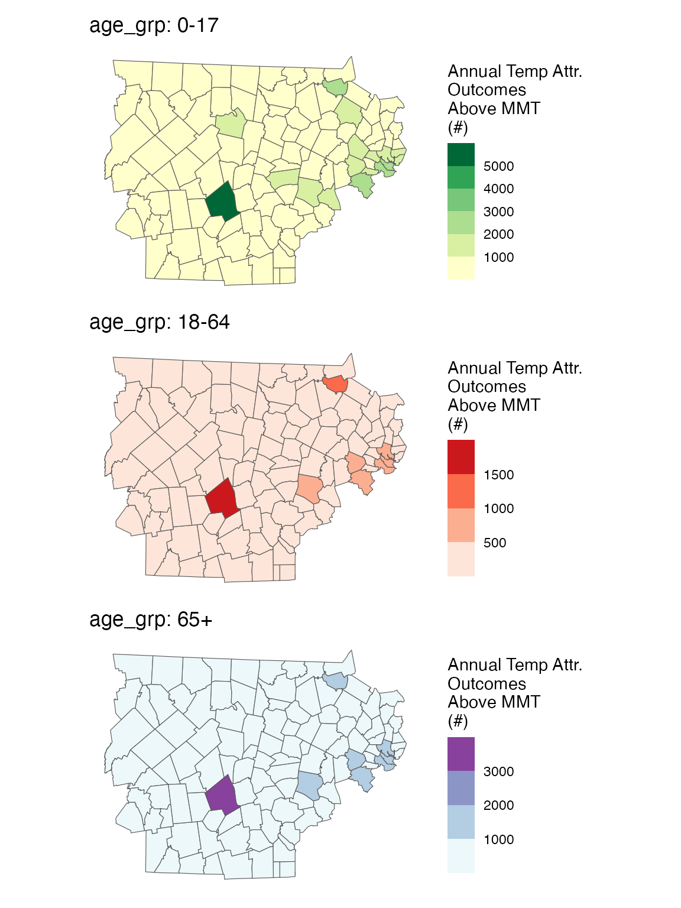
