# Getting started with \`cityClimateHealth\`

## Getting started with `cityClimateHealth`

Here is code that shows the basic skeleton of how this package works. We
can run the model and then calculate attributable numbers easily, and
provide a number of outputs.

``` r

library(cityClimateHealth)
```

## Run the model

### Exposure

First, create the exposure object - you will need to define the
`exposure_columns`.

``` r

library(data.table)

# load a built-in dataset and get a subset
data("ma_exposure") 

exposure_sub <- 
  subset(ma_exposure,
         COUNTY20 %in% c('MIDDLESEX', 'WORCESTER'))

# define columns of ma_exposure
exposure_columns <- list(
  "date" = "date",
  "exposure" = "tmax_C",
  "geo_unit" = "TOWN20",
  "geo_unit_grp" = "COUNTY20"
)

# create the object
ma_exposure_matrix <- make_exposure_matrix(exposure_sub, 
                                           exposure_columns,
                                           time_subset = list(
                                       month = 5:9,
                                       year = 2012:2015
                                     ))
#> -- NA values automatically removed
#> strata dt_by = 'day', setting strata as geo_unit:yr:mn:dow
```

And lets preview this

``` r

head(ma_exposure_matrix)
#>          date TOWN20  COUNTY20  tmax_C                  strata     match_strata
#>        <IDat> <char>    <char>   <num>                  <char>           <char>
#> 1: 2012-05-01  ACTON MIDDLESEX 16.4633 ACTON:yr2012:mn05:dow03 ACTON:2012-05-01
#> 2: 2012-05-02  ACTON MIDDLESEX  8.6743 ACTON:yr2012:mn05:dow04 ACTON:2012-05-02
#> 3: 2012-05-03  ACTON MIDDLESEX 11.1778 ACTON:yr2012:mn05:dow05 ACTON:2012-05-03
#> 4: 2012-05-04  ACTON MIDDLESEX 12.4253 ACTON:yr2012:mn05:dow06 ACTON:2012-05-04
#> 5: 2012-05-05  ACTON MIDDLESEX 12.8489 ACTON:yr2012:mn05:dow07 ACTON:2012-05-05
#> 6: 2012-05-06  ACTON MIDDLESEX 17.7602 ACTON:yr2012:mn05:dow01 ACTON:2012-05-06
#>    explag1 explag2 explag3 explag4 explag5
#>      <num>   <num>   <num>   <num>   <num>
#> 1: 14.0179 14.1931 12.7975 17.5538 16.2753
#> 2: 16.4633 14.0179 14.1931 12.7975 17.5538
#> 3:  8.6743 16.4633 14.0179 14.1931 12.7975
#> 4: 11.1778  8.6743 16.4633 14.0179 14.1931
#> 5: 12.4253 11.1778  8.6743 16.4633 14.0179
#> 6: 12.8489 12.4253 11.1778  8.6743 16.4633
```

### Outcome

Next, create the outcome object. As seen in other tutorials, you can
`collapse_to` a factor level and get outputs that way later on.

``` r

# load a built-in dataset, and get a subset, for speed
data("ma_deaths") 

deaths_sub <- 
  subset(ma_deaths,
        COUNTY20 %in% c('MIDDLESEX', 'WORCESTER'))

# define columns of ma_deaths
outcome_columns <- list(
  "date" = "date",
  "outcome" = "daily_deaths",
  "geo_unit" = "TOWN20",
  "geo_unit_grp" = "COUNTY20"
)

# create the object
ma_outcomes_tbl <- make_outcome_table(deaths_sub, outcome_columns,
                                      time_subset = list(
                                       month = 5:9,
                                       year = 2012:2015
                                     ))
#> Missing outcome values introduced by xgrid were set to 0;
#>             assumes that every time in the dataset should have an outcome value
#> strata dt_by = 'day', setting strata as geo_unit:yr:mn:dow
```

And lets preview this

``` r

head(ma_outcomes_tbl)
#>          date TOWN20  COUNTY20 daily_deaths                  strata
#>        <IDat> <char>    <char>        <int>                  <char>
#> 1: 2012-05-01  ACTON MIDDLESEX           73 ACTON:yr2012:mn05:dow03
#> 2: 2012-05-02  ACTON MIDDLESEX           78 ACTON:yr2012:mn05:dow04
#> 3: 2012-05-03  ACTON MIDDLESEX           78 ACTON:yr2012:mn05:dow05
#> 4: 2012-05-04  ACTON MIDDLESEX           78 ACTON:yr2012:mn05:dow06
#> 5: 2012-05-05  ACTON MIDDLESEX           78 ACTON:yr2012:mn05:dow07
#> 6: 2012-05-06  ACTON MIDDLESEX           72 ACTON:yr2012:mn05:dow01
#>    strata_total     match_strata
#>           <int>           <char>
#> 1:          423 ACTON:2012-05-01
#> 2:          420 ACTON:2012-05-02
#> 3:          414 ACTON:2012-05-03
#> 4:          327 ACTON:2012-05-04
#> 5:          334 ACTON:2012-05-05
#> 6:          334 ACTON:2012-05-06
```

### Run the conditional poisson model

we then run a conditional poisson model.

#### Cross-basis arguments

There are built-in arguments for `argvar` and `arglag` that you can
override if you’d like, but the defaults are:

- `maxlag`: default is 5 (days)
- `argvar`: default is `ns()` and knots at the 50th and 90th percentile
  of unit-specific exposure.
- `arglag`: default is
  `list(fun = 'ns', knots = logknots(maxlag, nk = 2))`

You can also affect the global centering point:

- the default behavior is `global_cen = NULL`, meaning that the mininum
  RR will be used
- you can override this by setting `global_cen`

#### Model types

Now you have several options for running the conditional poisson model:

| Design | Function | Description |
|----|----|----|
| **1-stage design** | `condPois_1stage` | Produces a single set of beta coefficients across all included spatial units. If multiple `geo_units` are present in the input objects, `multi_zone = TRUE` must be set. This option does not use `mixmeta` or `blup`. |
| **2-stage design** | `condPois_2stage` | Estimates beta coefficients for each spatial unit and then uses `mixmeta` and `blup` to obtain more stable estimates. |
| **Spatial Bayes** | `condPois_sb` | Also estimates beta coefficients for each spatial unit, but applies Bayesian methods to stabilize estimates by borrowing information from neighboring spatial units, rather than from the full dataset as in `mixmeta`. This approach is especially useful in settings with small outcome numbers. |

We show code for each but just run `condPois_2stage` in this vignette.

``` r

ma_model <- condPois_2stage(ma_exposure_matrix, 
                            ma_outcomes_tbl,
                            verbose = 1,
                            global_cen = 15)
#> -- validation passed
#> -- stage 1
#> 
#> crossbasis args for geo_unit  ACTON :
#> 
#> maxlag: 5 
#> 
#> argvar:
#> List of 2
#>  $ fun  : chr "ns"
#>  $ knots: Named num [1:2] 25.7 31.4
#>   ..- attr(*, "names")= chr [1:2] "50%" "90%"
#> 
#> arglag:
#> List of 2
#>  $ fun  : chr "ns"
#>  $ knots: num [1:2] 0.878 2.095
#> 
#> strata:
#> ACTON:yr2012:mn05:dow03
#> strata_min: 0 
#> 
#> min_n: 50 
#> 
#> truncate final RR and basis cen:  0 
#> formula:
#>    daily_deaths ~ cb
#> family: quasipoisson
#> 
#> -- mixmeta
#> formula: coef_matrix ~ exp_mean + exp_IQR
#> random: ~ 1 | COUNTY20/TOWN20 
#> -- stage 2
#> truncate final RR and basis cen:  0.01
```

For `condPois_1stage` the call would look like this, where you’d need to
add the argument `multi_zone = T` because there are multiple `geo_units`
in `ma_exposure_matrix`:

``` r

ma_model <- condPois_1stage(ma_exposure_matrix, ma_outcomes_tbl, 
                            multi_zone = T,
                            global_cen = 15)
```

See
[`vignette("one_stage_demo")`](http://climatehealth.city/articles/one_stage_demo.md)
for more details. Note that `forest_plot` and `spatial_plot` are not
implemented for `condPois_1stage` since you can get all of that
information from the RR plot.

And for `condPois_sb`, the only additional information you’d need is a
shapefile showing how the `geo_unit`s are arranged, in this case
`ma_towns` (in a test run this code took 20 minutes to complete for the
full MA dataset \[with maybe some additional bugs to work out\]):

``` r

data("ma_towns")
ma_model <- condPois_sb(ma_exposure_matrix, ma_outcomes_tbl, 
                        global_cen = 15, ma_towns)
```

See
[`vignette("bayesian_demo")`](http://climatehealth.city/articles/bayesian_demo.md)
for more details.

### Plot outputs

And are several plots you can make.

First, a basic RR plot by `geo_unit`:

``` r

plot(ma_model, "CAMBRIDGE")
```

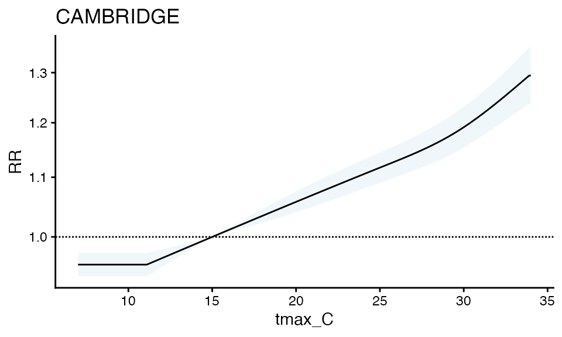

You can also make a forest plot at a specific exposure value

``` r

forest_plot(ma_model, exposure_val = 25.1)
#> Warning in forest_plot.condPois_2stage(ma_model, exposure_val = 25.1): plotting
#> by group since n_geos > 20
```

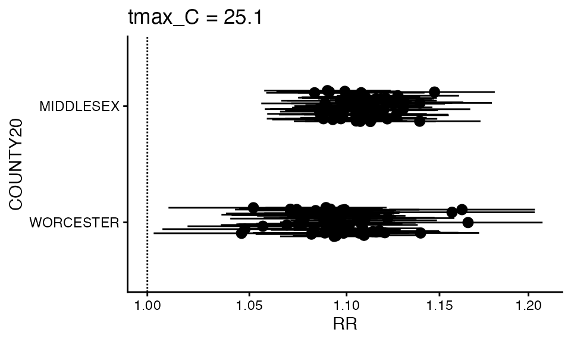

You can also make a spatial plot at a specific exposure value:

``` r

spatial_plot(ma_model, shp = ma_towns, exposure_val = 25.1)
```

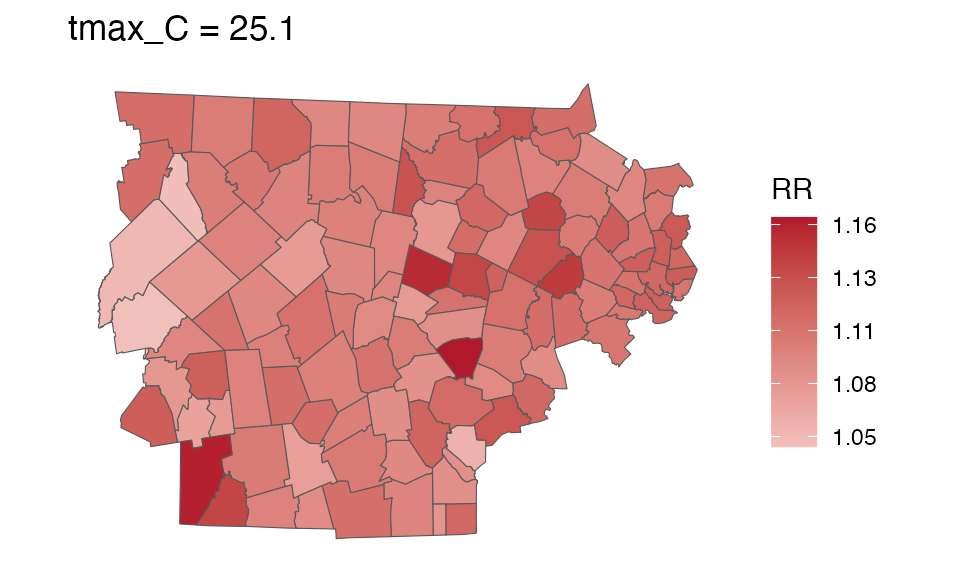

### getRR

For your own purposes, each of these objects has a `getRR` function

``` r

getRR(ma_model)
#>           TOWN20  COUNTY20 tmax_C        RR      RRlb      RRub  stage
#>           <char>    <char>  <num>     <num>     <num>     <num> <char>
#>     1:     ACTON MIDDLESEX    7.0 0.9772782 0.9587192 0.9961965 stage2
#>     2:     ACTON MIDDLESEX    7.1 0.9772782 0.9587192 0.9961965 stage2
#>     3:     ACTON MIDDLESEX    7.2 0.9772782 0.9587192 0.9961965 stage2
#>     4:     ACTON MIDDLESEX    7.3 0.9772782 0.9587192 0.9961965 stage2
#>     5:     ACTON MIDDLESEX    7.4 0.9772782 0.9587192 0.9961965 stage2
#>    ---                                                                
#> 64868: WORCESTER WORCESTER   33.0 1.2067807 1.1632921 1.2518951 stage1
#> 64869: WORCESTER WORCESTER   33.1 1.2079470 1.1632097 1.2544049 stage1
#> 64870: WORCESTER WORCESTER   33.2 1.2091133 1.1631117 1.2569342 stage1
#> 64871: WORCESTER WORCESTER   33.3 1.2102799 1.1630002 1.2594816 stage1
#> 64872: WORCESTER WORCESTER   33.4 1.2114471 1.1628771 1.2620457 stage1
#>            model_class
#>                 <char>
#>     1: condPois_2stage
#>     2: condPois_2stage
#>     3: condPois_2stage
#>     4: condPois_2stage
#>     5: condPois_2stage
#>    ---                
#> 64868: condPois_2stage
#> 64869: condPois_2stage
#> 64870: condPois_2stage
#> 64871: condPois_2stage
#> 64872: condPois_2stage
```

## Calculate attributable numbers

See more details in
[`vignette("attributable_number")`](http://climatehealth.city/articles/attributable_number.md),
but here is a brief demo

### Population data

The first step of calculating attributable numbers is having a
population data estimate.

This varies a lot by place and dataset, so we don’t include
functionality for it (but an example of how this could be done can be
seen in
[`vignette("get_pop_estimates")`](http://climatehealth.city/articles/get_pop_estimates.md)).

Assume you are starting with a dataset for the entire timeframe that
looks like this:

``` r

library(data.table)
data("ma_pop_data")
setDT(ma_pop_data)
ma_pop_data
#>               TOWN20 Female_0-17 Female_18-64 Female_65+ Male_0-17 Male_18-64
#>               <char>       <num>        <num>      <num>     <num>      <num>
#>   1:      BARNSTABLE        3899        15017       6014      4499      14035
#>   2:          BOURNE        1891         5751       3212      1489       5302
#>   3:        BREWSTER         634         2518       2007       833       2628
#>   4:         CHATHAM         163         1477       1759       480       1265
#>   5:          DENNIS         573         3792       3133       784       4101
#>  ---                                                                         
#> 347:   WEST BOYLSTON         619         2021       1107       604       2554
#> 348: WEST BROOKFIELD         343         1162        578       243       1002
#> 349:     WESTMINSTER         847         2371       1131       762       2028
#> 350:      WINCHENDON        1254         3318        711      1031       3134
#> 351:       WORCESTER       18779        67750      15995     21129      69365
#>      Male_65+
#>         <num>
#>   1:     5458
#>   2:     2810
#>   3:     1721
#>   4:     1463
#>   5:     2359
#>  ---         
#> 347:      790
#> 348:      495
#> 349:     1081
#> 350:      924
#> 351:    11173
```

Need to do some transformations:

- pivot longer
- variable clean

Note again, this processing will vary by application so this approach is
not prescriptive !

Pivot longer:

``` r

ma_pop_data_long <- melt(
  ma_pop_data,
  id.vars = "TOWN20",
  variable.name = "sex_age",
  value.name = "population"
)
```

Variable clean:

``` r

ma_pop_data_long$sex_age <- as.character(ma_pop_data_long$sex_age)
varnames <- strsplit(ma_pop_data_long$sex_age, "_", fixed = T)
varnames <- data.frame(do.call(rbind, varnames))
names(varnames) <- c('sex', 'age_grp')
rr <- which(varnames$sex == 'Female')
varnames$sex[rr] <- 'F'
rr <- which(varnames$sex == 'Male')
varnames$sex[rr] <- 'M'
ma_pop_data_long$sex = varnames$sex
ma_pop_data_long$age_grp = varnames$age_grp
ma_pop_data_long$sex_age <- NULL
```

Lets look at it:

``` r

ma_pop_data_long
#>                TOWN20 population    sex age_grp
#>                <char>      <num> <char>  <char>
#>    1:      BARNSTABLE       3899      F    0-17
#>    2:          BOURNE       1891      F    0-17
#>    3:        BREWSTER        634      F    0-17
#>    4:         CHATHAM        163      F    0-17
#>    5:          DENNIS        573      F    0-17
#>   ---                                          
#> 2102:   WEST BOYLSTON        790      M     65+
#> 2103: WEST BROOKFIELD        495      M     65+
#> 2104:     WESTMINSTER       1081      M     65+
#> 2105:      WINCHENDON        924      M     65+
#> 2106:       WORCESTER      11173      M     65+
```

We assume that these properties hold for the entire timeframe of our
analysis, but you could also make a version of this dataset with a
‘year’ column.

### Calculate AN

Now, you can easily calculate attributrable numbers (and rates) using
`calcAN()`.

There are two new inputs that this function needs, in addition to
population data:

- `spatial_agg_type` - what spatial resolution are you summarizing to:
  ‘geo_unit’, ‘geo_unit_grp’, or ‘all’
- `spatial_join_col` - which columns in `ma_outcomes_tbl` are you
  joining `ma_pop_data_long` by

``` r

ma_AN <- calc_AN(ma_model, ma_outcomes_tbl, ma_pop_data_long,
                 spatial_agg_type = 'TOWN20', spatial_join_col = 'TOWN20')
```

From this you get a `rate_table` :

``` r

ma_AN$`_`$rate_table
#>          TOWN20  COUNTY20 population above_MMT mean_annual_attr_rate_est
#>          <char>    <char>      <num>    <lgcl>                     <num>
#>   1:      ACTON MIDDLESEX      23864      TRUE                5187.73047
#>   2:      ACTON MIDDLESEX      23864     FALSE                 -26.19008
#>   3:  ARLINGTON MIDDLESEX      45906      TRUE                5741.07960
#>   4:  ARLINGTON MIDDLESEX      45906     FALSE                 -35.94301
#>   5: ASHBURNHAM WORCESTER       6337      TRUE                4025.95866
#>  ---                                                                    
#> 224: WINCHESTER MIDDLESEX      22809     FALSE                 -42.74628
#> 225:     WOBURN MIDDLESEX      40992      TRUE                5059.82875
#> 226:     WOBURN MIDDLESEX      40992     FALSE                 -18.29625
#> 227:  WORCESTER WORCESTER     204191      TRUE                5008.72957
#> 228:  WORCESTER WORCESTER     204191     FALSE                 -28.71086
#>      mean_annual_attr_rate_lb mean_annual_attr_rate_ub
#>                         <num>                    <num>
#>   1:               4083.45206              6434.168622
#>   2:                -52.38015                -2.042826
#>   3:               4683.17050              6829.703634
#>   4:                -56.63748               -16.051823
#>   5:               3161.88654              4979.091053
#>  ---                                                  
#> 224:                -64.66746               -23.017230
#> 225:               4010.41667              6208.955406
#> 226:                -33.25344                -4.238632
#> 227:               4029.92786              5993.083681
#> 228:                -46.09961               -12.895402
```

and a `number_table`:

``` r

ma_AN$`_`$number_table
#>          TOWN20  COUNTY20 population above_MMT mean_annual_attr_num_est
#>          <char>    <char>      <num>    <lgcl>                    <num>
#>   1:      ACTON MIDDLESEX      23864      TRUE                 1238.000
#>   2:      ACTON MIDDLESEX      23864     FALSE                   -6.250
#>   3:  ARLINGTON MIDDLESEX      45906      TRUE                 2635.500
#>   4:  ARLINGTON MIDDLESEX      45906     FALSE                  -16.500
#>   5: ASHBURNHAM WORCESTER       6337      TRUE                  255.125
#>  ---                                                                   
#> 224: WINCHESTER MIDDLESEX      22809     FALSE                   -9.750
#> 225:     WOBURN MIDDLESEX      40992      TRUE                 2074.125
#> 226:     WOBURN MIDDLESEX      40992     FALSE                   -7.500
#> 227:  WORCESTER WORCESTER     204191      TRUE                10227.375
#> 228:  WORCESTER WORCESTER     204191     FALSE                  -58.625
#>      mean_annual_attr_num_lb mean_annual_attr_num_ub
#>                        <num>                   <num>
#>   1:               974.47500              1535.45000
#>   2:               -12.50000                -0.48750
#>   3:              2149.85625              3135.24375
#>   4:               -26.00000                -7.36875
#>   5:               200.36875               315.52500
#>  ---                                                
#> 224:               -14.75000                -5.25000
#> 225:              1643.95000              2545.17500
#> 226:               -13.63125                -1.73750
#> 227:              8228.75000             12237.33750
#> 228:               -94.13125               -26.33125
```

And you can plot either one

``` r

plot(ma_AN, "num", above_MMT = T)
#> Warning in plot.calcAN(ma_AN, "num", above_MMT = T): plot elements > 20,
#> subsetting to top 20
```

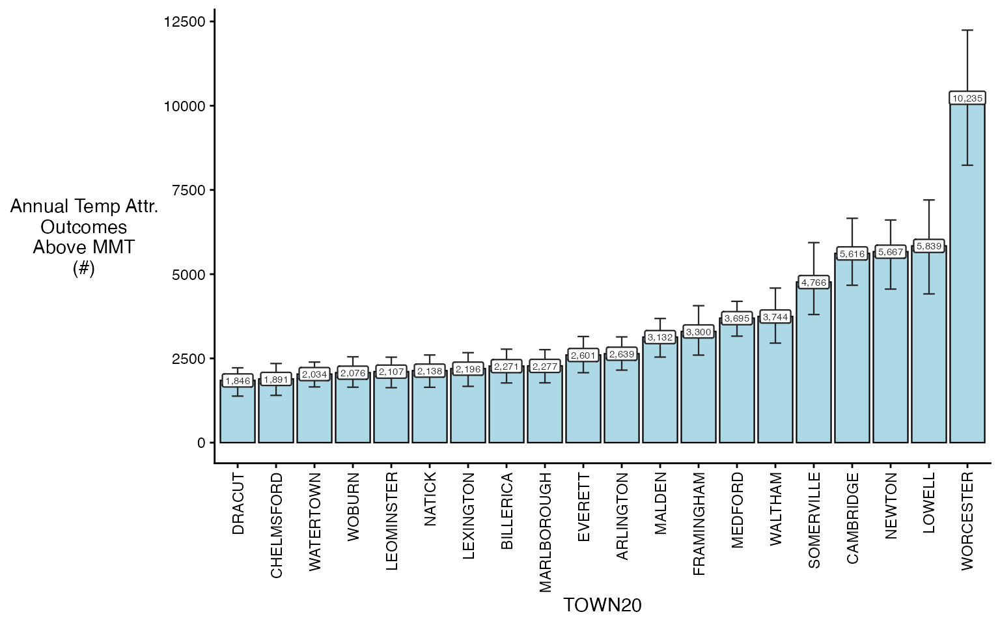

You can also plot spatially

``` r

spatial_plot(ma_AN, shp = ma_towns, table_type = "num", above_MMT = T)
#>          TOWN20  COUNTY20 population above_MMT mean_annual_attr_num_est
#>          <char>    <char>      <num>    <lgcl>                    <num>
#>   1:      ACTON MIDDLESEX      23864      TRUE                 1238.000
#>   2:  ARLINGTON MIDDLESEX      45906      TRUE                 2635.500
#>   3: ASHBURNHAM WORCESTER       6337      TRUE                  255.125
#>   4:      ASHBY MIDDLESEX       3187      TRUE                  156.750
#>   5:    ASHLAND MIDDLESEX      18634      TRUE                  670.500
#>  ---                                                                   
#> 110: WILMINGTON MIDDLESEX      23191      TRUE                 1310.000
#> 111: WINCHENDON WORCESTER      10372      TRUE                  549.125
#> 112: WINCHESTER MIDDLESEX      22809      TRUE                 1422.500
#> 113:     WOBURN MIDDLESEX      40992      TRUE                 2074.125
#> 114:  WORCESTER WORCESTER     204191      TRUE                10227.375
#>      mean_annual_attr_num_lb mean_annual_attr_num_ub
#>                        <num>                   <num>
#>   1:                974.4750               1535.4500
#>   2:               2149.8562               3135.2437
#>   3:                200.3687                315.5250
#>   4:                115.2938                203.2750
#>   5:                482.2125                840.6125
#>  ---                                                
#> 110:                944.2250               1711.0625
#> 111:                422.2812                656.2625
#> 112:               1155.9125               1671.7312
#> 113:               1643.9500               2545.1750
#> 114:               8228.7500              12237.3375
#> Simple feature collection with 114 features and 42 fields
#> Geometry type: MULTIPOLYGON
#> Dimension:     XY
#> Bounding box:  xmin: 132799.7 ymin: 862007.2 xmax: 239462 ymax: 942912.8
#> Projected CRS: NAD83 / Massachusetts Mainland
#> First 10 features:
#>        TOWN20 STATEFP20 COUNTYFP20 COUSUBFP20 COUSUBNS20    GEOID20
#> 1       ACTON        25        017      00380   00618213 2501700380
#> 2   ARLINGTON        25        017      01605   00619393 2501701605
#> 3  ASHBURNHAM        25        027      01885   00618356 2502701885
#> 4       ASHBY        25        017      01955   00618214 2501701955
#> 5     ASHLAND        25        017      02130   00619394 2501702130
#> 6       ATHOL        25        027      02480   00619473 2502702480
#> 7      AUBURN        25        027      02760   00619474 2502702760
#> 8        AYER        25        017      03005   00618215 2501703005
#> 9       BARRE        25        027      03740   00619475 2502703740
#> 10    BEDFORD        25        017      04615   00619395 2501704615
#>         NAMELSAD20 LSAD20 CLASSFP20 MTFCC20 CNECTAFP20 NECTAFP20 NCTADVFP20
#> 1       Acton town     43        T1   G4040        715     71650      71634
#> 2   Arlington town     43        T1   G4040        715     71650      71634
#> 3  Ashburnham town     43        T1   G4040        715     74500       <NA>
#> 4       Ashby town     43        T1   G4040        715     74500       <NA>
#> 5     Ashland town     43        T1   G4040        715     71650      73104
#> 6       Athol town     43        T1   G4040        715     70450       <NA>
#> 7      Auburn town     43        T1   G4040        715     79600       <NA>
#> 8        Ayer town     43        T1   G4040        715     71650      71634
#> 9       Barre town     43        T1   G4040        715     79600       <NA>
#> 10    Bedford town     43        T1   G4040        715     71650      71634
#>    FUNCSTAT20   ALAND20 AWATER20  INTPTLAT20   INTPTLON20 TOWN_ID FIPS_STCO2
#> 1           A  51453349  1115114 +42.4839530 -071.4384947       2      25017
#> 2           A  13319999   886901 +42.4187215 -071.1639124      10      25017
#> 3           A  99284822  6768398 +42.6486969 -071.9198962      11      25027
#> 4           A  61289600  1000254 +42.6762927 -071.8325227      12      25017
#> 5           A  31954435  1389649 +42.2577546 -071.4735257      14      25017
#> 6           A  83649153  2763016 +42.5759263 -072.2295891      15      25027
#> 7           A  40105400  2408374 +42.1988672 -071.8457222      17      25027
#> 8           A  23176782  1437476 +42.5665731 -071.5751350      19      25017
#> 9           A 114858654   718803 +42.4188835 -072.1120769      21      25027
#> 10          A  35385677   457784 +42.4993321 -071.2819012      23      25017
#>    COUNTY20.x TYPE FOURCOLOR AREA_ACRES SQ_MILES POP1960 POP1970 POP1980
#> 1   MIDDLESEX    T         2   12989.35    20.30    7238   14770   17544
#> 2   MIDDLESEX    T         1    3510.40     5.49   49953   53524   48219
#> 3   WORCESTER    T         2   26206.15    40.95    2758    3484    4075
#> 4   MIDDLESEX    T         1   15392.13    24.05    1883    2274    2311
#> 5   MIDDLESEX    T         3    8238.92    12.87    7779    8882    9165
#> 6   WORCESTER    T         1   21352.36    33.36   11637   11185   10634
#> 7   WORCESTER    T         2   10504.64    16.41   14047   15347   14845
#> 8   MIDDLESEX    T         4    6082.13     9.50   14927    7393    6993
#> 9   WORCESTER    T         1   28558.21    44.62    3479    3825    4102
#> 10  MIDDLESEX    T         1    8856.72    13.84   10969   13513   13067
#>    POP1990 POP2000 POP2010 POP2020 POPCH10_20 HOUSING20 SHAPE_AREA SHAPE_LEN
#> 1    17872   20331   21924   24021       2097      9219   52566027  30789.68
#> 2    44630   42389   42844   46308       3464     20461   14206098  16931.37
#> 3     5433    5546    6081    6315        234      2730  106052512  41818.42
#> 4     2717    2845    3074    3193        119      1243   62289742  35416.14
#> 5    12066   14674   16593   18832       2239      7495   33341745  25926.80
#> 6    11451   11299   11584   11945        361      5291   86409922  48179.61
#> 7    15005   15901   16188   16889        701      6999   42510768  24818.12
#> 8     6871    7287    7427    8479       1052      3807   24613491  25017.41
#> 9     4546    5113    5398    5530        132      2262  115570988  43248.14
#> 10   12996   12595   13320   14383       1063      5444   35841874  24810.30
#>    COUNTY20.y population above_MMT mean_annual_attr_num_est
#> 1   MIDDLESEX      23864      TRUE                 1238.000
#> 2   MIDDLESEX      45906      TRUE                 2635.500
#> 3   WORCESTER       6337      TRUE                  255.125
#> 4   MIDDLESEX       3187      TRUE                  156.750
#> 5   MIDDLESEX      18634      TRUE                  670.500
#> 6   WORCESTER      11921      TRUE                  591.750
#> 7   WORCESTER      16849      TRUE                  741.125
#> 8   MIDDLESEX       8408      TRUE                  369.125
#> 9   WORCESTER       5531      TRUE                  194.250
#> 10  MIDDLESEX      14273      TRUE                  792.625
#>    mean_annual_attr_num_lb mean_annual_attr_num_ub
#> 1                 974.4750               1535.4500
#> 2                2149.8562               3135.2437
#> 3                 200.3687                315.5250
#> 4                 115.2938                203.2750
#> 5                 482.2125                840.6125
#> 6                 468.7000                710.4500
#> 7                 576.0187                879.8813
#> 8                 266.9000                457.3625
#> 9                 126.0438                263.2750
#> 10                637.2000                951.2062
#>                          geometry
#> 1  MULTIPOLYGON (((209455.5 91...
#> 2  MULTIPOLYGON (((228807.6 90...
#> 3  MULTIPOLYGON (((167331.8 94...
#> 4  MULTIPOLYGON (((177670.7 93...
#> 5  MULTIPOLYGON (((206659 8896...
#> 6  MULTIPOLYGON (((146318.2 93...
#> 7  MULTIPOLYGON (((175466.6 88...
#> 8  MULTIPOLYGON (((199059.1 92...
#> 9  MULTIPOLYGON (((158242.2 90...
#> 10 MULTIPOLYGON (((222035.1 91...
```

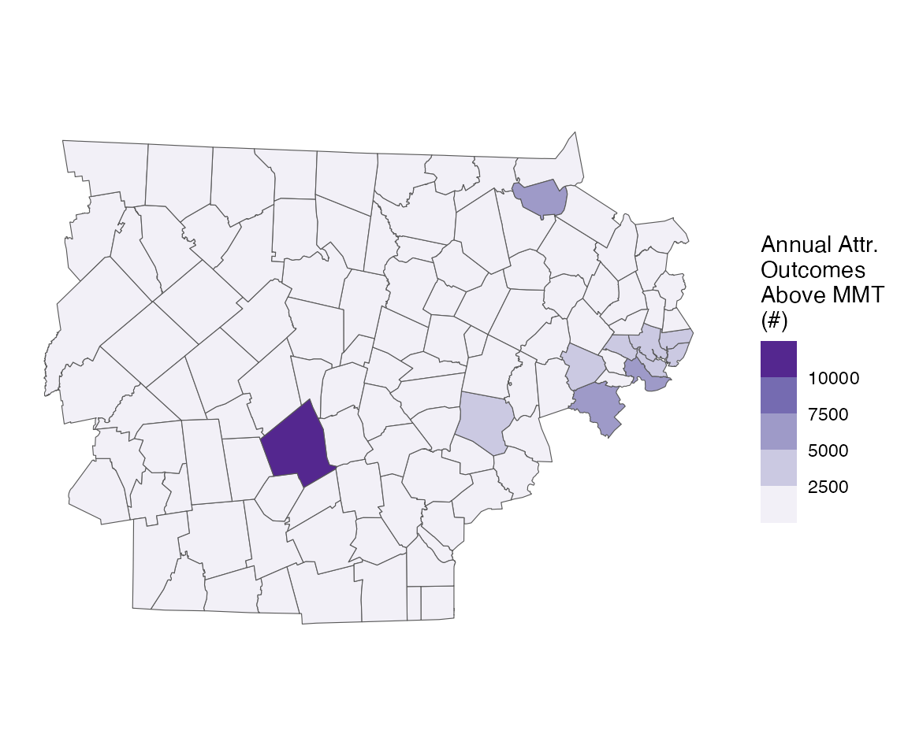

## Running with factors

Very often, we also get asked to run these results, with differences by
both modifiable and non-modifiable factors:

- age group
- sex
- the prevalence of air conditioning in a certain town

We can easily do this, by using the `collapse_to` argument:

``` r

outcome_columns <- list(
  "date" = "date",
  "outcome" = "daily_deaths",
  "geo_unit" = "TOWN20",
  "geo_unit_grp" = "COUNTY20",
  "factor" = "age_grp"
)

ma_outcomes_tbl_fct <- make_outcome_table(
  deaths_sub, outcome_columns, 
  time_subset = list(
       month = 5:9,
       year = 2012:2015
     ))
#> > Combined factor is  age_grp
#> Missing outcome values introduced by xgrid were set to 0;
#>             assumes that every time in the dataset should have an outcome value
#> strata dt_by = 'day', setting strata as geo_unit:yr:mn:dow
```

Lets look at the result:

``` r

head(ma_outcomes_tbl_fct)
#>          date TOWN20  COUNTY20 age_grp daily_deaths                  strata
#>        <IDat> <char>    <char>  <char>        <int>                  <char>
#> 1: 2012-05-01  ACTON MIDDLESEX    0-17           25 ACTON:yr2012:mn05:dow03
#> 2: 2012-05-01  ACTON MIDDLESEX   18-64           24 ACTON:yr2012:mn05:dow03
#> 3: 2012-05-01  ACTON MIDDLESEX     65+           24 ACTON:yr2012:mn05:dow03
#> 4: 2012-05-02  ACTON MIDDLESEX    0-17           26 ACTON:yr2012:mn05:dow04
#> 5: 2012-05-02  ACTON MIDDLESEX   18-64           26 ACTON:yr2012:mn05:dow04
#> 6: 2012-05-02  ACTON MIDDLESEX     65+           26 ACTON:yr2012:mn05:dow04
#>    strata_total     match_strata
#>           <int>           <char>
#> 1:          147 ACTON:2012-05-01
#> 2:          136 ACTON:2012-05-01
#> 3:          140 ACTON:2012-05-01
#> 4:          145 ACTON:2012-05-02
#> 5:          136 ACTON:2012-05-02
#> 6:          139 ACTON:2012-05-02
```

Now, all of our other functions can stay the same:

Running the model (adding the `verbose` argument so you can follow
along)

``` r

ma_model_fct <- condPois_2stage(ma_exposure_matrix, ma_outcomes_tbl_fct,
                                verbose = 1, global_cen = 15)
#> < age_grp : 0-17 >
#> -- validation passed
#> -- stage 1
#> 
#> crossbasis args for geo_unit  ACTON :
#> 
#> maxlag: 5 
#> 
#> argvar:
#> List of 2
#>  $ fun  : chr "ns"
#>  $ knots: Named num [1:2] 25.7 31.4
#>   ..- attr(*, "names")= chr [1:2] "50%" "90%"
#> 
#> arglag:
#> List of 2
#>  $ fun  : chr "ns"
#>  $ knots: num [1:2] 0.878 2.095
#> 
#> strata:
#> ACTON:yr2012:mn05:dow03
#> strata_min: 0 
#> 
#> min_n: 50 
#> 
#> truncate final RR and basis cen:  0 
#> formula:
#>    daily_deaths ~ cb
#> family: quasipoisson
#> 
#> -- mixmeta
#> formula: coef_matrix ~ exp_mean + exp_IQR
#> random: ~ 1 | COUNTY20/TOWN20 
#> -- stage 2
#> truncate final RR and basis cen:  0.01 
#> 
#> < age_grp : 18-64 >
#> -- validation passed
#> -- stage 1
#> 
#> crossbasis args for geo_unit  ACTON :
#> 
#> maxlag: 5 
#> 
#> argvar:
#> List of 2
#>  $ fun  : chr "ns"
#>  $ knots: Named num [1:2] 25.7 31.4
#>   ..- attr(*, "names")= chr [1:2] "50%" "90%"
#> 
#> arglag:
#> List of 2
#>  $ fun  : chr "ns"
#>  $ knots: num [1:2] 0.878 2.095
#> 
#> strata:
#> ACTON:yr2012:mn05:dow03
#> strata_min: 0 
#> 
#> min_n: 50 
#> 
#> truncate final RR and basis cen:  0 
#> formula:
#>    daily_deaths ~ cb
#> family: quasipoisson
#> 
#> -- mixmeta
#> formula: coef_matrix ~ exp_mean + exp_IQR
#> random: ~ 1 | COUNTY20/TOWN20 
#> -- stage 2
#> truncate final RR and basis cen:  0.01 
#> 
#> < age_grp : 65+ >
#> -- validation passed
#> -- stage 1
#> 
#> crossbasis args for geo_unit  ACTON :
#> 
#> maxlag: 5 
#> 
#> argvar:
#> List of 2
#>  $ fun  : chr "ns"
#>  $ knots: Named num [1:2] 25.7 31.4
#>   ..- attr(*, "names")= chr [1:2] "50%" "90%"
#> 
#> arglag:
#> List of 2
#>  $ fun  : chr "ns"
#>  $ knots: num [1:2] 0.878 2.095
#> 
#> strata:
#> ACTON:yr2012:mn05:dow03
#> strata_min: 0 
#> 
#> min_n: 50 
#> 
#> truncate final RR and basis cen:  0 
#> formula:
#>    daily_deaths ~ cb
#> family: quasipoisson
#> 
#> -- mixmeta
#> formula: coef_matrix ~ exp_mean + exp_IQR
#> random: ~ 1 | COUNTY20/TOWN20 
#> -- stage 2
#> truncate final RR and basis cen:  0.01
```

And plotting the output

``` r

plot(ma_model_fct, "CAMBRIDGE")
```

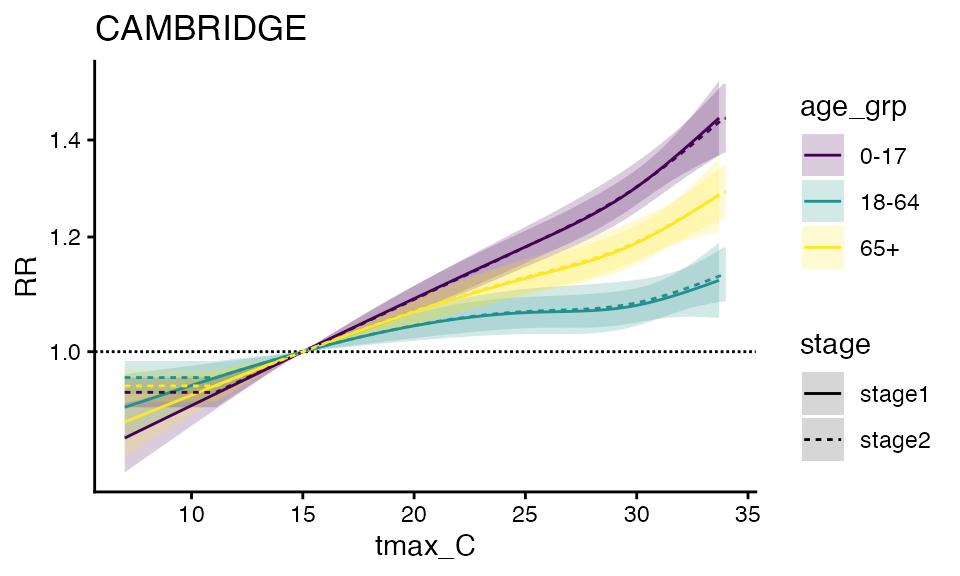

``` r

forest_plot(ma_model_fct, exposure_val = 25.1)
#> Warning in forest_plot.condPois_2stage_list(ma_model_fct, exposure_val = 25.1):
#> plotting by group since n_geos > 20
```

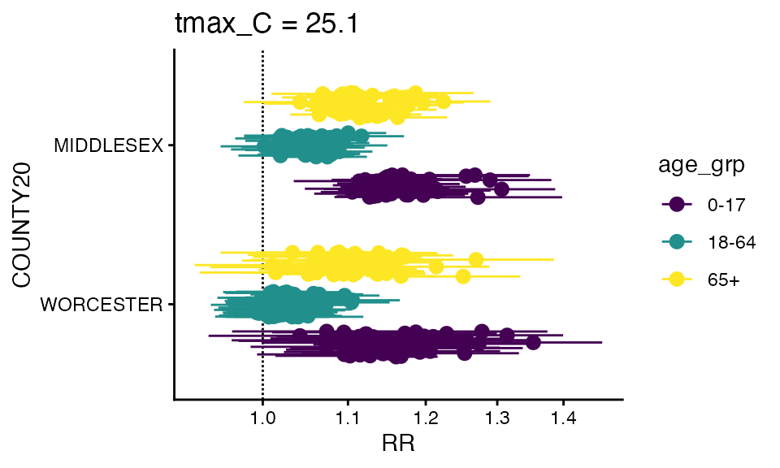

You can also make a spatial plot at a specific exposure value:

``` r

spatial_plot(ma_model_fct, shp = ma_towns, exposure_val = 25.1)
```

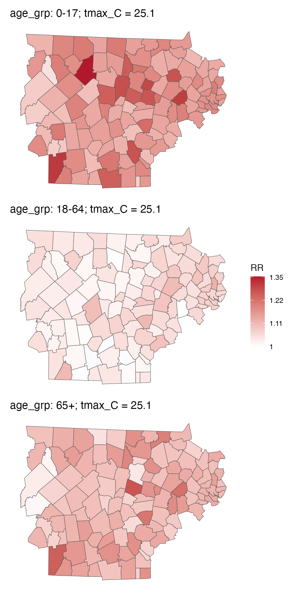

You can also getRR:

``` r

getRR(ma_model_fct)
#>            TOWN20  COUNTY20 tmax_C        RR      RRlb      RRub  stage age_grp
#>            <char>    <char>  <num>     <num>     <num>     <num> <char>  <char>
#>      1:     ACTON MIDDLESEX    7.0 0.9692331 0.9445686 0.9945417 stage2    0-17
#>      2:     ACTON MIDDLESEX    7.1 0.9692331 0.9445686 0.9945417 stage2    0-17
#>      3:     ACTON MIDDLESEX    7.2 0.9692331 0.9445686 0.9945417 stage2    0-17
#>      4:     ACTON MIDDLESEX    7.3 0.9692331 0.9445686 0.9945417 stage2    0-17
#>      5:     ACTON MIDDLESEX    7.4 0.9692331 0.9445686 0.9945417 stage2    0-17
#>     ---                                                                        
#> 194612: WORCESTER WORCESTER   33.0 1.2047947 1.1612618 1.2499595 stage1     65+
#> 194613: WORCESTER WORCESTER   33.1 1.2058778 1.1610980 1.2523846 stage1     65+
#> 194614: WORCESTER WORCESTER   33.2 1.2069606 1.1609184 1.2548287 stage1     65+
#> 194615: WORCESTER WORCESTER   33.3 1.2080433 1.1607252 1.2572904 stage1     65+
#> 194616: WORCESTER WORCESTER   33.4 1.2091265 1.1605202 1.2597685 stage1     65+
#>                  model_class
#>                       <char>
#>      1: condPois_2stage_list
#>      2: condPois_2stage_list
#>      3: condPois_2stage_list
#>      4: condPois_2stage_list
#>      5: condPois_2stage_list
#>     ---                     
#> 194612: condPois_2stage_list
#> 194613: condPois_2stage_list
#> 194614: condPois_2stage_list
#> 194615: condPois_2stage_list
#> 194616: condPois_2stage_list
```

And finally, you can `calcAN`, note that both `ma_outcomes_tbl_fct` and
`ma_model_fct` need to have factors, again adding the verbose so you can
see the progress

``` r

ma_AN_fct <- calc_AN(ma_model_fct, 
                     ma_outcomes_tbl_fct, 
                     ma_pop_data_long,
                 spatial_agg_type = 'TOWN20', spatial_join_col = 'TOWN20',
                 verbose = 1)
#> -- over-writing `scale` argument with factor scales
#> < age_grp : 0-17 >
#> Warning in calc_AN(model = sub_model, outcomes_tbl = sub_outcomes_tbl, pop_data
#> = sub_pop_data, : some pop data are zero
#> -- validation passed
#> -- estimate in each geo_unit
#> -- summarize by simulation
#> < age_grp : 18-64 >
#> -- validation passed
#> -- estimate in each geo_unit
#> -- summarize by simulation
#> < age_grp : 65+ >
#> -- validation passed
#> -- estimate in each geo_unit
#> -- summarize by simulation
```

And you can plot either one – some empty bars not because there are no
adults there but because this takes the top 20 in each bin, which don’t
have to overlap. Probably a better way to do this in the future but fine
for diagnostics.

``` r

plot(ma_AN_fct, "num", above_MMT = T)
#> Warning in plot.calcAN_list(ma_AN_fct, "num", above_MMT = T): plot elements >
#> 20, subsetting to top 20
#> Warning in plot.calcAN_list(ma_AN_fct, "num", above_MMT = T): plot elements >
#> 20, subsetting to top 20
#> Warning in plot.calcAN_list(ma_AN_fct, "num", above_MMT = T): plot elements >
#> 20, subsetting to top 20
```

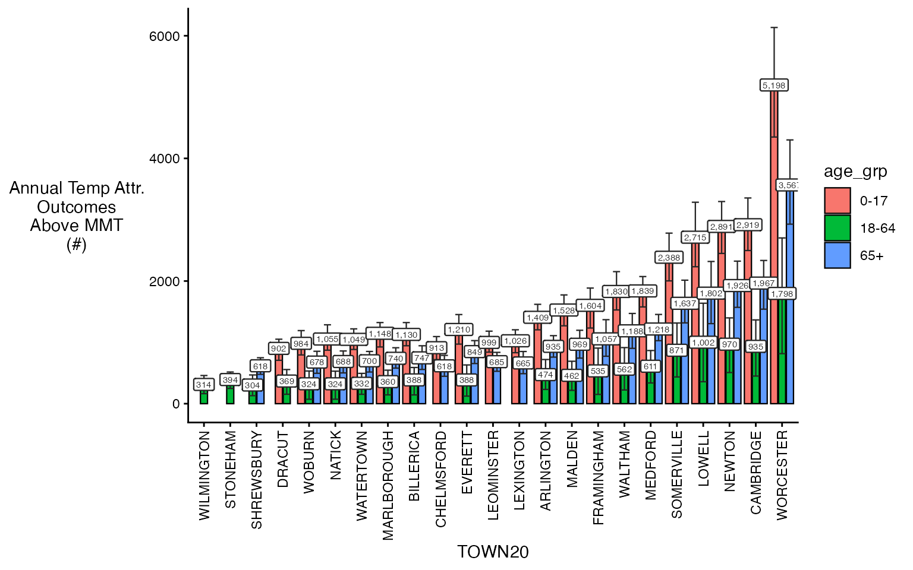

You can also make use of some additional arguments to get plot subsets,
including `spatial_sub` and `ordered_levels`.

``` r

plot(ma_AN_fct, 'rate', above_MMT = T, 
     spatial_sub = c('BOSTON', 'CAMBRIDGE'),
     ordered_levels = c("0-17", "18-64", "65+"))
```

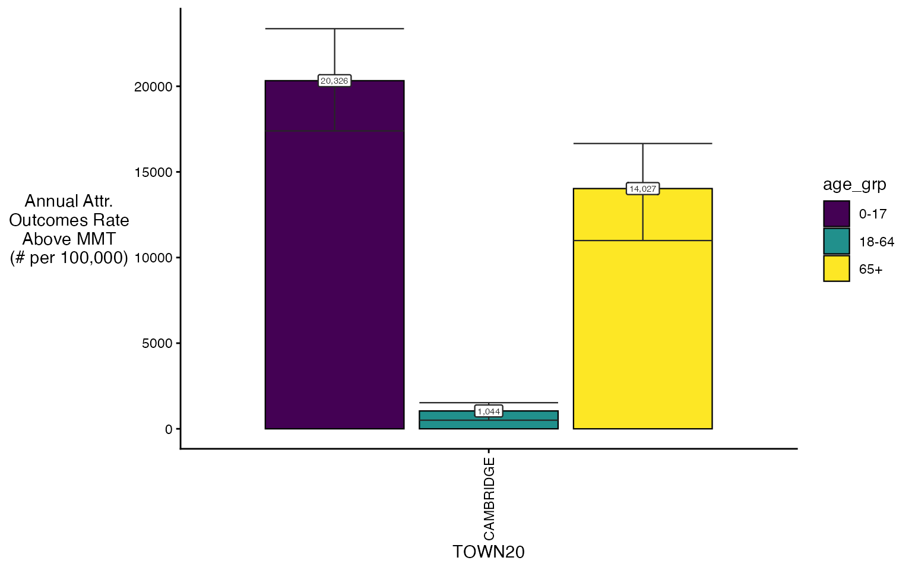

You can also plot spatially

``` r

spatial_plot(ma_AN_fct, shp = ma_towns, table_type = "num", above_MMT = T)
#>               TOWN20  COUNTY20 population above_MMT mean_annual_attr_num_est
#>               <char>    <char>      <num>    <lgcl>                    <num>
#>   1:       WORCESTER WORCESTER      39908      TRUE                 5197.625
#>   2:       CAMBRIDGE MIDDLESEX      14359      TRUE                 2918.625
#>   3:          NEWTON MIDDLESEX      18368      TRUE                 2890.750
#>   4:          LOWELL MIDDLESEX      23724      TRUE                 2714.750
#>   5:      SOMERVILLE MIDDLESEX       8379      TRUE                 2388.250
#>  ---                                                                        
#> 110: EAST BROOKFIELD WORCESTER        371      TRUE                   22.000
#> 111:       PETERSHAM WORCESTER        160      TRUE                   21.375
#> 112:        HARDWICK WORCESTER        591      TRUE                   20.000
#> 113:          OAKHAM WORCESTER        267      TRUE                   17.750
#> 114:     PHILLIPSTON WORCESTER        359      TRUE                   13.875
#>      mean_annual_attr_num_lb mean_annual_attr_num_ub age_grp
#>                        <num>                   <num>  <char>
#>   1:              4348.34375              6134.74375    0-17
#>   2:              2497.53125              3354.62500    0-17
#>   3:              2449.97500              3296.72500    0-17
#>   4:              2233.20625              3284.89375    0-17
#>   5:              2002.56875              2781.10000    0-17
#>  ---                                                        
#> 110:                 4.97500                38.88125    0-17
#> 111:                -0.76250                41.52500    0-17
#> 112:                -3.77500                39.00000    0-17
#> 113:                 3.23750                31.63125    0-17
#> 114:               -10.90625                34.77500    0-17
#> Simple feature collection with 114 features and 43 fields
#> Geometry type: MULTIPOLYGON
#> Dimension:     XY
#> Bounding box:  xmin: 132799.7 ymin: 862007.2 xmax: 239462 ymax: 942912.8
#> Projected CRS: NAD83 / Massachusetts Mainland
#> First 10 features:
#>        TOWN20 STATEFP20 COUNTYFP20 COUSUBFP20 COUSUBNS20    GEOID20
#> 1       ACTON        25        017      00380   00618213 2501700380
#> 2   ARLINGTON        25        017      01605   00619393 2501701605
#> 3  ASHBURNHAM        25        027      01885   00618356 2502701885
#> 4       ASHBY        25        017      01955   00618214 2501701955
#> 5     ASHLAND        25        017      02130   00619394 2501702130
#> 6       ATHOL        25        027      02480   00619473 2502702480
#> 7      AUBURN        25        027      02760   00619474 2502702760
#> 8        AYER        25        017      03005   00618215 2501703005
#> 9       BARRE        25        027      03740   00619475 2502703740
#> 10    BEDFORD        25        017      04615   00619395 2501704615
#>         NAMELSAD20 LSAD20 CLASSFP20 MTFCC20 CNECTAFP20 NECTAFP20 NCTADVFP20
#> 1       Acton town     43        T1   G4040        715     71650      71634
#> 2   Arlington town     43        T1   G4040        715     71650      71634
#> 3  Ashburnham town     43        T1   G4040        715     74500       <NA>
#> 4       Ashby town     43        T1   G4040        715     74500       <NA>
#> 5     Ashland town     43        T1   G4040        715     71650      73104
#> 6       Athol town     43        T1   G4040        715     70450       <NA>
#> 7      Auburn town     43        T1   G4040        715     79600       <NA>
#> 8        Ayer town     43        T1   G4040        715     71650      71634
#> 9       Barre town     43        T1   G4040        715     79600       <NA>
#> 10    Bedford town     43        T1   G4040        715     71650      71634
#>    FUNCSTAT20   ALAND20 AWATER20  INTPTLAT20   INTPTLON20 TOWN_ID FIPS_STCO2
#> 1           A  51453349  1115114 +42.4839530 -071.4384947       2      25017
#> 2           A  13319999   886901 +42.4187215 -071.1639124      10      25017
#> 3           A  99284822  6768398 +42.6486969 -071.9198962      11      25027
#> 4           A  61289600  1000254 +42.6762927 -071.8325227      12      25017
#> 5           A  31954435  1389649 +42.2577546 -071.4735257      14      25017
#> 6           A  83649153  2763016 +42.5759263 -072.2295891      15      25027
#> 7           A  40105400  2408374 +42.1988672 -071.8457222      17      25027
#> 8           A  23176782  1437476 +42.5665731 -071.5751350      19      25017
#> 9           A 114858654   718803 +42.4188835 -072.1120769      21      25027
#> 10          A  35385677   457784 +42.4993321 -071.2819012      23      25017
#>    COUNTY20.x TYPE FOURCOLOR AREA_ACRES SQ_MILES POP1960 POP1970 POP1980
#> 1   MIDDLESEX    T         2   12989.35    20.30    7238   14770   17544
#> 2   MIDDLESEX    T         1    3510.40     5.49   49953   53524   48219
#> 3   WORCESTER    T         2   26206.15    40.95    2758    3484    4075
#> 4   MIDDLESEX    T         1   15392.13    24.05    1883    2274    2311
#> 5   MIDDLESEX    T         3    8238.92    12.87    7779    8882    9165
#> 6   WORCESTER    T         1   21352.36    33.36   11637   11185   10634
#> 7   WORCESTER    T         2   10504.64    16.41   14047   15347   14845
#> 8   MIDDLESEX    T         4    6082.13     9.50   14927    7393    6993
#> 9   WORCESTER    T         1   28558.21    44.62    3479    3825    4102
#> 10  MIDDLESEX    T         1    8856.72    13.84   10969   13513   13067
#>    POP1990 POP2000 POP2010 POP2020 POPCH10_20 HOUSING20 SHAPE_AREA SHAPE_LEN
#> 1    17872   20331   21924   24021       2097      9219   52566027  30789.68
#> 2    44630   42389   42844   46308       3464     20461   14206098  16931.37
#> 3     5433    5546    6081    6315        234      2730  106052512  41818.42
#> 4     2717    2845    3074    3193        119      1243   62289742  35416.14
#> 5    12066   14674   16593   18832       2239      7495   33341745  25926.80
#> 6    11451   11299   11584   11945        361      5291   86409922  48179.61
#> 7    15005   15901   16188   16889        701      6999   42510768  24818.12
#> 8     6871    7287    7427    8479       1052      3807   24613491  25017.41
#> 9     4546    5113    5398    5530        132      2262  115570988  43248.14
#> 10   12996   12595   13320   14383       1063      5444   35841874  24810.30
#>    COUNTY20.y population above_MMT mean_annual_attr_num_est
#> 1   MIDDLESEX       5966      TRUE                  608.875
#> 2   MIDDLESEX       9788      TRUE                 1408.625
#> 3   WORCESTER       1326      TRUE                  157.625
#> 4   MIDDLESEX        496      TRUE                   88.125
#> 5   MIDDLESEX       3539      TRUE                  303.500
#> 6   WORCESTER       2376      TRUE                  285.375
#> 7   WORCESTER       3479      TRUE                  295.875
#> 8   MIDDLESEX       1501      TRUE                  257.125
#> 9   WORCESTER        901      TRUE                  100.000
#> 10  MIDDLESEX       3315      TRUE                  391.625
#>    mean_annual_attr_num_lb mean_annual_attr_num_ub age_grp
#> 1                 471.7812                735.9187    0-17
#> 2                1204.3063               1620.1875    0-17
#> 3                 100.5000                197.4187    0-17
#> 4                  51.1875                120.7500    0-17
#> 5                 229.1875                390.2750    0-17
#> 6                 223.5813                348.9562    0-17
#> 7                 216.8375                388.4312    0-17
#> 8                 198.4125                319.3937    0-17
#> 9                  38.2500                147.7500    0-17
#> 10                318.6187                470.2875    0-17
#>                          geometry
#> 1  MULTIPOLYGON (((209455.5 91...
#> 2  MULTIPOLYGON (((228807.6 90...
#> 3  MULTIPOLYGON (((167331.8 94...
#> 4  MULTIPOLYGON (((177670.7 93...
#> 5  MULTIPOLYGON (((206659 8896...
#> 6  MULTIPOLYGON (((146318.2 93...
#> 7  MULTIPOLYGON (((175466.6 88...
#> 8  MULTIPOLYGON (((199059.1 92...
#> 9  MULTIPOLYGON (((158242.2 90...
#> 10 MULTIPOLYGON (((222035.1 91...
#>               TOWN20  COUNTY20 population above_MMT mean_annual_attr_num_est
#>               <char>    <char>      <num>    <lgcl>                    <num>
#>   1:       WORCESTER WORCESTER     137115      TRUE                 1798.000
#>   2:          LOWELL MIDDLESEX      77712      TRUE                 1002.500
#>   3:          NEWTON MIDDLESEX      53545      TRUE                  970.125
#>   4:       CAMBRIDGE MIDDLESEX      89583      TRUE                  935.125
#>   5:      SOMERVILLE MIDDLESEX      64223      TRUE                  871.250
#>  ---                                                                        
#> 110:   NEW BRAINTREE WORCESTER        568      TRUE                    8.250
#> 111:          OAKHAM WORCESTER       1006      TRUE                    8.000
#> 112:       PETERSHAM WORCESTER        710      TRUE                    7.375
#> 113: EAST BROOKFIELD WORCESTER       1218      TRUE                    7.250
#> 114:     PHILLIPSTON WORCESTER       1283      TRUE                    6.750
#>      mean_annual_attr_num_lb mean_annual_attr_num_ub age_grp
#>                        <num>                   <num>  <char>
#>   1:               816.13750              2702.78750   18-64
#>   2:               358.06250              1638.00625   18-64
#>   3:               507.83750              1399.08125   18-64
#>   4:               450.35000              1366.08125   18-64
#>   5:               435.61250              1315.54375   18-64
#>  ---                                                        
#> 110:                -1.88125                18.50000   18-64
#> 111:                -1.89375                17.63125   18-64
#> 112:                -5.25000                21.75000   18-64
#> 113:                -3.50000                17.88125   18-64
#> 114:                -9.38125                21.38125   18-64
#> Simple feature collection with 114 features and 43 fields
#> Geometry type: MULTIPOLYGON
#> Dimension:     XY
#> Bounding box:  xmin: 132799.7 ymin: 862007.2 xmax: 239462 ymax: 942912.8
#> Projected CRS: NAD83 / Massachusetts Mainland
#> First 10 features:
#>        TOWN20 STATEFP20 COUNTYFP20 COUSUBFP20 COUSUBNS20    GEOID20
#> 1       ACTON        25        017      00380   00618213 2501700380
#> 2   ARLINGTON        25        017      01605   00619393 2501701605
#> 3  ASHBURNHAM        25        027      01885   00618356 2502701885
#> 4       ASHBY        25        017      01955   00618214 2501701955
#> 5     ASHLAND        25        017      02130   00619394 2501702130
#> 6       ATHOL        25        027      02480   00619473 2502702480
#> 7      AUBURN        25        027      02760   00619474 2502702760
#> 8        AYER        25        017      03005   00618215 2501703005
#> 9       BARRE        25        027      03740   00619475 2502703740
#> 10    BEDFORD        25        017      04615   00619395 2501704615
#>         NAMELSAD20 LSAD20 CLASSFP20 MTFCC20 CNECTAFP20 NECTAFP20 NCTADVFP20
#> 1       Acton town     43        T1   G4040        715     71650      71634
#> 2   Arlington town     43        T1   G4040        715     71650      71634
#> 3  Ashburnham town     43        T1   G4040        715     74500       <NA>
#> 4       Ashby town     43        T1   G4040        715     74500       <NA>
#> 5     Ashland town     43        T1   G4040        715     71650      73104
#> 6       Athol town     43        T1   G4040        715     70450       <NA>
#> 7      Auburn town     43        T1   G4040        715     79600       <NA>
#> 8        Ayer town     43        T1   G4040        715     71650      71634
#> 9       Barre town     43        T1   G4040        715     79600       <NA>
#> 10    Bedford town     43        T1   G4040        715     71650      71634
#>    FUNCSTAT20   ALAND20 AWATER20  INTPTLAT20   INTPTLON20 TOWN_ID FIPS_STCO2
#> 1           A  51453349  1115114 +42.4839530 -071.4384947       2      25017
#> 2           A  13319999   886901 +42.4187215 -071.1639124      10      25017
#> 3           A  99284822  6768398 +42.6486969 -071.9198962      11      25027
#> 4           A  61289600  1000254 +42.6762927 -071.8325227      12      25017
#> 5           A  31954435  1389649 +42.2577546 -071.4735257      14      25017
#> 6           A  83649153  2763016 +42.5759263 -072.2295891      15      25027
#> 7           A  40105400  2408374 +42.1988672 -071.8457222      17      25027
#> 8           A  23176782  1437476 +42.5665731 -071.5751350      19      25017
#> 9           A 114858654   718803 +42.4188835 -072.1120769      21      25027
#> 10          A  35385677   457784 +42.4993321 -071.2819012      23      25017
#>    COUNTY20.x TYPE FOURCOLOR AREA_ACRES SQ_MILES POP1960 POP1970 POP1980
#> 1   MIDDLESEX    T         2   12989.35    20.30    7238   14770   17544
#> 2   MIDDLESEX    T         1    3510.40     5.49   49953   53524   48219
#> 3   WORCESTER    T         2   26206.15    40.95    2758    3484    4075
#> 4   MIDDLESEX    T         1   15392.13    24.05    1883    2274    2311
#> 5   MIDDLESEX    T         3    8238.92    12.87    7779    8882    9165
#> 6   WORCESTER    T         1   21352.36    33.36   11637   11185   10634
#> 7   WORCESTER    T         2   10504.64    16.41   14047   15347   14845
#> 8   MIDDLESEX    T         4    6082.13     9.50   14927    7393    6993
#> 9   WORCESTER    T         1   28558.21    44.62    3479    3825    4102
#> 10  MIDDLESEX    T         1    8856.72    13.84   10969   13513   13067
#>    POP1990 POP2000 POP2010 POP2020 POPCH10_20 HOUSING20 SHAPE_AREA SHAPE_LEN
#> 1    17872   20331   21924   24021       2097      9219   52566027  30789.68
#> 2    44630   42389   42844   46308       3464     20461   14206098  16931.37
#> 3     5433    5546    6081    6315        234      2730  106052512  41818.42
#> 4     2717    2845    3074    3193        119      1243   62289742  35416.14
#> 5    12066   14674   16593   18832       2239      7495   33341745  25926.80
#> 6    11451   11299   11584   11945        361      5291   86409922  48179.61
#> 7    15005   15901   16188   16889        701      6999   42510768  24818.12
#> 8     6871    7287    7427    8479       1052      3807   24613491  25017.41
#> 9     4546    5113    5398    5530        132      2262  115570988  43248.14
#> 10   12996   12595   13320   14383       1063      5444   35841874  24810.30
#>    COUNTY20.y population above_MMT mean_annual_attr_num_est
#> 1   MIDDLESEX      14056      TRUE                  253.250
#> 2   MIDDLESEX      28495      TRUE                  473.875
#> 3   WORCESTER       3872      TRUE                   23.750
#> 4   MIDDLESEX       2034      TRUE                   28.250
#> 5   MIDDLESEX      11882      TRUE                   90.625
#> 6   WORCESTER       7320      TRUE                   99.375
#> 7   WORCESTER       9780      TRUE                  121.500
#> 8   MIDDLESEX       5581      TRUE                   58.125
#> 9   WORCESTER       3767      TRUE                   20.750
#> 10  MIDDLESEX       8608      TRUE                  153.875
#>    mean_annual_attr_num_lb mean_annual_attr_num_ub age_grp
#> 1                123.56875               385.70625   18-64
#> 2                232.29375               720.34375   18-64
#> 3                 -5.80000                51.00000   18-64
#> 4                  8.11875                51.39375   18-64
#> 5                 10.70000               165.40625   18-64
#> 6                 40.41250               151.77500   18-64
#> 7                 47.36875               187.55000   18-64
#> 8                 20.36875               104.38125   18-64
#> 9                -23.18125                57.51250   18-64
#> 10                86.96250               222.26250   18-64
#>                          geometry
#> 1  MULTIPOLYGON (((209455.5 91...
#> 2  MULTIPOLYGON (((228807.6 90...
#> 3  MULTIPOLYGON (((167331.8 94...
#> 4  MULTIPOLYGON (((177670.7 93...
#> 5  MULTIPOLYGON (((206659 8896...
#> 6  MULTIPOLYGON (((146318.2 93...
#> 7  MULTIPOLYGON (((175466.6 88...
#> 8  MULTIPOLYGON (((199059.1 92...
#> 9  MULTIPOLYGON (((158242.2 90...
#> 10 MULTIPOLYGON (((222035.1 91...
#>           TOWN20  COUNTY20 population above_MMT mean_annual_attr_num_est
#>           <char>    <char>      <num>    <lgcl>                    <num>
#>   1:   WORCESTER WORCESTER      27168      TRUE                 3566.875
#>   2:   CAMBRIDGE MIDDLESEX      14020      TRUE                 1966.625
#>   3:      NEWTON MIDDLESEX      16540      TRUE                 1926.125
#>   4:      LOWELL MIDDLESEX      13301      TRUE                 1802.375
#>   5:  SOMERVILLE MIDDLESEX       7862      TRUE                 1637.125
#>  ---                                                                    
#> 110:   ROYALSTON WORCESTER        268      TRUE                   20.000
#> 111:      OAKHAM WORCESTER        312      TRUE                   17.000
#> 112:   PETERSHAM WORCESTER        307      TRUE                    9.250
#> 113: PHILLIPSTON WORCESTER        276      TRUE                    6.750
#> 114:    HARDWICK WORCESTER        519      TRUE                    5.000
#>      mean_annual_attr_num_lb mean_annual_attr_num_ub age_grp
#>                        <num>                   <num>  <char>
#>   1:              2927.46875              4301.10625     65+
#>   2:              1541.15000              2335.39375     65+
#>   3:              1570.94375              2324.43125     65+
#>   4:              1305.36875              2319.20000     65+
#>   5:              1317.62500              2013.95000     65+
#>  ---                                                        
#> 110:                 5.98750                31.27500     65+
#> 111:                 5.00000                26.63125     65+
#> 112:                -9.26250                26.13125     65+
#> 113:               -12.64375                22.38125     65+
#> 114:               -15.64375                24.13125     65+
#> Simple feature collection with 114 features and 43 fields
#> Geometry type: MULTIPOLYGON
#> Dimension:     XY
#> Bounding box:  xmin: 132799.7 ymin: 862007.2 xmax: 239462 ymax: 942912.8
#> Projected CRS: NAD83 / Massachusetts Mainland
#> First 10 features:
#>        TOWN20 STATEFP20 COUNTYFP20 COUSUBFP20 COUSUBNS20    GEOID20
#> 1       ACTON        25        017      00380   00618213 2501700380
#> 2   ARLINGTON        25        017      01605   00619393 2501701605
#> 3  ASHBURNHAM        25        027      01885   00618356 2502701885
#> 4       ASHBY        25        017      01955   00618214 2501701955
#> 5     ASHLAND        25        017      02130   00619394 2501702130
#> 6       ATHOL        25        027      02480   00619473 2502702480
#> 7      AUBURN        25        027      02760   00619474 2502702760
#> 8        AYER        25        017      03005   00618215 2501703005
#> 9       BARRE        25        027      03740   00619475 2502703740
#> 10    BEDFORD        25        017      04615   00619395 2501704615
#>         NAMELSAD20 LSAD20 CLASSFP20 MTFCC20 CNECTAFP20 NECTAFP20 NCTADVFP20
#> 1       Acton town     43        T1   G4040        715     71650      71634
#> 2   Arlington town     43        T1   G4040        715     71650      71634
#> 3  Ashburnham town     43        T1   G4040        715     74500       <NA>
#> 4       Ashby town     43        T1   G4040        715     74500       <NA>
#> 5     Ashland town     43        T1   G4040        715     71650      73104
#> 6       Athol town     43        T1   G4040        715     70450       <NA>
#> 7      Auburn town     43        T1   G4040        715     79600       <NA>
#> 8        Ayer town     43        T1   G4040        715     71650      71634
#> 9       Barre town     43        T1   G4040        715     79600       <NA>
#> 10    Bedford town     43        T1   G4040        715     71650      71634
#>    FUNCSTAT20   ALAND20 AWATER20  INTPTLAT20   INTPTLON20 TOWN_ID FIPS_STCO2
#> 1           A  51453349  1115114 +42.4839530 -071.4384947       2      25017
#> 2           A  13319999   886901 +42.4187215 -071.1639124      10      25017
#> 3           A  99284822  6768398 +42.6486969 -071.9198962      11      25027
#> 4           A  61289600  1000254 +42.6762927 -071.8325227      12      25017
#> 5           A  31954435  1389649 +42.2577546 -071.4735257      14      25017
#> 6           A  83649153  2763016 +42.5759263 -072.2295891      15      25027
#> 7           A  40105400  2408374 +42.1988672 -071.8457222      17      25027
#> 8           A  23176782  1437476 +42.5665731 -071.5751350      19      25017
#> 9           A 114858654   718803 +42.4188835 -072.1120769      21      25027
#> 10          A  35385677   457784 +42.4993321 -071.2819012      23      25017
#>    COUNTY20.x TYPE FOURCOLOR AREA_ACRES SQ_MILES POP1960 POP1970 POP1980
#> 1   MIDDLESEX    T         2   12989.35    20.30    7238   14770   17544
#> 2   MIDDLESEX    T         1    3510.40     5.49   49953   53524   48219
#> 3   WORCESTER    T         2   26206.15    40.95    2758    3484    4075
#> 4   MIDDLESEX    T         1   15392.13    24.05    1883    2274    2311
#> 5   MIDDLESEX    T         3    8238.92    12.87    7779    8882    9165
#> 6   WORCESTER    T         1   21352.36    33.36   11637   11185   10634
#> 7   WORCESTER    T         2   10504.64    16.41   14047   15347   14845
#> 8   MIDDLESEX    T         4    6082.13     9.50   14927    7393    6993
#> 9   WORCESTER    T         1   28558.21    44.62    3479    3825    4102
#> 10  MIDDLESEX    T         1    8856.72    13.84   10969   13513   13067
#>    POP1990 POP2000 POP2010 POP2020 POPCH10_20 HOUSING20 SHAPE_AREA SHAPE_LEN
#> 1    17872   20331   21924   24021       2097      9219   52566027  30789.68
#> 2    44630   42389   42844   46308       3464     20461   14206098  16931.37
#> 3     5433    5546    6081    6315        234      2730  106052512  41818.42
#> 4     2717    2845    3074    3193        119      1243   62289742  35416.14
#> 5    12066   14674   16593   18832       2239      7495   33341745  25926.80
#> 6    11451   11299   11584   11945        361      5291   86409922  48179.61
#> 7    15005   15901   16188   16889        701      6999   42510768  24818.12
#> 8     6871    7287    7427    8479       1052      3807   24613491  25017.41
#> 9     4546    5113    5398    5530        132      2262  115570988  43248.14
#> 10   12996   12595   13320   14383       1063      5444   35841874  24810.30
#>    COUNTY20.y population above_MMT mean_annual_attr_num_est
#> 1   MIDDLESEX       3842      TRUE                  411.250
#> 2   MIDDLESEX       7623      TRUE                  935.000
#> 3   WORCESTER       1139      TRUE                   98.125
#> 4   MIDDLESEX        657      TRUE                   31.250
#> 5   MIDDLESEX       3213      TRUE                  240.500
#> 6   WORCESTER       2225      TRUE                  209.125
#> 7   WORCESTER       3590      TRUE                  259.250
#> 8   MIDDLESEX       1326      TRUE                  131.500
#> 9   WORCESTER        863      TRUE                   59.625
#> 10  MIDDLESEX       2350      TRUE                  296.750
#>    mean_annual_attr_num_lb mean_annual_attr_num_ub age_grp
#> 1                281.86875                522.7750     65+
#> 2                759.10625               1109.3500     65+
#> 3                 55.93750                137.3937     65+
#> 4                  2.33125                 57.8000     65+
#> 5                170.48750                316.2187     65+
#> 6                148.22500                265.1562     65+
#> 7                168.61250                335.0812     65+
#> 8                 72.61875                179.8812     65+
#> 9                  2.11875                104.3937     65+
#> 10               232.72500                364.9562     65+
#>                          geometry
#> 1  MULTIPOLYGON (((209455.5 91...
#> 2  MULTIPOLYGON (((228807.6 90...
#> 3  MULTIPOLYGON (((167331.8 94...
#> 4  MULTIPOLYGON (((177670.7 93...
#> 5  MULTIPOLYGON (((206659 8896...
#> 6  MULTIPOLYGON (((146318.2 93...
#> 7  MULTIPOLYGON (((175466.6 88...
#> 8  MULTIPOLYGON (((199059.1 92...
#> 9  MULTIPOLYGON (((158242.2 90...
#> 10 MULTIPOLYGON (((222035.1 91...
```

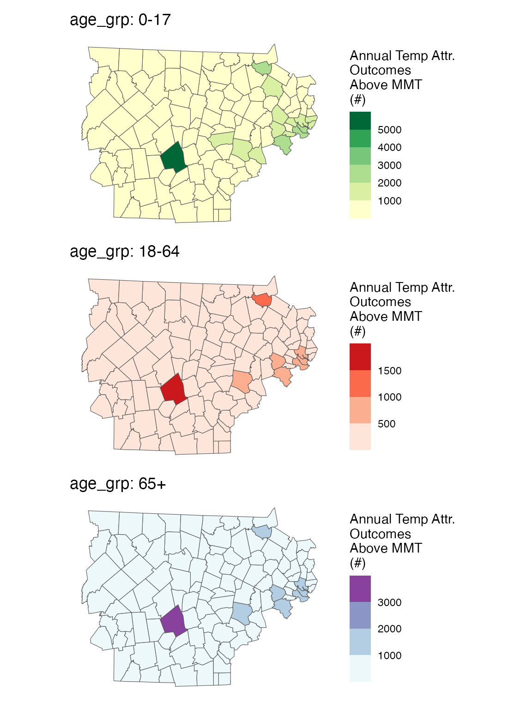
