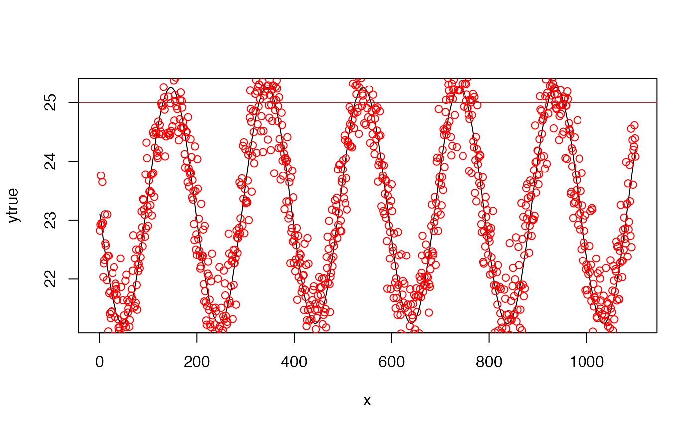
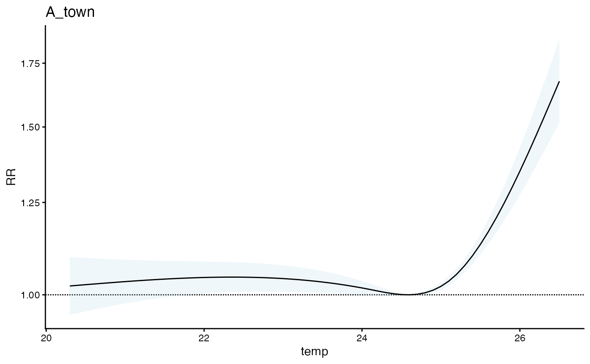

# Test of population sizes

``` r

library(cityClimateHealth)
```

This vignette

Lets first make a simple function to estimate the attributable fraction,
assuming a the following relationship between both exposure magnitude
and exposure timing.

AF = rescale(z from 0 to 0.3)

where

z is a function applied to the last three days of temperature

``` r

t0 = 25
z = function(t3, t2, t1) {
  ifelse(t3 > t0, 0.1 * (t3 - t0), 0) + 
  ifelse(t2 > t0, 0.2 * (t2 - t0), 0) + 
  ifelse(t1 > t0, 0.4 * (t1 - t0), 0)
}
```

Lets test that this works, so simulate some periodic exposure data:

``` r

set.seed(123)
n = 1100
x = 1:n
aa = 2
bb  = 0.2
cc = 100 
vv = 23.25
ytrue = aa * sin(bb / (2*pi)* (x  + cc)) + vv
y = ytrue + rnorm(n, sd = 0.5)
plot(x, ytrue, 'l')
points(x, y, col = 'red')
abline(h = 25, col = 'brown')
```



And now get the underlying AF that are due to excess temperature

``` r

AF_vec <- vector("numeric", n)
AF_vec[1] <- AF_vec[2] <- 0
for(i in 3:n) {
  local_z <- z(y[i], y[i-1], y[i-2])
  AF_vec[i] <- local_z
}

AF_vec <- scales::rescale(AF_vec, to = c(0, 0.3))
summary(AF_vec)
#>    Min. 1st Qu.  Median    Mean 3rd Qu.    Max. 
#> 0.00000 0.00000 0.00000 0.01745 0.00000 0.30000
plot(x, AF_vec, 'l')
```


And now simulate baseline deaths – this doesn’t need to be related to
the exposure beecause all we are tracking is excess mortality.

``` r

baseline_deaths = runif(n, 100, 120)
```

And update deaths based on the AF

``` r

excess_deaths = baseline_deaths * AF_vec
new_deaths = baseline_deaths + excess_deaths
new_deaths = as.integer(round(new_deaths))
plot(x, new_deaths, 'l')
```


So now get an estimate of the exposure response function here, using our
package

``` r

exp_df <- data.frame(x, temp = y)
exp_df$dt = lubridate::make_date(2020, 1, 1) + exp_df$x
exp_df$TOWN20 = 'A_town'
exp_df$COUNTY20 = 'A_county'

exp_df$x <- NULL # a bug to fix

exposure_columns <- list(
  "date" = "dt",
  "exposure" = "temp",
  "geo_unit" = "TOWN20",
  "geo_unit_grp" = "COUNTY20"
)

exp_mat <- make_exposure_matrix(exp_df, exposure_columns,
                                time_subset = list(month = 5:9))
#> strata dt_by = 'day', setting strata as geo_unit:yr:mn:dow
head(exp_mat)
#>            dt TOWN20 COUNTY20     temp                   strata
#>        <IDat> <char>   <char>    <num>                   <char>
#> 1: 2020-05-01 A_town A_county 24.67424 A_town:yr2020:mn05:dow06
#> 2: 2020-05-02 A_town A_county 24.18750 A_town:yr2020:mn05:dow07
#> 3: 2020-05-03 A_town A_county 24.46034 A_town:yr2020:mn05:dow01
#> 4: 2020-05-04 A_town A_county 24.62049 A_town:yr2020:mn05:dow02
#> 5: 2020-05-05 A_town A_county 25.71186 A_town:yr2020:mn05:dow03
#> 6: 2020-05-06 A_town A_county 24.50379 A_town:yr2020:mn05:dow04
#>         match_strata  explag1  explag2  explag3  explag4  explag5
#>               <char>    <num>    <num>    <num>    <num>    <num>
#> 1: A_town:2020-05-01 24.05615 24.09483 24.14950 24.47164 24.51713
#> 2: A_town:2020-05-02 24.67424 24.05615 24.09483 24.14950 24.47164
#> 3: A_town:2020-05-03 24.18750 24.67424 24.05615 24.09483 24.14950
#> 4: A_town:2020-05-04 24.46034 24.18750 24.67424 24.05615 24.09483
#> 5: A_town:2020-05-05 24.62049 24.46034 24.18750 24.67424 24.05615
#> 6: A_town:2020-05-06 25.71186 24.62049 24.46034 24.18750 24.67424
```

And now make the outcome dataset

``` r

deaths_df <- data.frame(dt = exp_df$dt,
                         deaths = new_deaths,
                         TOWN20 = 'A_town', 
                         COUNTY20 = 'A_county')

outcome_columns <- list(
  "date" = "dt",
  "outcome" = "deaths",
  "geo_unit" = "TOWN20",
  "geo_unit_grp" = "COUNTY20"
)

sim_tbl <- make_outcome_table(deaths_df,  outcome_columns,
                              time_subset = list(month = 5:9))
#> Missing outcome values introduced by xgrid were set to 0;
#>             assumes that every time in the dataset should have an outcome value
#> strata dt_by = 'day', setting strata as geo_unit:yr:mn:dow
#> Warning in make_outcome_table(deaths_df, outcome_columns, time_subset = list(month = 5:9)): 2020 in data years, Outcome counts likely impacted by the
#>             COVID-19 Pandemic. Be sure to include a covariate adjustment
#>             or exclude this year from analysis.
sim_tbl
#>              dt TOWN20 COUNTY20 deaths                   strata strata_total
#>          <IDat> <char>   <char>  <int>                   <char>        <int>
#>   1: 2020-05-01 A_town A_county    114 A_town:yr2020:mn05:dow06          561
#>   2: 2020-05-02 A_town A_county    111 A_town:yr2020:mn05:dow07          581
#>   3: 2020-05-03 A_town A_county    107 A_town:yr2020:mn05:dow01          589
#>   4: 2020-05-04 A_town A_county    114 A_town:yr2020:mn05:dow02          455
#>   5: 2020-05-05 A_town A_county    113 A_town:yr2020:mn05:dow03          454
#>  ---                                                                        
#> 608: 2023-09-26 A_town A_county      0 A_town:yr2023:mn09:dow03            0
#> 609: 2023-09-27 A_town A_county      0 A_town:yr2023:mn09:dow04            0
#> 610: 2023-09-28 A_town A_county      0 A_town:yr2023:mn09:dow05            0
#> 611: 2023-09-29 A_town A_county      0 A_town:yr2023:mn09:dow06            0
#> 612: 2023-09-30 A_town A_county      0 A_town:yr2023:mn09:dow07            0
#>           match_strata
#>                 <char>
#>   1: A_town:2020-05-01
#>   2: A_town:2020-05-02
#>   3: A_town:2020-05-03
#>   4: A_town:2020-05-04
#>   5: A_town:2020-05-05
#>  ---                  
#> 608: A_town:2023-09-26
#> 609: A_town:2023-09-27
#> 610: A_town:2023-09-28
#> 611: A_town:2023-09-29
#> 612: A_town:2023-09-30
```

``` r

m1 <- condPois_1stage(exposure_matrix = exp_mat, 
                  outcomes_tbl = sim_tbl)
#> 
#> crossbasis args for geo_unit  A_town :
#> 
#> maxlag: 5 
#> 
#> argvar:
#> List of 2
#>  $ fun  : chr "ns"
#>  $ knots: Named num [1:2] 24.1 25.1
#>   ..- attr(*, "names")= chr [1:2] "50%" "90%"
#> 
#> arglag:
#> List of 2
#>  $ fun  : chr "ns"
#>  $ knots: num [1:2] 0.878 2.095
#> 
#> strata:
#> A_town:yr2020:mn05:dow06
#> strata_min: 0 
#> 
#> min_n: 50 
#> 
#> formula:
#>    deaths ~ cb
#> family: quasipoisson
plot(m1)
```



Looks good (an interesting to note that there is a bump up in the
exposure response curve at the lower end when we know there is not
relationship there … more on that later !)

Now the question we want to answer is, if this relationship is different
for a larger place and we put the two together in the same (i) 1-stage
model or (ii) 2-stage model, how do things change – is the larger county
weighted more.

Lets wrap our entire outcome dataset creation pipeline into a single
function, assuming that the two spatial regions experience the same
temperature.

``` r

get_sim_outcome <- function(exposure_ts, t0, z1, z2, z3, 
                            AFmax, baseline_outcomes) {
  
  # the z function
  z = function(t3, t2, t1) {
    ifelse(t3 > t0, z1 * (t3 - t0), 0) + 
    ifelse(t2 > t0, z2 * (t2 - t0), 0) + 
    ifelse(t1 > t0, z3 * (t1 - t0), 0)
  }
  
  # AF 
  n = length(exposure_ts)
  AF_vec <- vector("numeric", n)
  AF_vec[1] <- AF_vec[2] <- 0
  for(i in 3:n) {
    local_z <- z(exposure_ts[i], exposure_ts[i-1], exposure_ts[i-2])
    AF_vec[i] <- local_z
  }

  AF_vec <- scales::rescale(AF_vec, to = c(0, AFmax))
  
  # outcomes
  excess_outcomes = baseline_outcomes * AF_vec
  new_outcomes = baseline_outcomes + excess_outcomes
  
  # make a df
  return(as.integer(round(new_outcomes)))
}
```

Confirm that it works

``` r

sim_out1 <- get_sim_outcome(exposure_ts = y, t0 = 25, 
                            z1 = 0.1, z2 = 0.2, z3 = 0.4,
                AFmax = 0.3, baseline_outcomes = baseline_deaths)

cor(sim_out1, new_deaths)
#> [1] 1
```

Great, now lets make two for different populations

## Research questions

There are probably a few important edge cases:

- the smaller population has an uncertain and null relationship
- the smaller population has a NEGATIVE relationship
- does the smaller populuation make the larger populations relationship
  worse as compared to a single stage model for the larger population
- at what ratio of population sizes does this really start to matter
