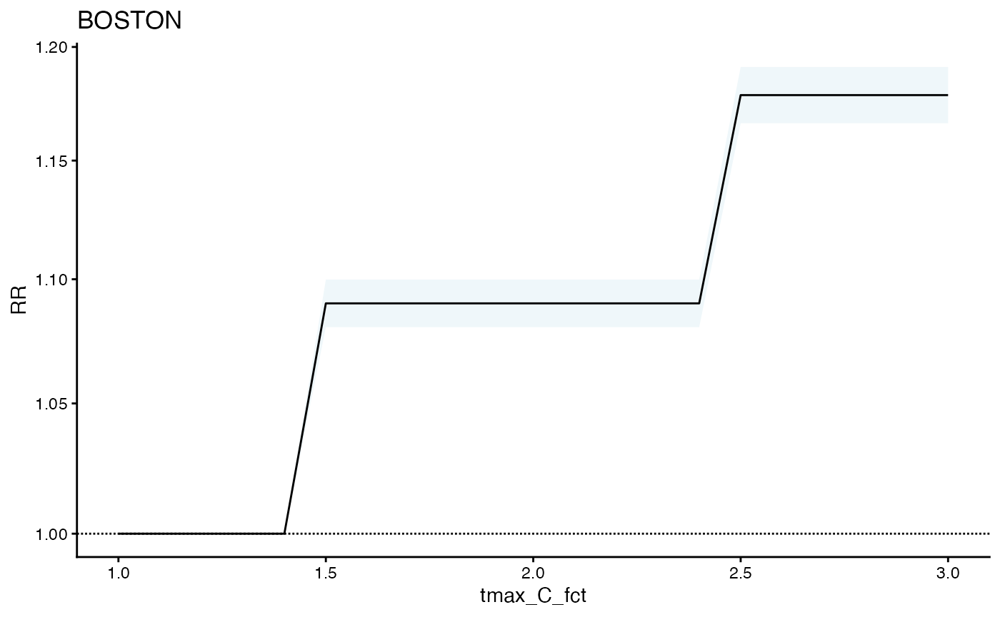

# Using Stratified Exposures

``` r

library(cityClimateHealth)
```

## EXPOSURE

Set up a stratified exposure

``` r


boston_exposure <- subset(ma_exposure, TOWN20 == 'BOSTON')

head(boston_exposure)
#>              date  tmax_C TOWN20 COUNTY20
#> 137783 2010-01-01 -0.3825 BOSTON  SUFFOLK
#> 137784 2010-01-02  1.4337 BOSTON  SUFFOLK
#> 137785 2010-01-03 -1.4163 BOSTON  SUFFOLK
#> 137786 2010-01-04 -0.4483 BOSTON  SUFFOLK
#> 137787 2010-01-05  0.6565 BOSTON  SUFFOLK
#> 137788 2010-01-06  1.2098 BOSTON  SUFFOLK

# convert tmax_C into a factor
boston_exposure$tmax_C_fct <- as.numeric(cut(boston_exposure$tmax_C, 
                                  breaks = c(-50, 25, 30, 50),
                                  include.lowest = T))

boston_exposure$tmax_C_fct
#>    [1]  1  1  1  1  1  1  1  1  1  1  1  1  1  1  1  1  1  1  1  1  1  1  1  1
#>   [25]  1  1  1  1  1  1  1  1  1  1  1  1  1  1  1  1  1  1  1  1  1  1  1  1
#>   [49]  1  1  1  1  1  1  1  1  1  1  1  1  1  1  1  1  1  1  1 NA  1  1  1  1
#>   [73]  1  1  1  1  1  1  1  1  1  1  1  1  1  1  1  1  1  1  1  1  2  1  1  1
#>   [97]  3  1  1  1  1  1  1  1  1  1  1  1  1  1  1  1  1  1  1  1  1  1  2  3
#>  [121]  2  2  2  1  1  1  1  1  1  1  1  1  1  1  1  1  1  2  1  1  1  2  3  3
#>  [145]  1  2  2  2  1  2  2  2  2  3  1  1  1  1  1  1  1  1  2  2  1  1  3  3
#>  [169]  3  3  2  2  3  2  2  2  3  3  2  1  2  3  3  3  3  3  3  3  2  3  3  1
#>  [193]  2  3  3  3  3  2  3  2  2  3  3  2  3  3  3  2  2  2  2  3  3  3  3  2
#>  [217]  3  3  3  3  2  2  2  2  2  3  2  3  2  2  1  1  1  1  2  2  2  3  3  3
#>  [241]  3  3  2  2  1  2  2  2  1  1  1  1  1  1  1 NA  1  1  1  1  1  2  1  2
#>  [265]  3  1  1  1  2  2  2  1  1  1  1  1  1  1  1  1  1  1  1  1  1  1  1  1
#>  [289]  1  1  1  1  1  1  1  1  1  1  1  1  1  1  1  1  1  1  1  1  1  1  1  1
#>  [313]  1  1  1  1  1  1  1  1  1  1  1  1  1  1  1  1  1  1  1  1  1  1  1  1
#>  [337]  1  1  1  1  1  1  1  1  1  1  1  1  1  1  1  1  1  1  1  1  1  1  1  1
#>  [361]  1  1  1  1  1  1  1  1  1  1  1  1  1  1  1  1  1  1  1  1  1  1  1  1
#>  [385]  1  1  1  1  1  1  1  1  1  1  1  1  1  1  1  1  1  1  1  1  1  1  1  1
#>  [409]  1  1  1  1  1  1  1  1  1  1  1  1  1  1  1  1  1  1  1  1  1  1  1  1
#>  [433] NA  1  1  1  1  1  1  1  1  1  1  1  1  1  1  1  1  1  1  1  1  1  1  1
#>  [457]  1  1  1  1  1  1  1  1  1  1  1  1  1  1  1  1  1  2  1  1  1  1  1  1
#>  [481]  1  1  1  1  1  1  1  1  1  1  1  1  1  1  1  1  1  1  2  1  2  3  2  3
#>  [505]  3  2  3  1  1  1  2  3  3  3  1  1  1  1 NA  1  3  1  2  2  2  2  1  1
#>  [529]  1  1  2  2  2  2  2  2  2  2  3  3  3  2  2  2  2  3  3  3  2  2  3  3
#>  [553]  2  3  3  3  3  3  3  1  2  2  2  3 NA  3  3  2  2  2  2  2  2  2  2  2
#>  [577]  1  1  1  2  3  3  3  3  1  2  2 NA  2  2  1  2  2  2  2  1  2  2  2  1
#>  [601]  1  1  2  1  1  2  2  2  1  1  1  1  1  1  2  1  1  2  2  1  1  1  1  1
#>  [625]  1  1  1  1  1  1  2  2  1  1  1  1  1  1  1  1  1  1  1  1  1  1  1 NA
#>  [649]  1  1  1  1  1  1  1  1  1  1  1  1  1  1  1  1 NA  1  1  1  1  1  1  1
#>  [673]  1  1  1  1 NA  1  1  1  1  1  1  1  1  1  1  1  1  1  1  1  1  1  1  1
#>  [697]  1  1  1  1  1  1  1  1  1  1  1  1  1  1  1  1  1  1  1  1  1  1  1  1
#>  [721]  1  1  1  1  1  1  1  1  1  1  1  1  1  1  1  1  1  1  1  1  1  1  1  1
#>  [745]  1  1  1  1  1  1 NA  1  1  1  1  1  1  1  1  1  1  1  1  1  1  1  1  1
#>  [769]  1  1  1  1  1  1  1  1  1  1  1  1  1  1  1  1  1  1  1  1  1  2  2  2
#>  [793]  2  2  1  1  1  1  1  1  1  1  1  1  1  1  1  1  1  1  1  1  1  1  1  1
#>  [817]  1  2  3  2  1  1  2  2  1  1  1  1  1  1  1  1  1  1  1  1  1  1  1  1
#>  [841]  1  1  1  1  2 NA  1  1  1  1  1  2  2  1  1  2  2  1  2  1  1  1  2  2
#>  [865]  1  1  1  1  1  1  1  2  2  2  1  2  1  1  1  1  1  1  1  3  3  3  3  2
#>  [889]  1  1  1  2  3  3  3  2  2  3  2  3  2  3  2  2  3  3  3  3  3  3  3  3
#>  [913]  2  1  2  3  3  3  2  2  1  2  1  2  2  2  3  3  2  2  3  3  2  2  2  2
#>  [937]  2  2  2  3  1  1  2  2  2  3  2  2  2  2  2  1  2  3  2  2  2  1  2  2
#>  [961]  3  2  1  1  1  2  2  2  1  1  1  1  1  1  1  1  1  1  1  1  1  1  1  1
#>  [985]  1  1  1  1  2  1  1  1  1  1  1  1  1  1  1  1  1  1  1  1  1  1  1  1
#> [1009]  1  1  1  1  1  1  1  1  1  1  1  1  1  1  1  1  1  1  1  1 NA  1  1  1
#> [1033]  1 NA  1  1  1  1 NA  1  1  1  1  1  1  1  1  1  1  1  1  1  1 NA  1  1
#> [1057]  1  1  1  1  1  1  1  1  1  1  1  1  1  1  1  1  1  1  1  1  1  1  1  1
#> [1081]  1  1  1  1  1  1  1  1  1  1  1  1  1  1  1  1  1  1  1  1  1  1  1  1
#> [1105]  1  1  1  1  1  1  1  1  1  1  1  1  1  1  1  1  1  1  1  1  1  1  1  1
#> [1129]  1  1  1  1  1  1  1  1  1  1  1  1  1  1  1  1  1  1  1  1  1  1  1  1
#> [1153] NA  1  1  1  1  1  1  1  1  1  1  1  1  1  1  1  1  1  1  1  1  1  1  1
#> [1177]  1 NA  1  1  1  1  1  1  1  1  1  1  1  1  1  1  2  1  1  1  1  2  1  1
#> [1201]  2  1  1  1  1  1  2  1  1  1  2  1  1  1  1 NA  1  1  1  1  3  3  3  3
#> [1225]  2  1  1  1  1  1 NA  1  1  1  1  1  2  1  2  1  1  2  2  2  3  3  3  2
#> [1249]  1  2  2  2  2  2  3  3  3  3  1  2  2  2  2  3  3  3  3  3 NA  2  2  2
#> [1273]  1  1  2  2  2  2  2  2  2  2  2  1  2  2  2  1  2  2  2  1  1 NA  2  2
#> [1297]  2  2  2  3  2  2  2  2  2  2  1  2  2  2  2  2  2  1  1  2  1  1  1  3
#> [1321]  3  1  1  1  1  1  1  2  2  1  1  1  1  1  1  1  1  1  1  2  1  1  1  1
#> [1345]  2  1  1  1  1  1  1  1  1  1  1  1  1  1  1  1  1  1  1  1  1  1  1  1
#> [1369]  1  1  1  1  1  1  1  1  1  1  1  1  1  1  1  1  1  1  1  1  1  1  1  1
#> [1393]  1  1  1  1  1  1  1  1  1  1  1  1  1  1  1  1  1  1  1  1  1  1  1  1
#> [1417]  1  1  1  1  1  1  1  1  1  1  1  1  1  1  1  1  1  1  1  1  1  1  1  1
#> [1441]  1  1  1  1  1  1  1 NA  1  1  1  1  1  1  1  1  1  1  1  1  1  1  1  1
#> [1465]  1  1  1  1  1  1  1  1  1  1  1  1  1  1  1  1  1  1  1 NA  1  1  1  1
#> [1489]  1  1  1  1  1  1  1  1  1  1  1  1  1  1  1  1  1  1  1  1  1  1  1  1
#> [1513]  1  1  1  1  1  1  1  1  1  1  1  1  1  1  1  1  1  1  2  1  1  1  1  1
#> [1537]  1  1  1  1  1  1  1  1  1  1  1  1  1  1  1  1  1  1  1  1  2  2  2  1
#> [1561]  1  2  1  1  1  1  1  1  1  1  1  1  2  1  1  1  1  1  1  2  2  1  1  2
#> [1585]  2 NA  2  2  1  1  1  1  2  2  3  2  2  1  1  1  2  2  3  2  2  2  3 NA
#> [1609]  3  3  3  1  2  2  3  3  3  2  2  2  2  3  3  1  2  2  1  1  2  3  3  2
#> [1633]  2  2  2  2  2  2  2  2  1  1  2  3  2  1  2  2  2  3  2  1  1  1  1  2
#> [1657]  1  2  2  1  1  1  2  3  3  3  2  1  2  2  3  3  2  2  3  1  1  1  1  1
#> [1681]  1  1  1  1  1  1  1  1  1  2  1  1  1  1  1  2  2  1  1  1  1  1  1  1
#> [1705]  1  1  1  1  1  1  1  1  1  2  1  1  1  1  1  1  1  1  1  1  1  1  1  1
#> [1729]  1  1  1  1  1  1  1  1  1  1  1  1  1  1  1  1  1  1  1  1  1  1  1  1
#> [1753]  1  1  1  1  1  1  1  1  1  1  1  1  1  1  1  1  1  1  1  1  1  1  1  1
#> [1777]  1  1  1  1  1  1  1  1  1  1  1  1  1  1  1  1  1  1  1  1  1  1  1  1
#> [1801]  1  1  1  1  1  1  1  1  1  1  1  1  1  1  1  1  1  1  1  1  1  1  1  1
#> [1825]  1  1  1  1  1  1  1 NA  1  1  1  1  1  1  1  1  1  1  1  1  1  1  1  1
#> [1849]  1  1  1  1  1  1  1  1  1  1  1  1  1  1  1  1  1  1  1  1  1  1  1  1
#> [1873]  1  1  1  1  1  1  1  1  1 NA  1  1  1  1  1  1  1  1  1  1  1  1  1  1
#> [1897]  1  1 NA  1  1  1  1  1  1  1  1  2  2  1  2  1  2  3  1  2  1  1  1 NA
#> [1921]  2  1  1  1  1  1  1  2  2  3  2  3  2  2  1  1  1  1  1  1  1  1  1  2
#> [1945]  2  2  2  2  1  1  1  2  2  1  1  2  2  2  2  1  1  1  1  2  2  2  2  1
#> [1969]  2  2  2  2  2  2  2  3  2  2  1  2  2  3  3  3  2  2  1  1  2  2  3  3
#> [1993]  3  2  2  2  3  2  2  2  2  2  1  2  1  2  2  2  3  3 NA  3  3  2  2  2
#> [2017]  1  2  2  2  2  2  2  2  3  2  3  3  1  2  3  3  3  3  1 NA  2  1  1  2
#> [2041]  2  3  3  2  1  1  1  1  1  1  1  1  2  2  2  1  1  1  1  1  1  1  1  1
#> [2065]  1  1  1  1  1  1  1  1  1  1  1  1  1  1  1  1  1  1  1  1  1  1  1  1
#> [2089]  1  1  1  1  1  1  1  1  1  1  1  1  1  1  1  1  1  1  1  1  1  1  1  1
#> [2113]  1  1  1  1  1  1  1  1  1  1  1  1  1  1  1  1  1  1  1  1  1  1  1  1
#> [2137]  1  1  1  1  1  1  1  1  1  1  1  1  1  1  1  1  1  1  1  1  1  1  1  1
#> [2161]  1  1  1  1  1  1  1  1  1  1  1  1  1  1  1  1  1  1  1  1  1  1  1  1
#> [2185]  1  1  1  1  1  1  1  1  1  1  1  1  1  1  1  1  1  1  1  1  1  1  1  1
#> [2209]  1  1  1  1  1  1  2  1  1  1  1  1  1  1  1  1  1  1  1  1  1  1  1  1
#> [2233]  1  1  1  1  1  1  1  1  1  1  1  1  1  1  1  1  1  1  1  1 NA  1  1  1
#> [2257]  1  1  2  1  1  1  1  1  1  1  1  1  1  1  1  1  1  1  1  1  1  1  2  1
#> [2281]  2  1  1  1  1  1  1  1  1  2  1  3  2  2  3  1  2  2  1  1  1  2  1  2
#> [2305]  2  1  1  1  1  1  1 NA  2  2  2  2  3  3  2  1  2  2  2  3  2  2  2  2
#> [2329]  2  2  2  3  2  3  2  1  1  1  2  3  3  2  3  3  3  3  2  2  3  3  3  3
#> [2353]  3  3  3  2  3  1  1  2  2  3  3  3  3  3  2  3  3  2  3  2  2  2  3  2
#> [2377]  2  1  2  3  2  3  3  2  2  2  2  2  2 NA  1  1  1  1  2  3  2  2  1  2
#> [2401]  3  1  1  2  2  1  2  2  2  1  1  1  1  1  1  1  1  1  1  1  1  1  1  1
#> [2425]  1  1  1  1  1  1  1  1  1  1  2  1  1  1  1  1  1  1  1  1  1  1  1  1
#> [2449]  1  1  1  1  1  1  1  1  1  1  1  1  1  1  1  1  1  1  1  1  1  1  1  1
#> [2473]  1  1  1  1  1  1  1  1  1  1  1  1  1  1  1  1  1  1  1  1  1  1  1  1
#> [2497]  1  1  1  1  1  1  1  1  1  1  1  1  1  1  1  1  1  1  1  1  1  1  1  1
#> [2521]  1  1  1  1  1  1  1  1  1  1  1  1  1  1  1  1  1  1  1  1  1  1  1  1
#> [2545]  1  1  1  1  1  1  1  1  1  1  1  1  1  1  1  1  1  1  1  1  1  1  1  1
#> [2569]  1  1  1  1  1  1  1  1  1  1  1  1  1  1  1  1  1  1  1  1  1  1  1  1
#> [2593]  1  1  1  1  1  1  1  1  1  1  2  2  1  1  1  1  2  1  1  1  1  1  1  1
#> [2617]  1  1  1  2  2  1  1  1  1  1  1  1  1  1  1  1  1  1  1  1  1  2  3  3
#> [2641]  3  1  1  1  1  1  1  1  1  1  1  1  1  1  1  1  1  1  1  1  2  2  2  3
#> [2665]  3  3  2  2  1  1  2  3  2  2  2  3  2  2  2  1  2  2  3  2  2  2  2 NA
#> [2689]  2  2  2  2  3  1  1  2  3  3  2  3  3  3  2  1  1  1  2  1  2  1  2  2
#> [2713]  3  2  2  2  2  1  1  1  2  3  2  2  2  2  1  2  2  1  2  2  2  3  2  2
#> [2737]  1  1  1  1  1  1  1  1  1  1  2  2  1  1  1  1  1  2  2  2  2  2  2  2
#> [2761]  1  1  1  1  1  2  3  3  2  3  1  1  1  1  1  2  2  1  2  1  1  1  1  1
#> [2785]  1  1  1  1  1  1  1  1  1  1  1  1  1  1  1  1  1  1  1  1  1  1  1  1
#> [2809]  1  1  1  1  1  1  1  1  1  1  1  1  1  1  1  1  1  1  1  1  1  1  1  1
#> [2833]  1  1  1  1  1  1 NA  1  1  1  1  1  1  1  1  1  1  1  1  1  1  1  1  1
#> [2857]  1  1  1  1  1  1  1  1  1  1  1  1  1  1  1  1  1  1  1  1  1  1  1  1
#> [2881]  1  1  1  1  1  1  1  1  1  1  1  1  1  1  1  1  1  1  1  1  1  1  1  1
#> [2905]  1  1  1  1  1  1  1  1  1  1  1  1  1  1  1  1  1  1  1  1  1  1  1 NA
#> [2929]  1  1  1  1  1  1  1  1  1  1  1  1  1  1  1  1  1  1  1  1  1  1  1  1
#> [2953]  1  1  1  1  1  1  1  1  1  1  1  1  1  1  1  1  1  1  1  1  1  1  1  1
#> [2977]  1  1  1  1  1  1  3  3  2  1  1  1  1  1  1  1  1  1  1  2  1  2  1  1
#> [3001]  2  2  1  2  1  3  3  1  1  3  2  2  2  2  1  1  1  1  1  2 NA  2  1  2
#> [3025]  2  1  1  2  3  2  2 NA  2  1  2  1  2  1  1  3  3  3  3  3  3  3  2  2
#> [3049]  2  3  3  2  2  2  2  2  3  3  2  2  2  2  2  2  3  2  3  3  3  2  2  3
#> [3073]  2  3  3  2  3  3  3  3  3  2  1  1  1  2  2  3  2  2  1  1  2  1  2  2
#> [3097]  3  3  3  2  1  1  2  3  3  3  3  1  1  1  1  1  1  1  2  1  3  2  1  1
#> [3121]  1  1  1  1  1  1  2  1  1  1  1  1  1  1  1 NA  1  1  1  2  2  1  1  1
#> [3145]  1  1  1  1  1  1  1  1  1  1  1  1  1  1  1  1  1  1  1  1  1  1  1  1
#> [3169]  1  1  1  1  1  1  1  1  1  1  1  1  1  1  1  1  1  1  1  1  1  1  1  1
#> [3193]  1  1  1  1  1  1  1  1  1  1  1  1  1  1  1  1  1  1  1  1  1  1  1  1
#> [3217]  1  1  1  1  1  1  1  1  1  1  1  1  1  1  1  1  1  1  1  1  1  1  1  1
#> [3241]  1  1  1  1  1  1  1  1  1  1  1 NA  1  1  1  1  1  1  1  1  1  1  1  1
#> [3265]  1  1  1  1  1  1  1  1  1  1  1  1  1 NA  1  1  1  1  1  1  1  1  1  1
#> [3289]  1  1  1  1  1  1  1  1  1  1  1  1  1  1  1  1  1  1  1  1  1  1  1  1
#> [3313]  1  1  1  1  1  1  1  1  1  1  1  1  1  1  1  1  1  1  1  1  1  1  1  1
#> [3337]  1  1  1  1  1  1  1  1  1  1  1  1  1  1  1  1  1  1  1  1  1  1  1  1
#> [3361]  1  2  1  1  1  1  1  2  1  1  1  1  1  1  1  1  1  2  2  2  2  1  1  1
#> [3385]  1  2  1  2  1  1  1  1  2  2  2  1  2  2  3  2  1  2  2  3  3  3  3  2
#> [3409]  2  3  3  2  2  2  2  2  2  3  1  3  3  3  2  1  2  2  2  2  3  3  3  3
#> [3433]  2  2  2  2  2  2  2  2  2  2  2  2  2  2  2  2  2  3  3  3  2  3  2  1
#> [3457]  1  1  2  2  2  2  2  1  1  2  2  1  1  1  1  1  1  2  1  1  1  2  1  1
#> [3481]  1  1  2  2  2  3  1  1  2  1  2  1  1  1  1  1  1  1  1  2  1  1  1  1
#> [3505]  1  1  1  1  1  1  1  1  1  1  1  1  1  1  1  1  1  1  1  1  1  1  1  1
#> [3529]  1  1  1  1  1  1  1  1  1  1  1  1  1  1  1  1  1  1  1  1  1  1  1  1
#> [3553]  1  1  1  1  1  1  1  1  1  1  1  1  1  1  1  1  1  1  1  1  1  1  1  1
#> [3577]  1  1  1  1  1  1  1  1  1  1  1  1  1  1  1  1  1  1  1  1  1  1  1  1
#> [3601]  1  1  1  1  1  1  1  1  1  1  1  1  1  1  1  1  1  1  1  1  1  1  1  1
#> [3625]  1  1 NA  1  1  1  1  1  1  1  1  1  1  1  1  1  1  1  1  1  1  1  1  1
#> [3649]  1  1  1  1  1  1  1  1  1  1  1  1  1  1  1  1  1  1  1  1  1  1  1  1
#> [3673]  1  1  1  1  1  1  1  1  1  1  1  1  1  1  1  1  1  1  1  1  1  1  1  1
#> [3697]  1  1  1  1  1  1 NA  1  1  1  2  1  1  1  1  1  1  1  1  1  1  1  2  1
#> [3721]  1  1  1  1  2  2  1  1  1  2  3  2  2  2  1  1  1  2  2  3  1  2  1  1
#> [3745]  1  2  1  1  1  1  2  3  3  3  2  3  2  2  2  2  2  1  1  2  3  1  2  2
#> [3769]  2  2  3  3  2  3  3  2  2  1  1  1  3  3  3  3  2  3  2  3  3  3  3  3
#> [3793]  3  3  3  2  3  2  3  2  2  3  3  3  3  3  3  2  1  1  2  2  2  2  3  2
#> [3817]  3  3  3  1  1  2  1  1  1  1  1  2  2  2  2  2  2  2  2  1  1  1  1  1
#> [3841]  1  1  1  1  1  1  2  2  1  2  2  2  2  1  1  1  1  1  1  1  1  1  1  2
#> [3865]  1  1  1  1  1  1  1  1  1  1  1  1  1  1  1  1  1  1  1  1 NA  1  1  1
#> [3889]  1  1  1  1  1  1  1  1  1  1  1  1  1 NA  1  1  1  1  1  1  1  1  1  1
#> [3913]  1  1  1  1  1  1  1  1  1  1  1  1  1  1  1  1  1  1  1  1  1  1  1  1
#> [3937]  1  1  1  1  1  1  1  1  1

# remove old exposure column
boston_exposure$tmax_C <- NULL

# create exposure matrix
exposure_columns <- list(
  "date" = "date",
  "exposure" = "tmax_C_fct",
  "geo_unit" = "TOWN20",
  "geo_unit_grp" = "COUNTY20"
)

boston_exposure_mat <- make_exposure_matrix(boston_exposure, exposure_columns)
#> Warning in make_exposure_matrix(boston_exposure, exposure_columns): check about any NA, some corrections for this later,
#>             but only in certain columns
```

## OUTCOME

Outcome processing should be the same

``` r

boston_deaths   <- subset(ma_deaths, TOWN20 == 'BOSTON')
head(boston_deaths)
#>          date TOWN20 daily_deaths age_grp    sex COUNTY20
#>        <Date> <char>        <int>  <char> <char>   <char>
#> 1: 2010-05-01 BOSTON          385    0-17      M  SUFFOLK
#> 2: 2010-05-02 BOSTON          367    0-17      M  SUFFOLK
#> 3: 2010-05-03 BOSTON          431    0-17      M  SUFFOLK
#> 4: 2010-05-04 BOSTON          431    0-17      M  SUFFOLK
#> 5: 2010-05-05 BOSTON          456    0-17      M  SUFFOLK
#> 6: 2010-05-06 BOSTON          400    0-17      M  SUFFOLK

outcome_columns <- list(
  "date" = "date",
  "outcome" = "daily_deaths",
  "factor" = 'age_grp',
  "factor" = 'sex',
  "geo_unit" = "TOWN20",
  "geo_unit_grp" = "COUNTY20"
)

boston_deaths_tbl <- make_outcome_table(boston_deaths,  outcome_columns)
head(boston_deaths_tbl)
#>          date TOWN20 COUNTY20 daily_deaths                   strata
#>        <IDat> <char>   <char>        <int>                   <char>
#> 1: 2010-05-01 BOSTON  SUFFOLK         2238 BOSTON:yr2010:mn05:dow07
#> 2: 2010-05-02 BOSTON  SUFFOLK         2089 BOSTON:yr2010:mn05:dow01
#> 3: 2010-05-03 BOSTON  SUFFOLK         2374 BOSTON:yr2010:mn05:dow02
#> 4: 2010-05-04 BOSTON  SUFFOLK         2354 BOSTON:yr2010:mn05:dow03
#> 5: 2010-05-05 BOSTON  SUFFOLK         2489 BOSTON:yr2010:mn05:dow04
#> 6: 2010-05-06 BOSTON  SUFFOLK         2191 BOSTON:yr2010:mn05:dow05
#>    strata_total      match_strata
#>           <num>            <char>
#> 1:        11312 BOSTON:2010-05-01
#> 2:        10929 BOSTON:2010-05-02
#> 3:        11435 BOSTON:2010-05-03
#> 4:         9372 BOSTON:2010-05-04
#> 5:         9193 BOSTON:2010-05-05
#> 6:         8657 BOSTON:2010-05-06
```

## MODEL

You need to take care in setting breaks. if factor is 1,2,3 breaks
should be 1.5, 2.5

``` r


# run the model
m1 <- condPois_1stage(
  exposure_matrix = boston_exposure_mat, 
  outcomes_tbl = boston_deaths_tbl,
  argvar = list(fun = 'strata', breaks = c(1.5, 2.5))
  )

plot(m1)
```


