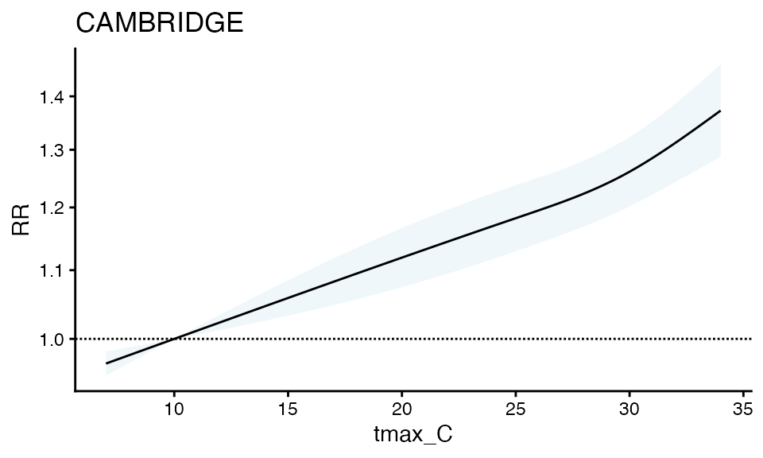
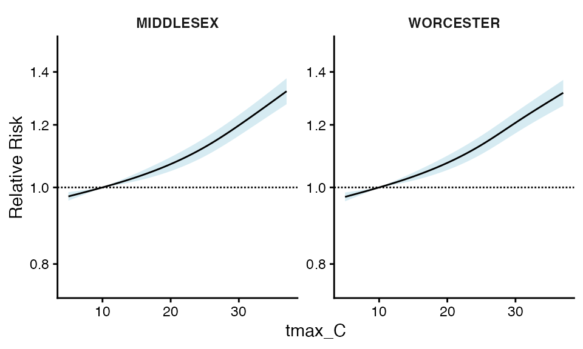
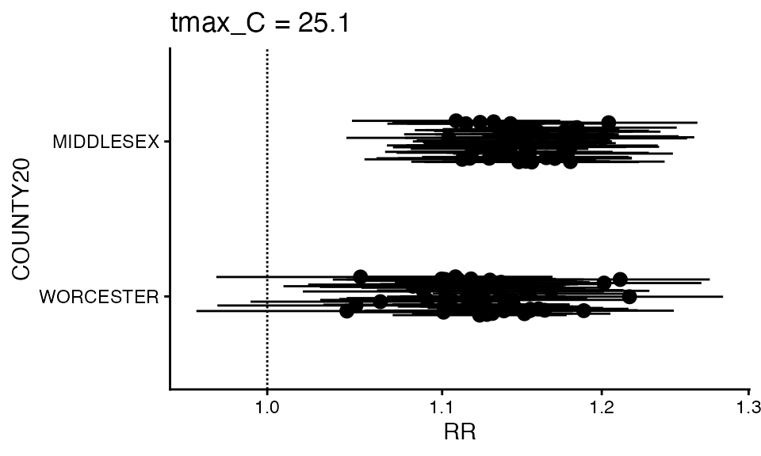
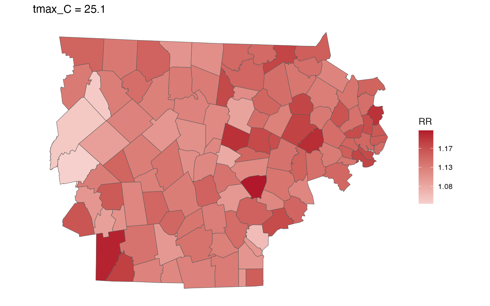
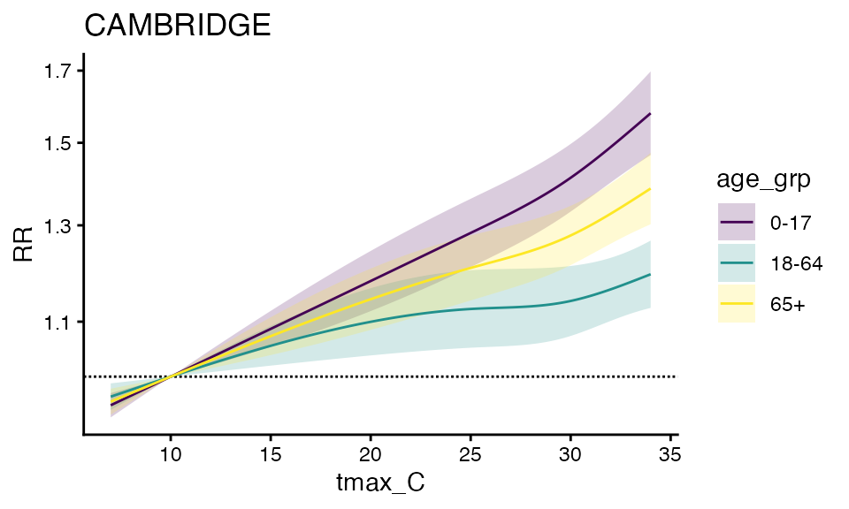
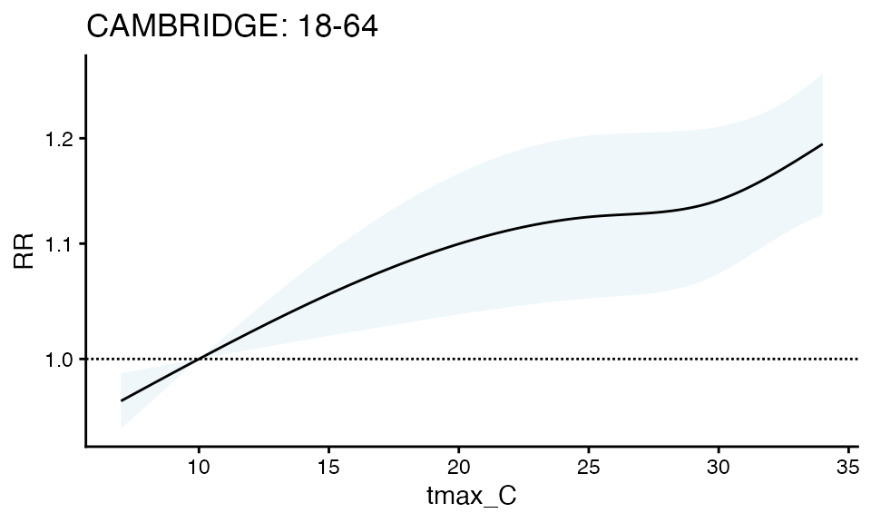
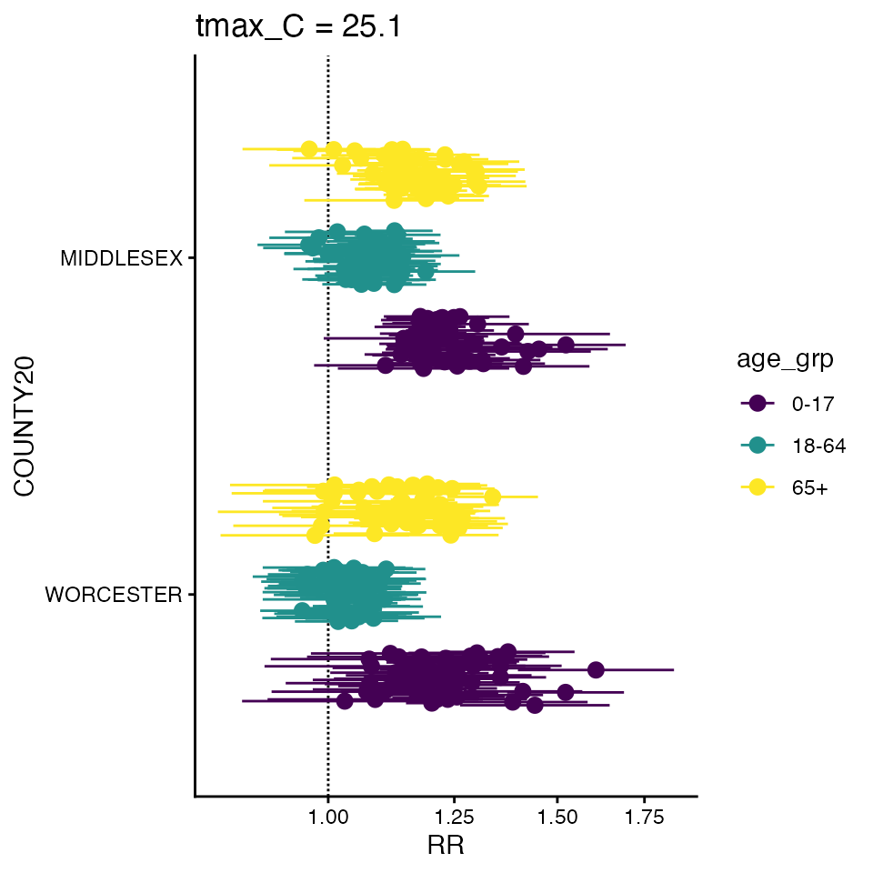
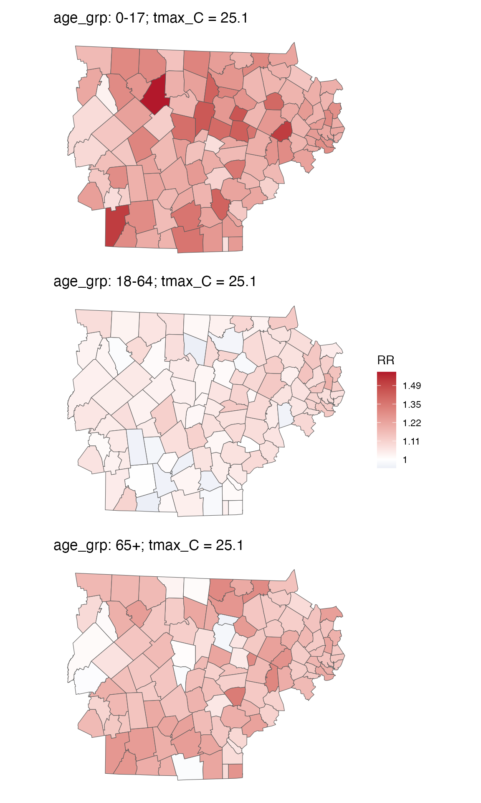
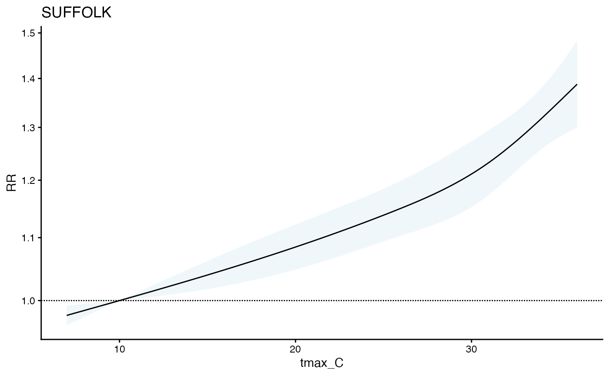

# Heat-Health Associations across multiple towns using \`cityClimateHealth\`

``` r

library(cityClimateHealth)
```

We can easily extend the functionality from
[`vignette("one_stage_demo")`](http://chadmilando.com/cityClimateHealth/articles/one_stage_demo.md)
to estimate individual-zone impacts across many zones.

### Model

First create the inputs, using the same `exposure_columns` and
`outcome_columns` as before.

``` r

library(data.table)
exposure_columns <- list(
  "date" = "date",
  "exposure" = "tmax_C",
  "geo_unit" = "TOWN20",
  "geo_unit_grp" = "COUNTY20"
)

ma_exposure_matrix <- make_exposure_matrix(
  subset(ma_exposure,COUNTY20 %in% c('MIDDLESEX', 'WORCESTER') &
           year(date) %in% 2012:2015), exposure_columns)
#> Warning in make_exposure_matrix(subset(ma_exposure, COUNTY20 %in% c("MIDDLESEX", : check about any NA, some corrections for this later,
#>             but only in certain columns

outcome_columns <- list(
  "date" = "date",
  "outcome" = "daily_deaths",
  "factor" = 'age_grp',
  "factor" = 'sex',
  "geo_unit" = "TOWN20",
  "geo_unit_grp" = "COUNTY20"
)
ma_outcomes_tbl <- make_outcome_table(
  subset(ma_deaths,COUNTY20 %in% c('MIDDLESEX', 'WORCESTER') &
           year(date) %in% 2012:2015), outcome_columns)
#> Missing values in outcome xgrid were set to 0
```

Now run by using `condPois_2stage`. This does the Gasp Extended2stage
design in 1 function from these inputs and defaults for `argvar`,
`arglag` and `maxlag`.

Importantly, the estimates in each `geo_unit` are bolstered by those in
their `geo_unit_grp` by including a random effect for `geo_unit_grp` in
the `mixmeta` model.

``` r

ma_model <- condPois_2stage(ma_exposure_matrix, ma_outcomes_tbl, 
                            verbose = 1, global_cen = 10)
#> -- validation passed
#> -- stage 1
#> 
#> -- mixmeta
#> formula: ~ 1 | COUNTY20/TOWN20 
#> -- stage 2
```

You can still view the RR output from a single zone:

``` r

plot(ma_model, "CAMBRIDGE")
```

 It does
seem like this is a wider confidence interval than the solo model –
Perhaps this is expected given the variables around it? Worth
investigating in your dataset, as these are simulated data.

You can also plot by `geo_unit_grp` (TODO – a way to make this cleaner
to get to)

``` r

ma_model$`_`$grp_plt
```



You can also make a forest plot at a specific exposure value

``` r

forest_plot(ma_model, 25.1)
#> Warning in forest_plot.condPois_2stage(ma_model, 25.1): plotting by group since
#> n_geos > 20
```



Finally you can also plot how the RR changes at specific expsoure units
across space – for this you need to bring in an `sf` shapefile:

``` r

data("ma_towns")
ma_towns
#> Simple feature collection with 351 features and 36 fields
#> Geometry type: MULTIPOLYGON
#> Dimension:     XY
#> Bounding box:  xmin: 33863.75 ymin: 777634.4 xmax: 330838.8 ymax: 959743
#> Projected CRS: NAD83 / Massachusetts Mainland
#> # A tibble: 351 × 37
#>    STATEFP20 COUNTYFP20 COUSUBFP20 COUSUBNS20 GEOID20    NAMELSAD20       LSAD20
#>    <chr>     <chr>      <chr>      <chr>      <chr>      <chr>            <chr> 
#>  1 25        003        34970      00618269   2500334970 Lenox town       43    
#>  2 25        003        44385      00598751   2500344385 New Ashford town 43    
#>  3 25        003        51580      00619422   2500351580 Otis town        43    
#>  4 25        015        29265      00618202   2501529265 Hatfield town    43    
#>  5 25        027        12715      00618359   2502712715 Charlton town    43    
#>  6 25        011        05560      00619378   2501105560 Bernardston town 43    
#>  7 25        003        59665      00619426   2500359665 Sandisfield town 43    
#>  8 25        003        79985      00619430   2500379985 Williamstown to… 43    
#>  9 25        017        31540      00618226   2501731540 Hudson town      43    
#> 10 25        017        37875      00619404   2501737875 Malden city      25    
#> # ℹ 341 more rows
#> # ℹ 30 more variables: CLASSFP20 <chr>, MTFCC20 <chr>, CNECTAFP20 <chr>,
#> #   NECTAFP20 <chr>, NCTADVFP20 <chr>, FUNCSTAT20 <chr>, ALAND20 <dbl>,
#> #   AWATER20 <dbl>, INTPTLAT20 <chr>, INTPTLON20 <chr>, TOWN20 <chr>,
#> #   TOWN_ID <int>, FIPS_STCO2 <dbl>, COUNTY20 <chr>, TYPE <chr>,
#> #   FOURCOLOR <int>, AREA_ACRES <dbl>, SQ_MILES <dbl>, POP1960 <dbl>,
#> #   POP1970 <dbl>, POP1980 <dbl>, POP1990 <dbl>, POP2000 <dbl>, …
head(ma_towns)
#> Simple feature collection with 6 features and 36 fields
#> Geometry type: MULTIPOLYGON
#> Dimension:     XY
#> Bounding box:  xmin: 48979.71 ymin: 869246.6 xmax: 166957.3 ymax: 942838.1
#> Projected CRS: NAD83 / Massachusetts Mainland
#> # A tibble: 6 × 37
#>   STATEFP20 COUNTYFP20 COUSUBFP20 COUSUBNS20 GEOID20 NAMELSAD20 LSAD20 CLASSFP20
#>   <chr>     <chr>      <chr>      <chr>      <chr>   <chr>      <chr>  <chr>    
#> 1 25        003        34970      00618269   250033… Lenox town 43     T1       
#> 2 25        003        44385      00598751   250034… New Ashfo… 43     T1       
#> 3 25        003        51580      00619422   250035… Otis town  43     T1       
#> 4 25        015        29265      00618202   250152… Hatfield … 43     T1       
#> 5 25        027        12715      00618359   250271… Charlton … 43     T1       
#> 6 25        011        05560      00619378   250110… Bernardst… 43     T1       
#> # ℹ 29 more variables: MTFCC20 <chr>, CNECTAFP20 <chr>, NECTAFP20 <chr>,
#> #   NCTADVFP20 <chr>, FUNCSTAT20 <chr>, ALAND20 <dbl>, AWATER20 <dbl>,
#> #   INTPTLAT20 <chr>, INTPTLON20 <chr>, TOWN20 <chr>, TOWN_ID <int>,
#> #   FIPS_STCO2 <dbl>, COUNTY20 <chr>, TYPE <chr>, FOURCOLOR <int>,
#> #   AREA_ACRES <dbl>, SQ_MILES <dbl>, POP1960 <dbl>, POP1970 <dbl>,
#> #   POP1980 <dbl>, POP1990 <dbl>, POP2000 <dbl>, POP2010 <dbl>, POP2020 <dbl>,
#> #   POPCH10_20 <dbl>, HOUSING20 <dbl>, SHAPE_AREA <dbl>, SHAPE_LEN <dbl>, …

spatial_plot(ma_model, shp = ma_towns, exposure_val = 25.1)
```



and You can get an RR table

``` r

getRR(ma_model)
#>           TOWN20  COUNTY20 tmax_C        RR      RRlb     RRub     model_class
#>           <char>    <char>  <num>     <num>     <num>    <num>          <char>
#>     1:     ACTON MIDDLESEX    7.0 0.9844671 0.9679222 1.001295 condPois_2stage
#>     2:     ACTON MIDDLESEX    7.1 0.9849752 0.9689752 1.001239 condPois_2stage
#>     3:     ACTON MIDDLESEX    7.2 0.9854837 0.9700294 1.001184 condPois_2stage
#>     4:     ACTON MIDDLESEX    7.3 0.9859924 0.9710848 1.001129 condPois_2stage
#>     5:     ACTON MIDDLESEX    7.4 0.9865016 0.9721413 1.001074 condPois_2stage
#>    ---                                                                        
#> 32510: WORCESTER WORCESTER   33.6 1.2626515 1.1955548 1.333514 condPois_2stage
#> 32511: WORCESTER WORCESTER   33.7 1.2644009 1.1966017 1.336042 condPois_2stage
#> 32512: WORCESTER WORCESTER   33.8 1.2661529 1.1976434 1.338581 condPois_2stage
#> 32513: WORCESTER WORCESTER   33.9 1.2679074 1.1986804 1.341132 condPois_2stage
#> 32514: WORCESTER WORCESTER   34.0 1.2696643 1.1997131 1.343694 condPois_2stage
```

### Model by factor

Only a small change is required to run the model by factor, e.g.,
age_grp:

``` r

ma_outcomes_tbl_fct <- make_outcome_table(
  subset(ma_deaths,COUNTY20 %in% c('MIDDLESEX', 'WORCESTER') &
           year(date) %in% 2012:2015),
  outcome_columns,collapse_to = 'age_grp')
#> Missing values in outcome xgrid were set to 0

head(ma_outcomes_tbl_fct)
#>          date TOWN20  COUNTY20 age_grp daily_deaths                  strata
#>        <IDat> <char>    <char>  <char>        <int>                  <char>
#> 1: 2012-05-01  ACTON MIDDLESEX    0-17           25 ACTON:yr2012:mn05:dow03
#> 2: 2012-05-01  ACTON MIDDLESEX   18-64           24 ACTON:yr2012:mn05:dow03
#> 3: 2012-05-01  ACTON MIDDLESEX     65+           24 ACTON:yr2012:mn05:dow03
#> 4: 2012-05-02  ACTON MIDDLESEX    0-17           26 ACTON:yr2012:mn05:dow04
#> 5: 2012-05-02  ACTON MIDDLESEX   18-64           26 ACTON:yr2012:mn05:dow04
#> 6: 2012-05-02  ACTON MIDDLESEX     65+           26 ACTON:yr2012:mn05:dow04
#>    strata_total     match_strata
#>           <num>           <char>
#> 1:          423 ACTON:2012-05-01
#> 2:          423 ACTON:2012-05-01
#> 3:          423 ACTON:2012-05-01
#> 4:          420 ACTON:2012-05-02
#> 5:          420 ACTON:2012-05-02
#> 6:          420 ACTON:2012-05-02
```

Run the model

``` r

ma_model_fct <- condPois_2stage(ma_exposure_matrix, ma_outcomes_tbl_fct, 
                                verbose = 1, global_cen = 10)
#> < age_grp : 0-17 >
#> -- validation passed
#> -- stage 1
#> 
#> -- mixmeta
#> formula: ~ 1 | COUNTY20/TOWN20 
#> -- stage 2
#> 
#> < age_grp : 18-64 >
#> -- validation passed
#> -- stage 1
#> 
#> -- mixmeta
#> formula: ~ 1 | COUNTY20/TOWN20 
#> -- stage 2
#> 
#> < age_grp : 65+ >
#> -- validation passed
#> -- stage 1
#> 
#> -- mixmeta
#> formula: ~ 1 | COUNTY20/TOWN20 
#> -- stage 2
```

And plot

``` r

plot(ma_model_fct, "CAMBRIDGE")
```



``` r

plot(ma_model_fct$`18-64`, "CAMBRIDGE", title = 'CAMBRIDGE: 18-64')
```



``` r

forest_plot(ma_model_fct, 25.1)
#> Warning in forest_plot.condPois_2stage_list(ma_model_fct, 25.1): plotting by
#> group since n_geos > 20
```



``` r

spatial_plot(ma_model_fct, shp = ma_towns, exposure_val = 25.1)
```

 and You can get
an RR table

``` r

getRR(ma_model_fct)
#>           TOWN20  COUNTY20 tmax_C        RR      RRlb     RRub age_grp
#>           <char>    <char>  <num>     <num>     <num>    <num>  <char>
#>     1:     ACTON MIDDLESEX    7.0 0.9791444 0.9572711 1.001518    0-17
#>     2:     ACTON MIDDLESEX    7.1 0.9798242 0.9586651 1.001450    0-17
#>     3:     ACTON MIDDLESEX    7.2 0.9805045 0.9600612 1.001383    0-17
#>     4:     ACTON MIDDLESEX    7.3 0.9811855 0.9614593 1.001316    0-17
#>     5:     ACTON MIDDLESEX    7.4 0.9818670 0.9628594 1.001250    0-17
#>    ---                                                                
#> 97538: WORCESTER WORCESTER   33.6 1.2671613 1.2062789 1.331117     65+
#> 97539: WORCESTER WORCESTER   33.7 1.2686961 1.2070137 1.333531     65+
#> 97540: WORCESTER WORCESTER   33.8 1.2702324 1.2077292 1.335970     65+
#> 97541: WORCESTER WORCESTER   33.9 1.2717706 1.2084263 1.338435     65+
#> 97542: WORCESTER WORCESTER   34.0 1.2733105 1.2091064 1.340924     65+
#>                 model_class
#>                      <char>
#>     1: condPois_2stage_list
#>     2: condPois_2stage_list
#>     3: condPois_2stage_list
#>     4: condPois_2stage_list
#>     5: condPois_2stage_list
#>    ---                     
#> 97538: condPois_2stage_list
#> 97539: condPois_2stage_list
#> 97540: condPois_2stage_list
#> 97541: condPois_2stage_list
#> 97542: condPois_2stage_list
```

## Change the strata level

There may also be situations where you want to overwrite the strata to
be a sub-strata level.

``` r


exposure_columns <- list(
  "date" = "date",
  "exposure" = "tmax_C",
  "geo_unit" = "TOWN20",
  "geo_unit_grp" = "COUNTY20"
)

ma_exposure_matrix <- make_exposure_matrix(
  subset(ma_exposure, COUNTY20 %in% c('MIDDLESEX', 'WORCESTER', 'SUFFOLK') &
           year(date) %in% 2012:2015), exposure_columns, 
  grp_level = T, keep_unit_exposures = T)
#> Warning in make_exposure_matrix(subset(ma_exposure, COUNTY20 %in% c("MIDDLESEX", : check about any NA, some corrections for this later,
#>             but only in certain columns


outcome_columns <- list(
  "date" = "date",
  "outcome" = "daily_deaths",
  "factor" = 'age_grp',
  "factor" = 'sex',
  "geo_unit" = "TOWN20",
  "geo_unit_grp" = "COUNTY20"
)


ma_outcomes_tbl <- make_outcome_table(
  subset(ma_deaths,COUNTY20 %in% c('MIDDLESEX', 'WORCESTER', 'SUFFOLK') &
           year(date) %in% 2012:2015), outcome_columns,
  grp_level = T, keep_unit_outcomes = T)
#> Missing values in outcome xgrid were set to 0

ma_model <- condPois_2stage(ma_exposure_matrix, 
                            ma_outcomes_tbl, 
                            verbose = 2, global_cen = 10)
#> -- validation passed
#> -- stage 1
#> MIDDLESEX    WORCESTER   SUFFOLK     
#> -- mixmeta
#> formula: ~ 1 | COUNTY20 
#> IGLS iterations:
#> iter 0: value 6.693313e-12
#> converged
#> Newton iterations:
#> initial  value -0.000000 
#> iter   1 value 0.000000
#> final  value -0.000000 
#> converged
#> -- stage 2
#> MIDDLESEX    WORCESTER   SUFFOLK     

plot(ma_model, geo_unit = "SUFFOLK")
```


