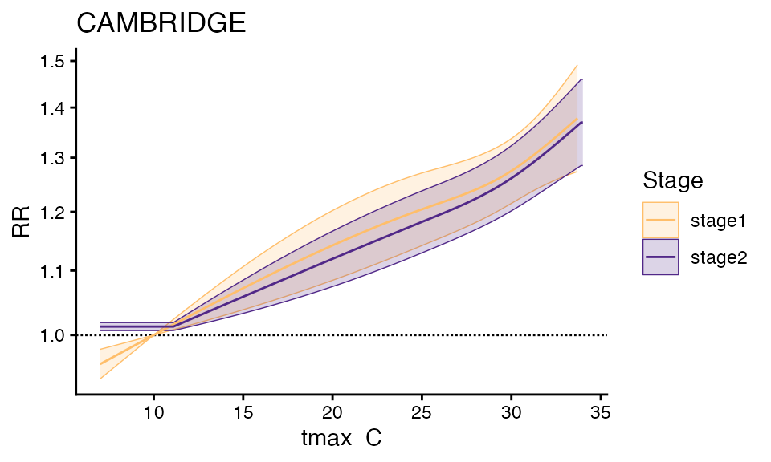
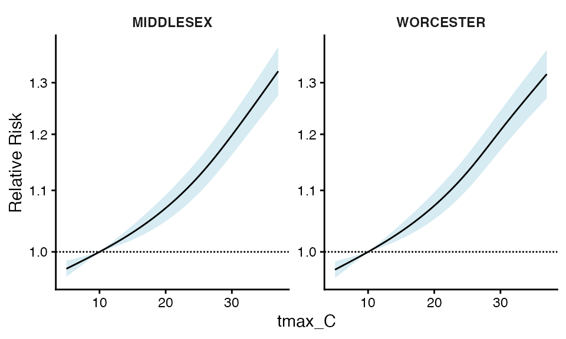
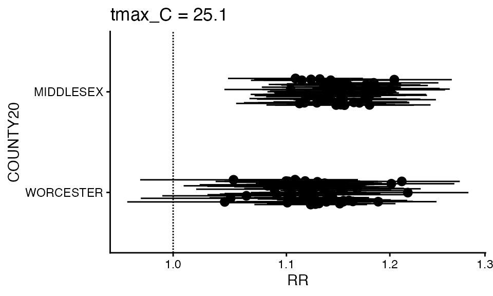
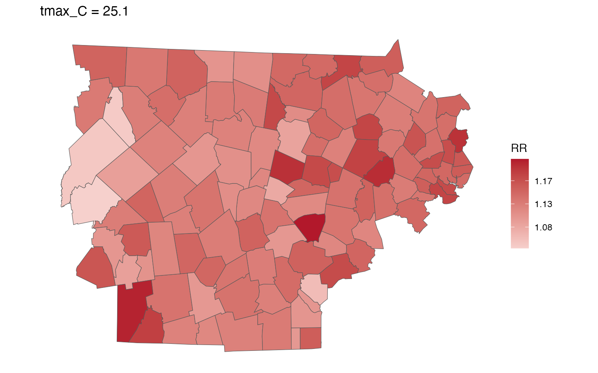
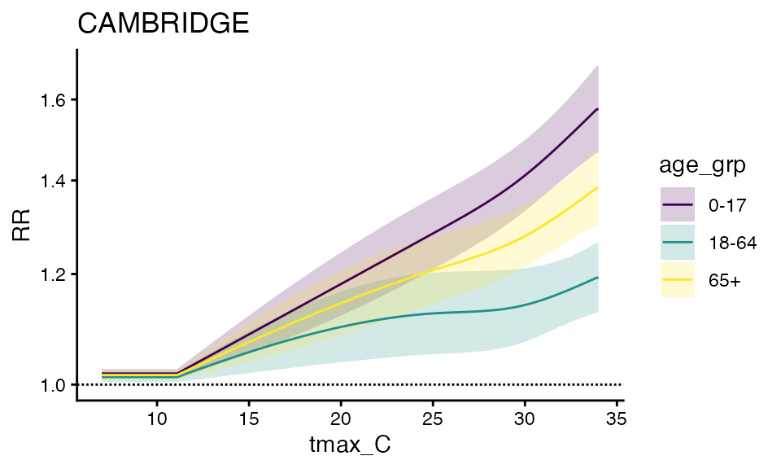
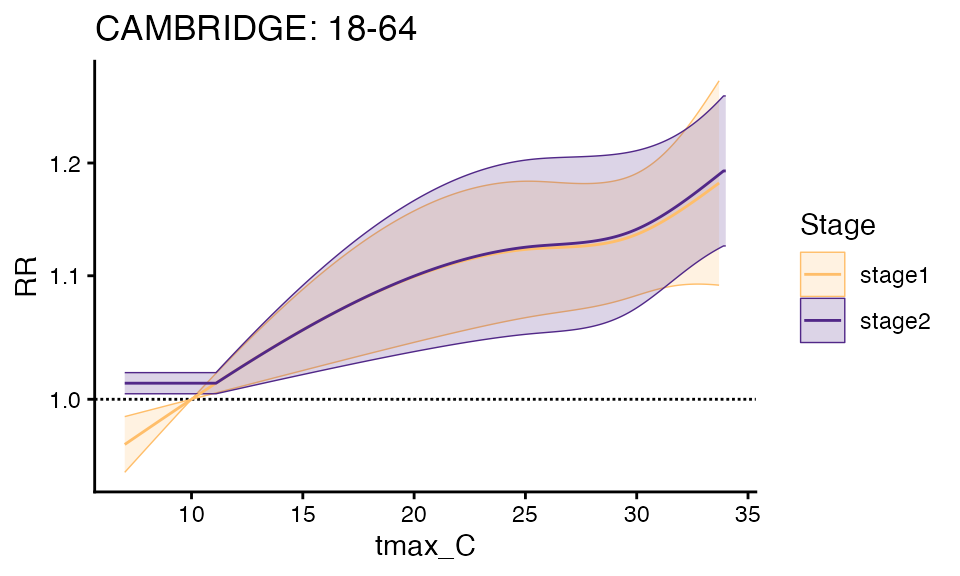
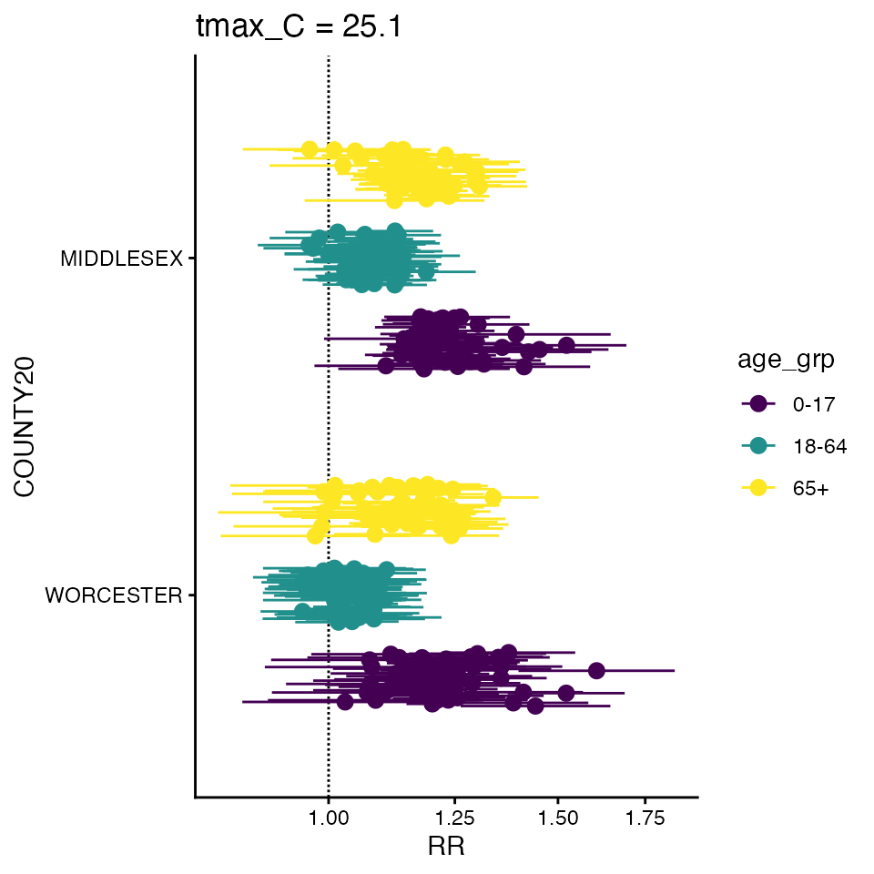
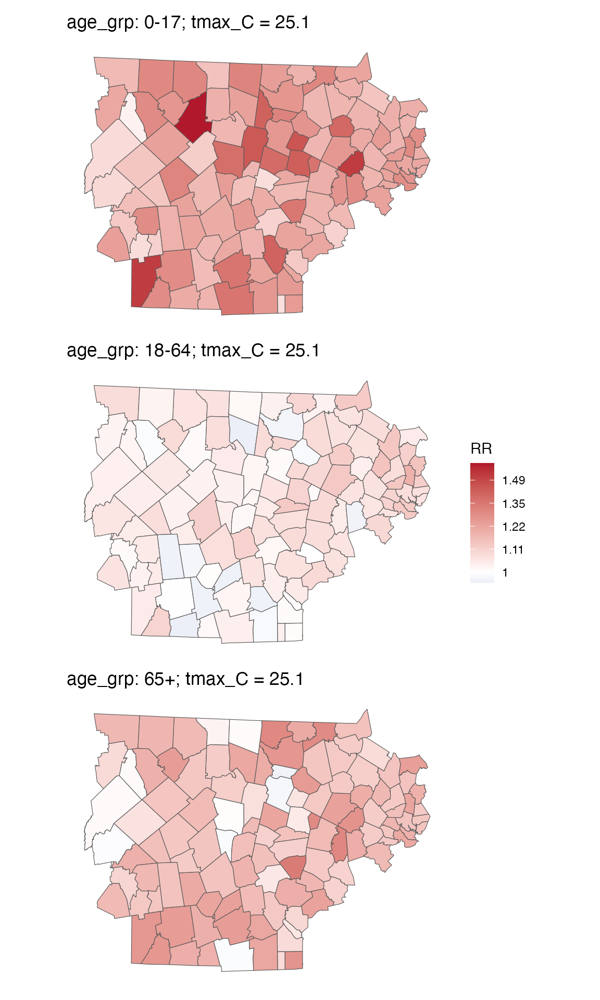
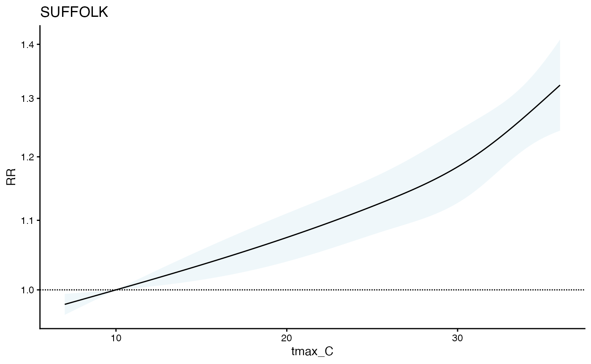

# Heat-Health Associations across multiple towns using \`cityClimateHealth\`

``` r

library(cityClimateHealth)
```

We can easily extend the functionality from
[`vignette("one_stage_demo")`](http://climatehealth.city/articles/one_stage_demo.md)
to estimate individual-zone impacts across many zones.

### Model

First create the inputs, using the same `exposure_columns` and
`outcome_columns` as before. Again, remember that this data is
**simulated**.

``` r

library(data.table)
exposure_columns <- list(
  "date" = "date",
  "exposure" = "tmax_C",
  "geo_unit" = "TOWN20",
  "geo_unit_grp" = "COUNTY20"
)

ma_exposure_matrix <- make_exposure_matrix(
  subset(ma_exposure,COUNTY20 %in% c('MIDDLESEX', 'WORCESTER')), 
         exposure_columns,
  time_subset = list(
       month = 5:9,
       year = 2012:2015
     ))
#> -- NA values automatically removed
#> strata dt_by = 'day', setting strata as geo_unit:yr:mn:dow

outcome_columns <- list(
  "date" = "date",
  "outcome" = "daily_deaths",
  "geo_unit" = "TOWN20",
  "geo_unit_grp" = "COUNTY20"
)
ma_outcomes_tbl <- make_outcome_table(
  subset(ma_deaths,COUNTY20 %in% c('MIDDLESEX', 'WORCESTER')), 
  outcome_columns,
  time_subset = list(
       month = 5:9,
       year = 2012:2015
     ))
#> Missing outcome values introduced by xgrid were set to 0;
#>             assumes that every time in the dataset should have an outcome value
#> strata dt_by = 'day', setting strata as geo_unit:yr:mn:dow
```

Now run by using `condPois_2stage`. This does the Gasp Extended2stage
design in 1 function from these inputs and defaults for `argvar`,
`arglag` and `maxlag`.

Importantly, the estimates in each `geo_unit` are bolstered by those in
their `geo_unit_grp` by including a random effect for `geo_unit_grp` in
the `mixmeta` model.

``` r

ma_model <- condPois_2stage(ma_exposure_matrix, ma_outcomes_tbl, 
                            verbose = 1, global_cen = 10)
#> -- validation passed
#> -- stage 1
#> 
#> crossbasis args for geo_unit  ACTON :
#> 
#> maxlag: 5 
#> 
#> argvar:
#> List of 2
#>  $ fun  : chr "ns"
#>  $ knots: Named num [1:2] 25.7 31.4
#>   ..- attr(*, "names")= chr [1:2] "50%" "90%"
#> 
#> arglag:
#> List of 2
#>  $ fun  : chr "ns"
#>  $ knots: num [1:2] 0.878 2.095
#> 
#> strata:
#> ACTON:yr2012:mn05:dow03
#> strata_min: 0 
#> 
#> min_n: 50 
#> 
#> truncate final RR and basis cen:  0 
#> formula:
#>    daily_deaths ~ cb
#> family: quasipoisson
#> 
#> -- mixmeta
#> formula: coef_matrix ~ exp_mean + exp_IQR
#> random: ~ 1 | COUNTY20/TOWN20 
#> -- stage 2
#> truncate final RR and basis cen:  0.01
```

You can still view the RR output from a single zone:

``` r

plot(ma_model, "CAMBRIDGE")
```

 It does
seem like this is a wider confidence interval than the solo model –
Perhaps this is expected given the variables around it? Worth
investigating in your dataset, as these are simulated data.

You can also plot by `geo_unit_grp` (TODO – a way to make this cleaner
to get to)

``` r

ma_model$`_`$grp_plt
```



You can also make a forest plot at a specific exposure value

``` r

forest_plot(ma_model, 25.1)
#> Warning in forest_plot.condPois_2stage(ma_model, 25.1): plotting by group since
#> n_geos > 20
```



Finally you can also plot how the RR changes at specific expsoure units
across space – for this you need to bring in an `sf` shapefile:

``` r

data("ma_towns")
ma_towns
#> Simple feature collection with 351 features and 36 fields
#> Geometry type: MULTIPOLYGON
#> Dimension:     XY
#> Bounding box:  xmin: 33863.75 ymin: 777634.4 xmax: 330838.8 ymax: 959743
#> Projected CRS: NAD83 / Massachusetts Mainland
#> # A tibble: 351 × 37
#>    STATEFP20 COUNTYFP20 COUSUBFP20 COUSUBNS20 GEOID20    NAMELSAD20       LSAD20
#>    <chr>     <chr>      <chr>      <chr>      <chr>      <chr>            <chr> 
#>  1 25        003        34970      00618269   2500334970 Lenox town       43    
#>  2 25        003        44385      00598751   2500344385 New Ashford town 43    
#>  3 25        003        51580      00619422   2500351580 Otis town        43    
#>  4 25        015        29265      00618202   2501529265 Hatfield town    43    
#>  5 25        027        12715      00618359   2502712715 Charlton town    43    
#>  6 25        011        05560      00619378   2501105560 Bernardston town 43    
#>  7 25        003        59665      00619426   2500359665 Sandisfield town 43    
#>  8 25        003        79985      00619430   2500379985 Williamstown to… 43    
#>  9 25        017        31540      00618226   2501731540 Hudson town      43    
#> 10 25        017        37875      00619404   2501737875 Malden city      25    
#> # ℹ 341 more rows
#> # ℹ 30 more variables: CLASSFP20 <chr>, MTFCC20 <chr>, CNECTAFP20 <chr>,
#> #   NECTAFP20 <chr>, NCTADVFP20 <chr>, FUNCSTAT20 <chr>, ALAND20 <dbl>,
#> #   AWATER20 <dbl>, INTPTLAT20 <chr>, INTPTLON20 <chr>, TOWN20 <chr>,
#> #   TOWN_ID <int>, FIPS_STCO2 <dbl>, COUNTY20 <chr>, TYPE <chr>,
#> #   FOURCOLOR <int>, AREA_ACRES <dbl>, SQ_MILES <dbl>, POP1960 <dbl>,
#> #   POP1970 <dbl>, POP1980 <dbl>, POP1990 <dbl>, POP2000 <dbl>, …
head(ma_towns)
#> Simple feature collection with 6 features and 36 fields
#> Geometry type: MULTIPOLYGON
#> Dimension:     XY
#> Bounding box:  xmin: 48979.71 ymin: 869246.6 xmax: 166957.3 ymax: 942838.1
#> Projected CRS: NAD83 / Massachusetts Mainland
#> # A tibble: 6 × 37
#>   STATEFP20 COUNTYFP20 COUSUBFP20 COUSUBNS20 GEOID20 NAMELSAD20 LSAD20 CLASSFP20
#>   <chr>     <chr>      <chr>      <chr>      <chr>   <chr>      <chr>  <chr>    
#> 1 25        003        34970      00618269   250033… Lenox town 43     T1       
#> 2 25        003        44385      00598751   250034… New Ashfo… 43     T1       
#> 3 25        003        51580      00619422   250035… Otis town  43     T1       
#> 4 25        015        29265      00618202   250152… Hatfield … 43     T1       
#> 5 25        027        12715      00618359   250271… Charlton … 43     T1       
#> 6 25        011        05560      00619378   250110… Bernardst… 43     T1       
#> # ℹ 29 more variables: MTFCC20 <chr>, CNECTAFP20 <chr>, NECTAFP20 <chr>,
#> #   NCTADVFP20 <chr>, FUNCSTAT20 <chr>, ALAND20 <dbl>, AWATER20 <dbl>,
#> #   INTPTLAT20 <chr>, INTPTLON20 <chr>, TOWN20 <chr>, TOWN_ID <int>,
#> #   FIPS_STCO2 <dbl>, COUNTY20 <chr>, TYPE <chr>, FOURCOLOR <int>,
#> #   AREA_ACRES <dbl>, SQ_MILES <dbl>, POP1960 <dbl>, POP1970 <dbl>,
#> #   POP1980 <dbl>, POP1990 <dbl>, POP2000 <dbl>, POP2010 <dbl>, POP2020 <dbl>,
#> #   POPCH10_20 <dbl>, HOUSING20 <dbl>, SHAPE_AREA <dbl>, SHAPE_LEN <dbl>, …

spatial_plot(ma_model, shp = ma_towns, exposure_val = 25.1)
```



and You can get an RR table

``` r

getRR(ma_model)
#>           TOWN20  COUNTY20 tmax_C       RR      RRlb     RRub  stage
#>           <char>    <char>  <num>    <num>     <num>    <num> <char>
#>     1:     ACTON MIDDLESEX    7.0 1.005964 0.9999591 1.012006 stage2
#>     2:     ACTON MIDDLESEX    7.1 1.005964 0.9999591 1.012006 stage2
#>     3:     ACTON MIDDLESEX    7.2 1.005964 0.9999591 1.012006 stage2
#>     4:     ACTON MIDDLESEX    7.3 1.005964 0.9999591 1.012006 stage2
#>     5:     ACTON MIDDLESEX    7.4 1.005964 0.9999591 1.012006 stage2
#>    ---                                                              
#> 64868: WORCESTER WORCESTER   33.0 1.245445 1.1839683 1.310114 stage1
#> 64869: WORCESTER WORCESTER   33.1 1.246649 1.1839629 1.312654 stage1
#> 64870: WORCESTER WORCESTER   33.2 1.247852 1.1839416 1.315213 stage1
#> 64871: WORCESTER WORCESTER   33.3 1.249056 1.1839062 1.317792 stage1
#> 64872: WORCESTER WORCESTER   33.4 1.250261 1.1838585 1.320388 stage1
#>            model_class
#>                 <char>
#>     1: condPois_2stage
#>     2: condPois_2stage
#>     3: condPois_2stage
#>     4: condPois_2stage
#>     5: condPois_2stage
#>    ---                
#> 64868: condPois_2stage
#> 64869: condPois_2stage
#> 64870: condPois_2stage
#> 64871: condPois_2stage
#> 64872: condPois_2stage
```

### Model by factor

Only a small change is required to run the model by factor, e.g.,
age_grp:

``` r

outcome_columns <- list(
  "date" = "date",
  "outcome" = "daily_deaths",
  "factor" = "age_grp",
  "geo_unit" = "TOWN20",
  "geo_unit_grp" = "COUNTY20"
)
ma_outcomes_tbl_fct <- make_outcome_table(
  subset(ma_deaths,COUNTY20 %in% c('MIDDLESEX', 'WORCESTER')),
  outcome_columns,
  time_subset = list(
       month = 5:9,
       year = 2012:2015
     ))
#> > Combined factor is  age_grp
#> Missing outcome values introduced by xgrid were set to 0;
#>             assumes that every time in the dataset should have an outcome value
#> strata dt_by = 'day', setting strata as geo_unit:yr:mn:dow

head(ma_outcomes_tbl_fct)
#>          date TOWN20  COUNTY20 age_grp daily_deaths                  strata
#>        <IDat> <char>    <char>  <char>        <int>                  <char>
#> 1: 2012-05-01  ACTON MIDDLESEX    0-17           25 ACTON:yr2012:mn05:dow03
#> 2: 2012-05-01  ACTON MIDDLESEX   18-64           24 ACTON:yr2012:mn05:dow03
#> 3: 2012-05-01  ACTON MIDDLESEX     65+           24 ACTON:yr2012:mn05:dow03
#> 4: 2012-05-02  ACTON MIDDLESEX    0-17           26 ACTON:yr2012:mn05:dow04
#> 5: 2012-05-02  ACTON MIDDLESEX   18-64           26 ACTON:yr2012:mn05:dow04
#> 6: 2012-05-02  ACTON MIDDLESEX     65+           26 ACTON:yr2012:mn05:dow04
#>    strata_total     match_strata
#>           <int>           <char>
#> 1:          147 ACTON:2012-05-01
#> 2:          136 ACTON:2012-05-01
#> 3:          140 ACTON:2012-05-01
#> 4:          145 ACTON:2012-05-02
#> 5:          136 ACTON:2012-05-02
#> 6:          139 ACTON:2012-05-02
```

Run the model

``` r

ma_model_fct <- condPois_2stage(ma_exposure_matrix, ma_outcomes_tbl_fct, 
                                verbose = 1, global_cen = 10)
#> < age_grp : 0-17 >
#> -- validation passed
#> -- stage 1
#> 
#> crossbasis args for geo_unit  ACTON :
#> 
#> maxlag: 5 
#> 
#> argvar:
#> List of 2
#>  $ fun  : chr "ns"
#>  $ knots: Named num [1:2] 25.7 31.4
#>   ..- attr(*, "names")= chr [1:2] "50%" "90%"
#> 
#> arglag:
#> List of 2
#>  $ fun  : chr "ns"
#>  $ knots: num [1:2] 0.878 2.095
#> 
#> strata:
#> ACTON:yr2012:mn05:dow03
#> strata_min: 0 
#> 
#> min_n: 50 
#> 
#> truncate final RR and basis cen:  0 
#> formula:
#>    daily_deaths ~ cb
#> family: quasipoisson
#> 
#> -- mixmeta
#> formula: coef_matrix ~ exp_mean + exp_IQR
#> random: ~ 1 | COUNTY20/TOWN20 
#> -- stage 2
#> truncate final RR and basis cen:  0.01 
#> 
#> < age_grp : 18-64 >
#> -- validation passed
#> -- stage 1
#> 
#> crossbasis args for geo_unit  ACTON :
#> 
#> maxlag: 5 
#> 
#> argvar:
#> List of 2
#>  $ fun  : chr "ns"
#>  $ knots: Named num [1:2] 25.7 31.4
#>   ..- attr(*, "names")= chr [1:2] "50%" "90%"
#> 
#> arglag:
#> List of 2
#>  $ fun  : chr "ns"
#>  $ knots: num [1:2] 0.878 2.095
#> 
#> strata:
#> ACTON:yr2012:mn05:dow03
#> strata_min: 0 
#> 
#> min_n: 50 
#> 
#> truncate final RR and basis cen:  0 
#> formula:
#>    daily_deaths ~ cb
#> family: quasipoisson
#> 
#> -- mixmeta
#> formula: coef_matrix ~ exp_mean + exp_IQR
#> random: ~ 1 | COUNTY20/TOWN20 
#> -- stage 2
#> truncate final RR and basis cen:  0.01 
#> 
#> < age_grp : 65+ >
#> -- validation passed
#> -- stage 1
#> 
#> crossbasis args for geo_unit  ACTON :
#> 
#> maxlag: 5 
#> 
#> argvar:
#> List of 2
#>  $ fun  : chr "ns"
#>  $ knots: Named num [1:2] 25.7 31.4
#>   ..- attr(*, "names")= chr [1:2] "50%" "90%"
#> 
#> arglag:
#> List of 2
#>  $ fun  : chr "ns"
#>  $ knots: num [1:2] 0.878 2.095
#> 
#> strata:
#> ACTON:yr2012:mn05:dow03
#> strata_min: 0 
#> 
#> min_n: 50 
#> 
#> truncate final RR and basis cen:  0 
#> formula:
#>    daily_deaths ~ cb
#> family: quasipoisson
#> 
#> -- mixmeta
#> formula: coef_matrix ~ exp_mean + exp_IQR
#> random: ~ 1 | COUNTY20/TOWN20 
#> -- stage 2
#> truncate final RR and basis cen:  0.01
```

And plot

``` r

plot(ma_model_fct, "CAMBRIDGE")
```



``` r

plot(ma_model_fct$`18-64`, "CAMBRIDGE", title = 'CAMBRIDGE: 18-64')
```



``` r

forest_plot(ma_model_fct, 25.1)
#> Warning in forest_plot.condPois_2stage_list(ma_model_fct, 25.1): plotting by
#> group since n_geos > 20
```



``` r

spatial_plot(ma_model_fct, shp = ma_towns, exposure_val = 25.1)
```

 and You can get
an RR table

``` r

getRR(ma_model_fct)
#>            TOWN20  COUNTY20 tmax_C       RR     RRlb     RRub  stage age_grp
#>            <char>    <char>  <num>    <num>    <num>    <num> <char>  <char>
#>      1:     ACTON MIDDLESEX    7.0 1.008063 1.000032 1.016157 stage2    0-17
#>      2:     ACTON MIDDLESEX    7.1 1.008063 1.000032 1.016157 stage2    0-17
#>      3:     ACTON MIDDLESEX    7.2 1.008063 1.000032 1.016157 stage2    0-17
#>      4:     ACTON MIDDLESEX    7.3 1.008063 1.000032 1.016157 stage2    0-17
#>      5:     ACTON MIDDLESEX    7.4 1.008063 1.000032 1.016157 stage2    0-17
#>     ---                                                                     
#> 194612: WORCESTER WORCESTER   33.0 1.243257 1.181728 1.307988 stage1     65+
#> 194613: WORCESTER WORCESTER   33.1 1.244374 1.181640 1.310439 stage1     65+
#> 194614: WORCESTER WORCESTER   33.2 1.245492 1.181536 1.312909 stage1     65+
#> 194615: WORCESTER WORCESTER   33.3 1.246609 1.181417 1.315398 stage1     65+
#> 194616: WORCESTER WORCESTER   33.4 1.247727 1.181286 1.317904 stage1     65+
#>                  model_class
#>                       <char>
#>      1: condPois_2stage_list
#>      2: condPois_2stage_list
#>      3: condPois_2stage_list
#>      4: condPois_2stage_list
#>      5: condPois_2stage_list
#>     ---                     
#> 194612: condPois_2stage_list
#> 194613: condPois_2stage_list
#> 194614: condPois_2stage_list
#> 194615: condPois_2stage_list
#> 194616: condPois_2stage_list
```

## Change the strata level

There may also be situations where you want to overwrite the strata to
be a sub-strata level.

``` r


exposure_columns <- list(
  "date" = "date",
  "exposure" = "tmax_C",
  "geo_unit" = "TOWN20",
  "geo_unit_grp" = "COUNTY20"
)

ma_exposure_matrix <- make_exposure_matrix(
  subset(ma_exposure, COUNTY20 %in% c('MIDDLESEX', 'WORCESTER', 'SUFFOLK')),
  exposure_columns, 
  time_subset = list(
       month = 5:9,
       year = 2012:2015
     ),
  grp_level = T, 
  keep_unit_exposures = T)
#> -- NA values automatically removed
#> strata dt_by = 'day', setting strata as geo_unit:yr:mn:dow

outcome_columns <- list(
  "date" = "date",
  "outcome" = "daily_deaths",
  "geo_unit" = "TOWN20",
  "geo_unit_grp" = "COUNTY20"
)

ma_outcomes_tbl <- make_outcome_table(
  subset(ma_deaths, COUNTY20 %in% c('MIDDLESEX', 'WORCESTER', 'SUFFOLK')), 
  outcome_columns,
  time_subset = list(
       month = 5:9,
       year = 2012:2015
     ),
  grp_level = T, keep_unit_outcomes = T)
#> Missing outcome values introduced by xgrid were set to 0;
#>             assumes that every time in the dataset should have an outcome value
#> strata dt_by = 'day', setting strata as geo_unit:yr:mn:dow

ma_model <- condPois_2stage(ma_exposure_matrix, 
                            ma_outcomes_tbl, 
                            verbose = 2, global_cen = 10)
#> -- validation passed
#> -- stage 1
#> MIDDLESEX    
#> crossbasis args for geo_unit  MIDDLESEX :
#> 
#> maxlag: 5 
#> 
#> argvar:
#> List of 2
#>  $ fun  : chr "ns"
#>  $ knots: Named num [1:2] 25.6 30.8
#>   ..- attr(*, "names")= chr [1:2] "50%" "90%"
#> 
#> arglag:
#> List of 2
#>  $ fun  : chr "ns"
#>  $ knots: num [1:2] 0.878 2.095
#> 
#> strata:
#> ACTON:yr2012:mn05:dow03
#> strata_min: 0 
#> 
#> min_n: 50 
#> 
#> truncate final RR and basis cen:  0 
#> formula:
#>    daily_deaths ~ cb
#> family: quasipoisson
#> WORCESTER    SUFFOLK     
#> -- mixmeta
#> formula: coef_matrix ~ exp_mean + exp_IQR
#> random: ~ 1 | COUNTY20 
#> IGLS iterations:
#> iter 0: value 7.865708e-12
#> converged
#> Newton iterations:
#> initial  value 0.000000 
#> iter   2 value 0.000000
#> iter   3 value 0.000000
#> iter   4 value 0.000000
#> iter   4 value 0.000000
#> iter   4 value 0.000000
#> final  value 0.000000 
#> converged
#> -- stage 2
#> truncate final RR and basis cen:  0.01 
#> MIDDLESEX    WORCESTER   SUFFOLK     

plot(ma_model, geo_unit = "SUFFOLK")
```


