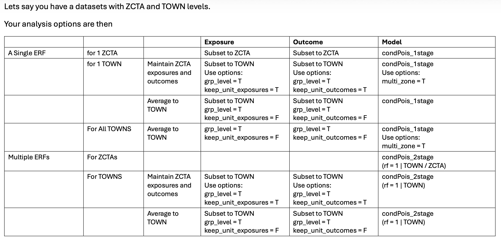

Note:</strong> This page is in development

# Overview

This package contains functions that streamline an analytical pipepline for estimating relative risks and attributable numbers.

Although situated in the contenxt of climate change and city-level health impacts,
there are not any physical limitations on applying this code to other signals and responses.

This package is drawn heavily from the work of [Dr. Antonio Gasparrini](http://www.ag-myresearch.com/).

For any questions that you don't see here answered, we have an additional [`FAQ`](faq.md)

# Exposures

We applied a distributed lag non-linear modeling (DLNM) framework to capture both the non-linear and lagged effects of exposure on an outcome. [Gasparrini 2011](https://www.jstatsoft.org/article/view/v043i08) describes these methods, and the R package [`dlnm`](https://cran.r-project.org/web/packages/dlnm/index.html). 

Helpful references include this [dlnm PDF](https://cran.r-project.org/web/packages/dlnm/vignettes/dlnmTS.pdf) and the methods explained in a [google sheet](https://docs.google.com/spreadsheets/d/1SP6PTXO6TtaVxoACTi5at0KpCNa9jmGhb6vR4PSiYmg/edit?gid=1087568396#gid=1087568396)

This approach represents exposure as a crossbasis matrix with separate components for exposure magnitude and lag. 

The interpretation of the crossbasis matrix is that it allows the model to account for nonlinear associations in exposure and in time. For example, temperatures of 100 °F do not have double the impact of temperatures of 50 °F, and exposures 2 days prior impact populations differently than those 1 day prior or 3 days prior.

Turning a single exposure time-series into a crossbasis matrix is done via the [`crossbasis()`](https://www.rdocumentation.org/packages/dlnm/versions/2.4.7/topics/crossbasis) function as part of `dlnm` and users must specify several function arguments:

* `maxlag`, the maximum lag
* `arvagr`, the nature of the non-linear relationship with exposure magnitude
* `arglag`, the nature of the non-linear relationship with exposure timing

More details on how to specify `maxlag`, `arglag`, and `argvar` can be found in the [`dlnm` documentation](https://spout.ussg.indiana.edu/CRAN/web/packages/dlnm/dlnm.pdf).

For `cityClimateHealth` we chose some default values for these arguments, specifically for the case study of looking at warm-season temperature and mortality/morbidity. :

* `maxlag = 5`
* `argvar`: natural spline with knots at the 50th and 90th percentiles of the exposure distribution. 
* `arglag`: a natural spline with two evenly spaced log-knots between 0 and a maximum lag of 8 days.

If other exposures / timings are desired, the user will need to adjust these arguments accordingly. 

Note that only the exposure lag is defined in [`make_exposure_matrix()`](../reference/make_exposure_matrix.md), `argvar`, `arglag` and a new (potentially shorter) `maxlag` are defined in the model functions (e.g., [`condPois_1stage()`](../reference/condPois_1stage.md), [`condPois_2stage()`](../reference/condPois_2stage.md), ...)

Note also that the `dlnm` outputs may be **highly sensitive** to the choices of `arglag`, `argvar`, and `maxlag` -- we have some additional code and thoughts for this in [`dlnm_sensitivity`](dlnm_sensitivity.md)

# Outcome

Any time-series of outcomes will work. Gaps and NA values in the outcome time-series are handled by [`make_outcome_table()`](../reference/make_outcome_table.md).

We are also testing this for non-fatal outcomes, which as the literature shows for temperature does not always have a U-shaped exposure-response curve which also means that the choice of centering point become very  

# Additional co-variates

We are investigating incorporating how to integrate temporally and spatially varying co-variates. 

References:
* the inclusion of time-invariant covariates (such as geographic variables) in the conditional poisson setting (which is different than the time-series setting)

This paper has a nice exposition on what we were talking about https://academic.oup.com/ije/article/53/2/dyae020/7611599 under the (aptly-named) section "Adjustment of subpopulation time-invariant covariates".

Essentially, since strata are being compared to themselves, anything that does not change with time is "conditioned out."

[Gasp 2014](https://link.springer.com/article/10.1186/1471-2288-14-122)

> The conditional Poisson model, like the unconditional Poisson and conditional logistic formulations, can incorporate potentially confounding covariates not homogeneous within strata for example temperature (if air pollution is the focus). All the models can also explore modification of associations of exposure with outcomes by either such covariates or those homogeneous in strata. In the case crossover context, modifiers may be individual (e.g. age) or in multi-city studies ecological (city-level). Analyses of multi-city studies may be single-step (pooling all strata across cities) as well as the conventional multi-step (city-specific at step 1, meta-analysis at step 2). The simplicity of the conditional Poisson formulation makes the single step approach straightforward to apply (simply pool all cities into one dataset and make the strata by city as well as month and day-of-week). However, the implicit assumptions of this approach (no random or systematic between-city effects) would need investigating. A single-step analysis is particularly attractive when exposure series are available for small areas within cities.

How about covariates that do change with time

What about covariates that change in space

* 

# Timing

You can use outcomes with a variety of timings:
* daily
* weekly
* monthly

These methods are still under development but the key is to ensure that the strata variables are correctly designed, if applicable. See the vignette [`non_daily_data`](non_daily_data.md) for examples.

# Model types

We can perform exposure-outcome analyses several ways:

* **space-time stratified case-crossover** -- time is controlled by assigning a strata variable and comparing counts (or rates) of outcomes within strata. a common strata choice is [spatial unit]:[year]:[month]:[day of week]. The following model types can be used in this study design: 

  * Conditional logistic
  * Poisson
  * Conditional Poisson
  
  [Gasparrini and Armstrong, 2014](https://link.springer.com/article/10.1186/1471-2288-14-122) provide analysis that show that these provide the same results, although Conditional Poisson is more computationally efficient because the strata terms are conditioned out and not modeled. We also provide a [google sheet](https://docs.google.com/spreadsheets/d/1eNbHk5S-NEwsu49rO7XXXCVJnmLdLUQRxH3OQ-5HwUU/edit?gid=0#gid=0) that show the similarities.
  
* **time-series** -- time is controlled by a natural spline with a specific number of knots for year, day of year, season, and decade. additional control is added by a categorical variable for day of week. See below for examples

## Conditional logistic

We are working to implement this code.

For examples see [github for Gasparrini and Armstrong, 2014](https://github.com/gasparrini/2014_armstrong_BMCmrm_codedata/blob/master/Rcode.R).

## Conditional Poisson 

The conditional Poisson approach enables efficient estimation of model coefficients without requiring estimation of strata-specific intercepts.

At the strata level, the model takes the form: 

E[log(yₛ,ᵢ)] = αₛ + βwₛ,ᵢ .

Here, the daily count of emergency department visits (yₛ,ᵢ) depends on a strata-specific intercept (αₛ), which is calculated in post-processing due to the conditional Poisson formulation, crossbasis weights (wₛ,ᵢ), and an indicator for federal holidays. 

Strata with no outcomes are excluded

There are minimums that each strata must include:
* x

For examples see [github for Gasparrini and Armstrong, 2014](https://github.com/gasparrini/2014_armstrong_BMCmrm_codedata/blob/master/Rcode.R).

The reason we sometimes choose conditional poisson (over time-series analysis) is because it has some built-in properties that can help with small numbers  (i.e., dropping low or empty strata). 

As such there as several places where numeric cut-offs are necessary: MinN, strata_total. tHese are sensitivitity points

## Time-series

we are working to implement this code. 

Code examples include:

* `formula <- death~cb+dow+ns(date,df=dfseas*length(unique(year)))`[ref](https://github.com/gasparrini/2015_gasparrini_Lancet_Rcodedata/blob/master/00.prepdata.R#L70)
  * in this example `dfseas = 8` so 8 degrees of freedom per year

* `model <- glm(death~cb+ns(time,10*14)+dow,family=quasipoisson(),lndn)`[ref](https://github.com/gasparrini/2014_gasparrini_BMCmrm_Rcodedata/blob/master/01.runmodel.R#L52)
  * in this example there are 10 degrees of freedom per year

* `model <- glm(all ~ cbtmean + dow + ns(yday(date), df=4) * factor(year(date)), data=dataggrsum, family=quasipoisson)`[ref](https://github.com/gasparrini/Extended2stage/blob/bd9b10d9dd45dd328a0bee5d161dc0ddac2b6479/addcode/00.prepdata.R#L79)
  * this model, which is summer only, has 4 degrees of freedom per year

# Model structures

Here is a table that shows how all of the various 1stage and 2stage designs compare

A relevant question is -- how do these methods compare in the case where 
We  explored the impact of doing a 1stage analysis in counties with large differences in population versus a 2-stage analysis - [see here](pop_size_test.md)

## 1-stage

A single-stage model obtains a single set of statistical coefficients for the data. In the case of multiple spatial zones, you are assuming that the same exposure-response relationship is applicable to spatial regions.

See the vignette [`one_stage_demo`](one_stage_demo.md).

## 2-stage

[...]

uses MixMeta()

See these example pipelines:

* [Multi-country 2-stage design](https://github.com/gasparrini/2015_gasparrini_Lancet_Rcodedata)
* [2-stage design with interaction](https://github.com/gasparrini/2015_gasparrini_EHP_Rcodedata)
* [Extended 2-stage design](https://github.com/gasparrini/extended2stage)

See the vignette [`two_stage_demo`](two_stage_demo.md).

## Spatial Bayesian methods

[...]

Combines the methods of [Gasparrini Armstrong 2014](https://link.springer.com/article/10.1186/1471-2288-14-122) with those of [Quijal-Zamorano,2024](https://academic.oup.com/ije/article/53/3/dyae061/7654027?guestAccessKey=), which was updated in [2025](https://academic.oup.com/ije/article-abstract/54/4/dyaf120/8210576)

See the vignette [`bayesian_demo`](bayesian_demo.md).

# Attributable numbers

After fitting the model, we calculated the number of emergency department visits attributable to high ambient summertime temperatures for each year. This requires defining a reference temperature, which serves as the baseline for comparison. We selected 75°F as the reference, corresponding to the average summertime daily maximum temperature.

The attributable number represents the additional health impacts occurring when temperatures exceed this baseline. In practical terms, it reflects the potentially avoidable emergency department visits that could be prevented if risks on very hot days were reduced to those observed on an average summer day.

For example, using 75°F as the reference, if a day reaches 100°F and is associated with 1,000 additional emergency department visits, this means that compared to a 75°F day, there were 1,000 excess visits at 100°F. Changing the reference temperature (for example, to 80°F or 70°F) would change the estimated attributable number accordingly.

Code examples include:
* [Gasparrini 2014](https://github.com/gasparrini/2014_gasparrini_BMCmrm_Rcodedata)

See the vignette [`attributable_number`](attributable_number.md).

# Validation

We have confirmed that this code gives identical results to test scripts using external data, see [`comparison`](comparison.md)
